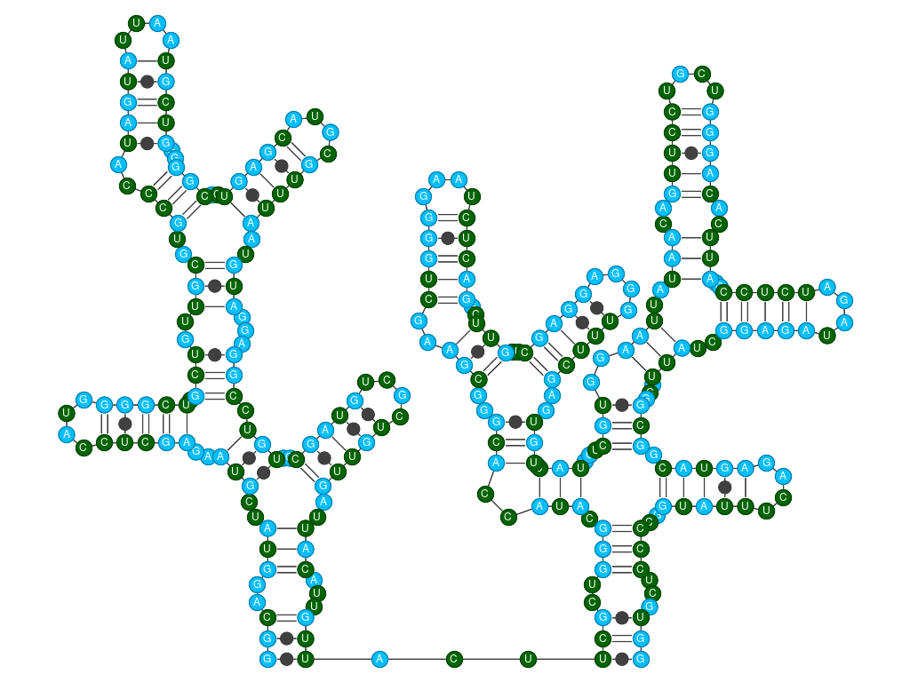
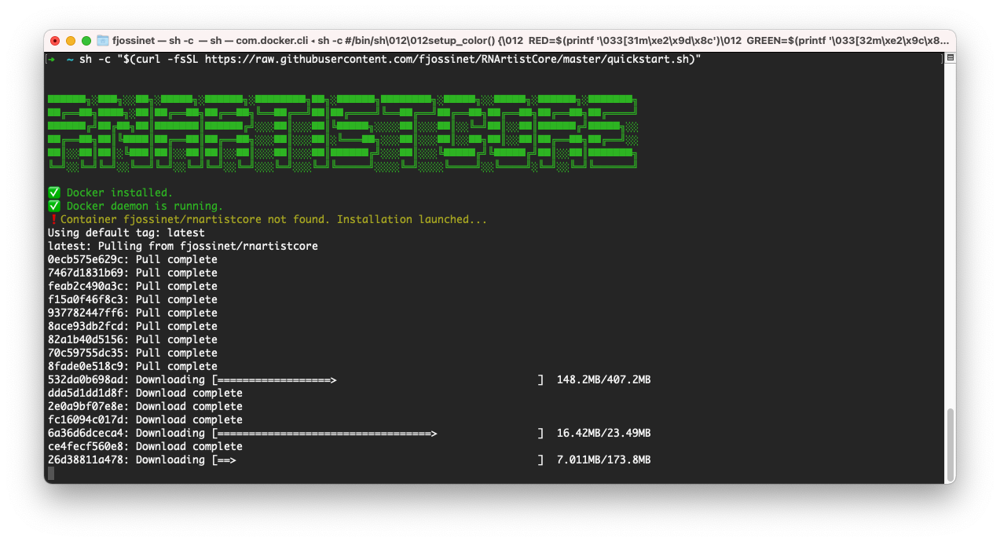
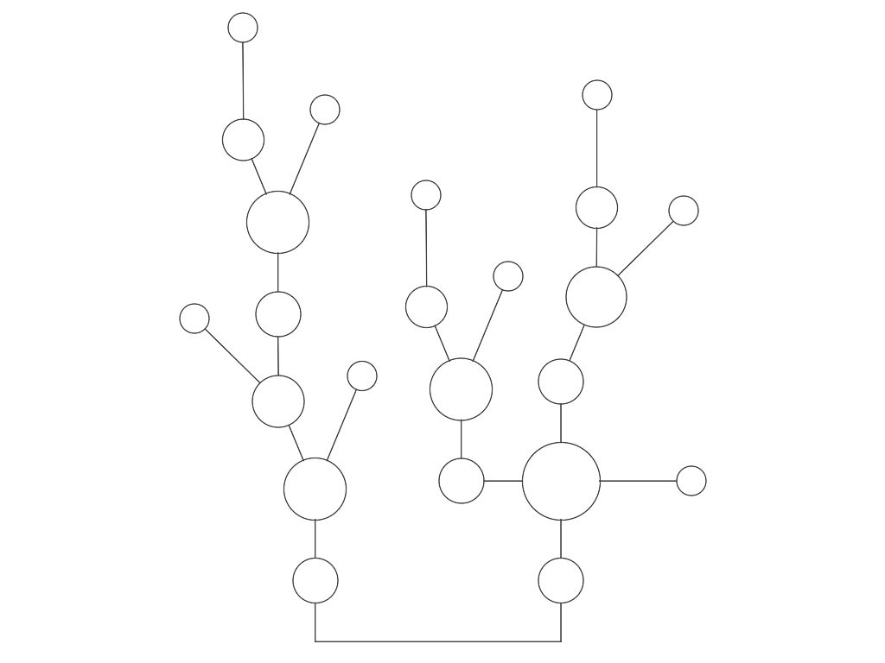
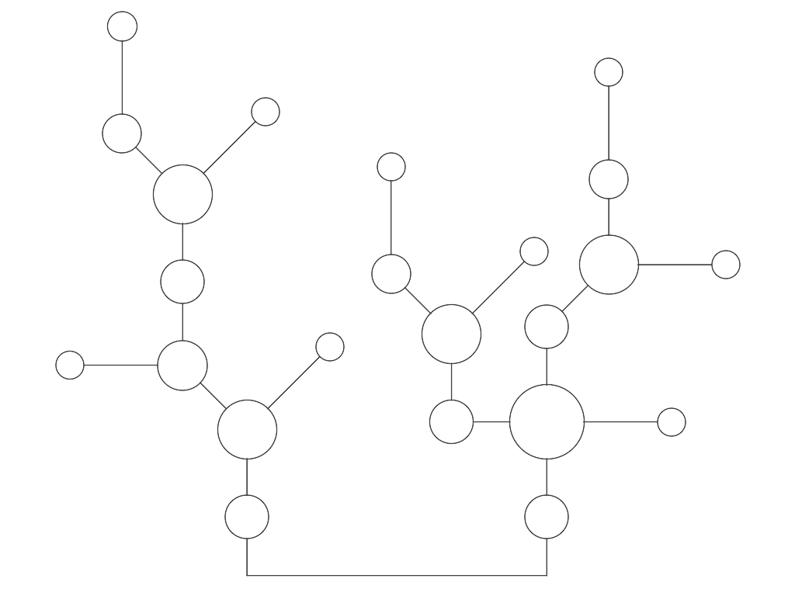
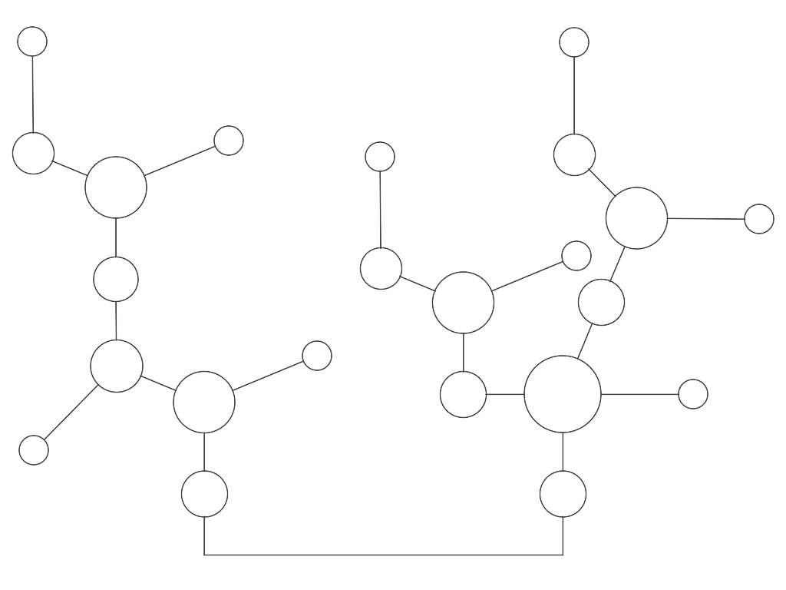
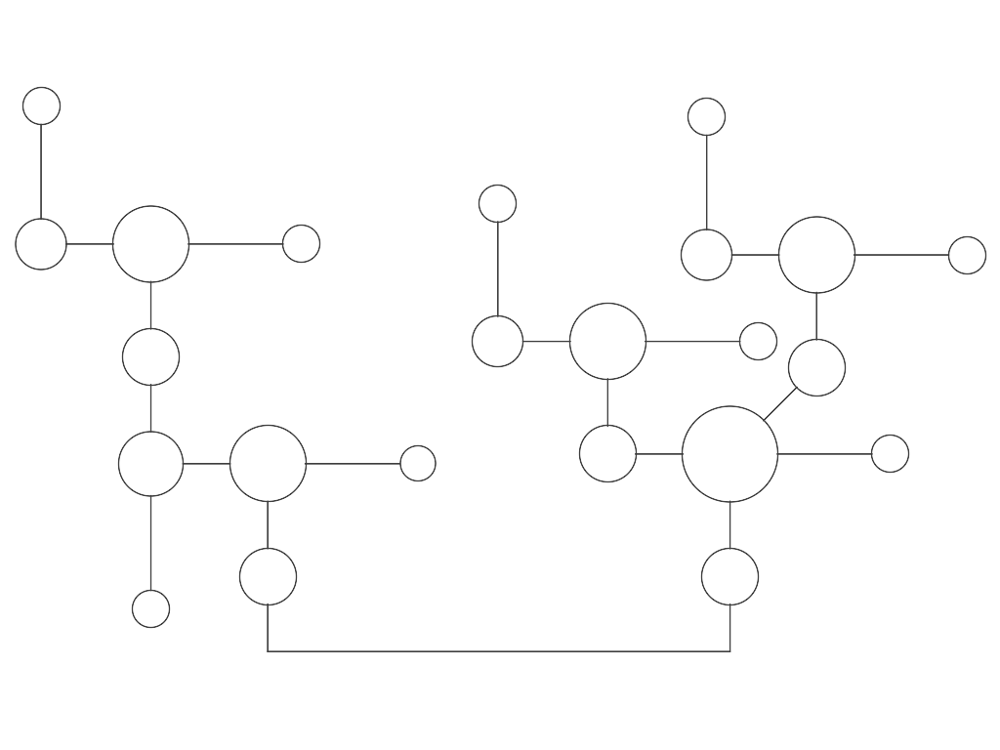
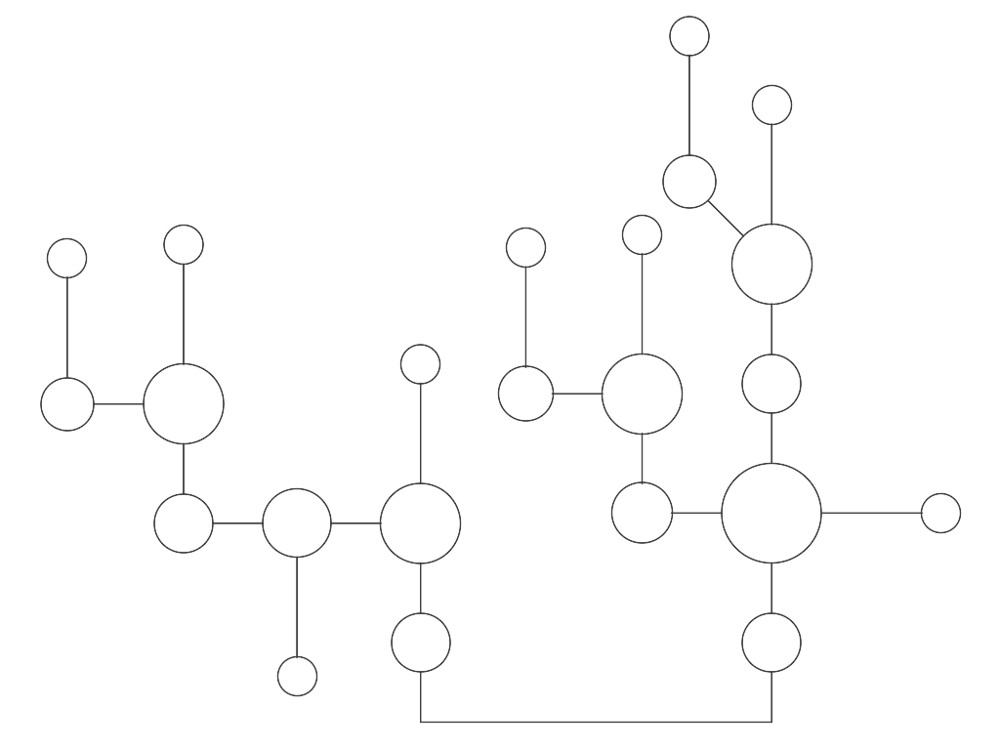
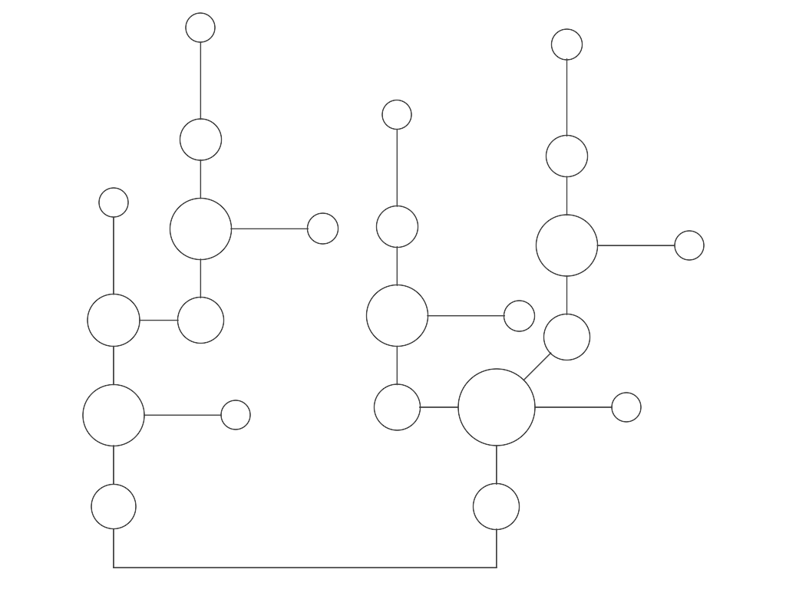

RNArtistCore
============




RNArtistCore provides:
* a language to describe your plotting instructions for RNA secondary structures
* a fully configured environment to run your instructions and store your plots in SVG files. 

It is also a component of the graphical tool named [RNArtist](https://github.com/fjossinet/RNArtist).

While [RNArtist](https://github.com/fjossinet/RNArtist) is an interactive tool for RNA drawing and coloring, RNArtistCore can be used from the commandline to automate the drawing and highlight of specific regions for hundreds of RNA structures.

The largest part of this documentation explains the [syntax to write your own plotting instructions](#dsl). But first, how to run your instructions? 

## Use RNArtistCore on a cloud service

Check the project [RNArtistCore Demo Binder](https://github.com/fjossinet/RNArtistCore-binder). It will redirect you to a fully configured environment hosted by [MyBinder.org](https://mybinder.org/). You will be able to write and run your plotting instructions inside Jupyter notebooks.

## Use RNArtistCore on your own computer

This option installs a local copy of RNArtistCore and creates a project directory both fully configured. To use this option, you just need to:

* install [Docker](https://www.docker.com/get-started) on your computer and run it. If you're using Windows or MacOSX, you should install [Docker Desktop](https://www.docker.com/products/docker-desktop) 
* type this command to create a fully configured project directory: 
  * using curl: ```sh -c "$(curl -fsSL https://raw.githubusercontent.com/fjossinet/RNArtistCore/master/rnartistcore.sh)"```
  * using wget: ```sh -c "$(wget https://raw.githubusercontent.com/fjossinet/RNArtistCore/master/rnartistcore.sh -O -)"```
* you will be asked to define the full path for your project directory. If the command is launched for the first time on your computer, a local copy of RNArtistCore fully configured will be installed.



Once the project directory created and everything installed and configured, you will see several files:

* [plot_2ds.sh](scripts/plot_2ds.sh): this script parses and executes your plotting instructions
* [sample_plots.kts](scripts/sample_plots.kts): a sample file containing plotting instructions for two SVG files: (i) an RNA 2D described from scratch and (ii) an RNA 2D derived from a [3D structure](https://www.rcsb.org/structure/1GID)
* inputs folder: contains input files used in [sample_plots.kts](scripts/sample_plots.kts)
* outputs folder: will contain the SVG outputs generated by [sample_plots.kts](scripts/sample_plots.kts)
* [rnartist_demo.ipynb](scripts/rnartistcore_demo.ipynb): a sample file to use RNArtistCore through Jupyter.

To create additional project directories you can:
* either relaunch the command ```sh -c "$(....)"```
* or make a copy of any project directory already installed.

RNArtistCore is frequently updated to fix bugs and to add new features. To update your local copy, you need to type this command from any project directory:
```./plot_2ds.sh -u```

# <a name="dsl"></a> How to write your plotting instructions

RNArtistCore exposes a language to write your plotting instructions more easily. All the examples described in this README are stored in the file [scripts/readme_plots.kts](scripts/readme_plots.kts)

* [The drawing algorithm element](#drawing)
  * [The **```rnartist```** element](#rnartist)
    * [The **```data```** element](#data)
    * [The **```theme```** element](#theme)
      * [The **```color```** element](#color)
      * [The **```details```** element](#details)
      * [The **```hide```** element](#hide)
      * [The **```line```** element](#line)
    * [The **```layout```** element](#layout)
  * [The **```booquet```** element](#booquet)
* [The **```ss```** element](#ss)
  * [The **```rna```** element](#molecule)

Using pseudo-code, here is the structure that your instructions have to fit with:

```kotlin
drawing_algorithm {

  parameter_1 = "value"
  parameter_2 = value

  secondary_structure {

    parameter_3 = "value"
    parameter_4 = value

    rna {
      parameter_5 = value
      parameter_6 = "value"
    }

  }

  theme {

  }

  layout {

  }

}
```

As you can see, you need to describe an RNA molecule, on which is constructed a secondary structure, used by an algorithm to produce a drawing. This drawing can be customized with a theme to suit your needs.

Here is a real example:

```kotlin
rnartist {
  file = "/project/media/real_example.svg"
  ss {
    rna {
      sequence = "CAACAUCAUACGUACUGCGCCCAAGCGUAACGCGAACACCACGAGUGGUGACUGGUGCUUG"
    }
    bracket_notation =
      "(((..(((..(((..(((((....)))))..)))..(((((....)))))..)))...)))"
  }
  theme {
    details_lvl = 5

    color {
      type="A"
      value = "#A0ECF5"
    }

    color {
      type="a"
      value = "black"
    }

    color {
      type="U"
      value = "#9157E5"
    }

    color {
      type="G"
      value = "darkgreen"
    }

    color {
      type="C"
      value = "#E557E5"
    }

  }
}
```


You need at least the drawing_algorithm element, its output file and an ss element to have a working file.

In the next paragraphs, we will detail the elements available to describe an RNA molecule, a secondary structure and a drawing algorithm.

### <a name="drawing"></a>The drawing algorithm element

Two algorithms are available:
* the one used by the graphical tool [RNArtist](https://github.com/fjossinet/RNArtist)
* booquet

Both algorithms need a secondary structure element and save their results in SVG files. Each molecular chain will be exported in its own SVG file. Each algorithm has its own parameters to configure the drawing process and the final result.

<a name="rnartist"></a> ***The **```rnartist```** element***

The parameters available are:
* **```file```**: the absolute path and the name of the SVG output file. The name of the molecular chain will be merged to the file name.
* **```ss```**: a secondary structure element
* **```data```**: a dataset to map values to residues
* **```theme```**: to change the colors, details, line width,... for any object in the 2D
* **```layout```**: to change the default layouts for the junctions

The size of the picture will fit the size of the drawing (with a minimum size of 1024x768 to see the residue characters).

<a name="data"></a> ____The **```data```** element____

Datasets can be linked to an RNA secondary structure. You can either fill the dataset within the script, or load it from a file.

```kotlin
rnartist {
    file = "/project/example1.svg"
    ss {
        bracket_notation = "(((..(((..(((..(((((....)))))..)))..(((((....)))))..)))...)))"
    }
    data {
        "1" to 200.7
        "2" to 192.3
        "3" to 143.6
    }
}
```

```kotlin
rnartist {
    file = "/project/example1.svg"
    ss {
        bracket_notation = "(((..(((..(((..(((((....)))))..)))..(((((....)))))..)))...)))"
    }
    data {
        file = "/project/QuSHAPE_01_shape_mode_reactivities.txt"
    }
}
```

The values linked to each residue can be used as a selection criteria to define the colors, line width and details level.

If you know Kotlin, you can embed Kotlin instructions to power your script.

```kotlin
rnartist {
  file = "/project/media/kotlin_powered.svg"
  ss {
    bracket_notation =
      "(((..(((..(((..(((((....)))))..)))..(((((....)))))..)))...)))"
  }
  data {
    (1..secondaryStructures[0].length).forEach {
      "${it}" to Math.random()
    }
  }
  theme {
    details_lvl = 5

    color {
      type = "R"
      value = "lightyellow"
      to = "firebrick"
    }

    color {
      type = "r"
      value = "black"
      to = "white"
    }

    hide {
      type = "Y"
    }

  }
}
```


<a name="theme"></a> ____The **```theme```** element____

Using a **```theme```**, you can define your drawing options for any 2D objects, from single residues to entire structural domains like helices or junctions.

To quickly change the details level of your entire 2D, you can use the parameter named **```details_lvl```**. This parameter is a shortcut to define the details level for the entire 2D objects. Five details levels are available.

_____Level 1_____

All 2D objects set to **```none```**

```kotlin
rnartist {
    file = "/project/media/details_lvl1.svg"
    ss {
        bracket_notation =
            "(((..(((..(((..(((((....)))))..)))..(((((....)))))..)))...)))"
    }
    theme {
        details_lvl = 1
    }
}
```


_____Level 2_____

The following 2D objets are set to **```full```**: helix, secondary_interaction, junction, single-strand, phosphodiester_bond

```kotlin
rnartist {
    file = "/project/media/details_lvl2.svg"
    ss {
        bracket_notation =
            "(((..(((..(((..(((((....)))))..)))..(((((....)))))..)))...)))"
    }
    theme {
        details_lvl = 2
    }
}
```


_____Level 3_____

In addition to those listed in the level 2, this level set the following 2D objects to **```full```** : N (all the residue circles)

```kotlin
rnartist {
    file = "/project/media/details_lvl3.svg"
    ss {
        bracket_notation =
            "(((..(((..(((..(((((....)))))..)))..(((((....)))))..)))...)))"
    }
    theme {
        details_lvl = 3
    }
}
```


_____Level 4_____

In addition to those listed in the level 3, this level set the following 2D objects to **```full```** : n (all the residue characters)

```kotlin
rnartist {
    file = "/project/media/details_lvl4.svg"
    ss {
        bracket_notation =
            "(((..(((..(((..(((((....)))))..)))..(((((....)))))..)))...)))"
    }
    theme {
        details_lvl = 4
    }
}
```


_____Level 5_____

In addition to those listed in the level 4, this level set the following 2D objects to **```full```** : interaction_symbol

```kotlin
rnartist {
    file = "/project/media/details_lvl5.svg"
    ss {
        bracket_notation =
            "(((..(((..(((..(((((....)))))..)))..(((((....)))))..)))...)))"
    }
    theme {
        details_lvl = 5
    }
}
```


Inside a **```theme```**, you can also add several times the following elements:
* **```color```**: define the color for 2D objects
* **```details```**: define the details level for 2D objects
* **```hide```**: hide residues
* **```line```**: define the line width for 2D objects
<!--* **```highlight```**: highlight residues
  * **```type```**: can only be a lower or upper character (default is "N"). Lower or upper character will produce the same results (the character and the shape of the delected residues is hidden)
  * **```location```**: the location of the residues to hide
  * **```data```**: selection based on the values linked to the residues
  * **```color```**: an HTML color code or predefined color name
  * **```width```**: the line width-->


<a name="color"></a> ____The **```color```** element____

Parameters:
* **```value```**: an HTML color code or predefined color name. If the parameter **```to```** is defined, this parameter defines the first color for the gradient.
* **```to```**: the last color in a gradient (HTML color code or predefined color name)
* **```type```**: the type of the 2D objects targeted
* **```location```**: the location of the 2D objects targeted
* **```data```**: selection based on the values linked to the residues

The parameter **```type```** can have the following values:
* **```A```**, **```U```**, **```G```**, **```C```**, **```X```**, **```N```**, **```R```**, **```Y```**: capital characters for residues target the circle surrounding the residue character. **```N```** is for any residue, **```R```** for purines, and **```Y```** for pyrimidines
* **```a```**, **```u```**, **```g```**, **```c```**, **```x```**, **```n```**, **```r```**, **```y```**: lowercase characters for residues target the character inside the circle. **```n```** is for any residue, **```r```** for purines, and **```y```** for pyrimidines
* **```helix```**
* **```single_strand```**
* **```junction```**
* **```secondary_interaction```**
* **```tertiary_interaction```**
* **```phosphodiester_bond```**
* **```interaction_symbol```**
* **```pknot```**

If the parameter **```type```** is not defined, all the types available are targeted.

You can define several types in the same string using a space as separator: **```"single_strand R C interaction_symbol"```**

The parameter **```location```** needs to have the following format: **```start_position_1:length, start_position_2:length, ...```**. A 2D object is targeted if its own location is inside the one defined with this parameter.

You can define a color with its HTML color code or its name ([list of color names](https://en.wikipedia.org/wiki/Web_colors#//project/media/File:SVG_Recognized_color_keyword_names.svg)).

Examples:

```kotlin
rnartist {
    file = "/project/media/all_red.svg"
    ss {
        bracket_notation =
            "(((..(((..(((..(((((....)))))..)))..(((((....)))))..)))...)))"
    }
    theme {
        details_lvl = 4

        color {
            value = "red"
        }

        color {
            type = "a c"
            value = "white"
        }

        color {
            type = "g u"
            value = "black"
            location = "10:10"
        }

    }
}
```


```kotlin
rnartist {
    file = "/project/media/details_lvl5_colored.svg"
    ss {
        bracket_notation =
            "(((..(((..(((..(((((....)))))..)))..(((((....)))))..)))...)))"
    }
    theme {
        details_lvl = 5

        color {
            type = "Y"
            value = "lavenderblush"
        }

        color {
            type = "y"
            value = "black"
        }

        color {
            type = "R"
            value = "green"
        }
        
    }
}
```


If a dataset is linked to the RNA secondary structure, a colored gradient can be defined inside the **```color```** element. You need to use the parameters  **```value```** and  **```to```**. To restrict the distribution of values to be used, you can use the parameter  **```data```**. You can select values lower than a value (**```lt```**), greater than a value (**```gt```**) or between two values (**```between```**).

```kotlin
rnartist {
    file = "/project/media/dataset.svg"
    ss {
        rna {
            sequence = "GCGAAAAAUCGC"
        }
        bracket_notation =
            "((((....))))"
    }
    data {
        "1" to 200.7
        "2" to 192.3
        "3" to 143.6
        "4" to 34.8
        "5" to 4.5
        "6" to 234.9
        "7" to 12.3
        "8" to 56.8
        "9" to 59.8
        "10" to 140.5
        "11" to 0.2
        "12" to 345.8
    }
    theme {
        details_lvl = 4
        color {
            type = "N"
            value = "lightyellow"
            to = "firebrick"
            data between 10.0..350.0
        }
        color {
            type = "n"
            value = "black"
            to = "white"
            data between 10.0..350.0
        }
        color {
            type = "N"
            value = "black"
            data lt 10.0
        }
        color {
            type = "n"
            value = "white"
            data lt 10.0
        }
    }
}
```


<a name="details"></a> ____The **```details```** element____

This element allows to decide if a 2D object can be drawn with full details or not. Full details means a combination of:
* the own rendering of the 2D object (if not drawn with full details, an helix is a simple line, a juntion is a circle, an interaction symbol will not render the LW symbols,...)
* allowing the children for this 2D object to be drawn (if not drawn with full details, an helix will not allow its phosphodiester bonds and secondary interactions to be drawn).

| 2D object       | "none"   | "full"   |
| :-------------: |:-------------:| ----------------|
| helix           | Line          | Render: <ul><li>phosphodiester_bond</li><li>secondary_interaction</li></ul> |
| junction        | Circle        |   Render: <ul><li>phosphodiester_bond</li><li>residues (A U G C N Y R)</li></ul> |
| single_strand   | Line          |    Render: <ul><li>phosphodiester_bond</li><li>residues (A U G C N Y R)</li></ul> |
| phosphodiester_bond   | No rendering          |    Line |
| secondary_interaction  | No rendering         |    Render: <ul><li>interaction_symbol</li><li>residues (A U G C N Y R)</li></ul> |
| interaction_symbol  | Line         |    LW symbols |
| residues (A U G C N Y R)  | Circle         |    Render: <ul><li>Circle</li><li>residue characters (a u g c n y r)</li></ul> |
| residue characters (a u g c n y r)  | No rendering         |   Character |

In the following examples, we will start with the details level 1 (the details for all 2D objects is set to **```none```**). Then we increase the details level for some parts of a single helix defined by its location.

```kotlin
rnartist {
    file = "/project/media/helix_details1.svg"
    ss {
        bracket_notation =
            "..((..((((....))))..))"
    }
    theme {
        details_lvl = 1
    }
}
```


```kotlin
rnartist {
    file = "/project/media/helix_details2.svg"
    ss {
        bracket_notation =
            "..((..((((....))))..))"
    }
    theme {
        details_lvl = 1

        details {
          type = "helix"
          value = "full"
          location="7:4,15:4"
        }
    }
}
```
The helix will disappear since its components have still their details set to **```none```**.


Now we display the phosphodiester bonds.

```kotlin
rnartist {
    file = "/project/media/helix_details3.svg"
    ss {
        bracket_notation =
            "..((..((((....))))..))"
    }
    theme {
        details_lvl = 1

        details {
          type = "helix phosphodiester_bond"
          value = "full"
          location="7:4,15:4"
        }
    }
}
```


Now we display the secondary interactions.

```kotlin
rnartist {
    file = "/project/media/helix_details4.svg"
    ss {
        bracket_notation =
            "..((..((((....))))..))"
    }
    theme {
        details_lvl = 1

        details {
          type = "helix phosphodiester_bond secondary_interaction"
          value = "full"
          location="7:4,15:4"
        }
    }
}
```


Now we display the residue circles.

```kotlin
rnartist {
    file = "/project/media/helix_details5.svg"
    ss {
        bracket_notation =
            "..((..((((....))))..))"
    }
    theme {
        details_lvl = 1

        details {
          type = "helix phosphodiester_bond secondary_interaction N"
          value = "full"
          location="7:4,15:4"
        }
    }
}
```


Now we display the residue characters.

```kotlin
rnartist {
    file = "/project/media/helix_details6.svg"
    ss {
        bracket_notation =
            "..((..((((....))))..))"
    }
    theme {
        details_lvl = 1

        details {
          type = "helix phosphodiester_bond secondary_interaction N n"
          value = "full"
          location="7:4,15:4"
        }
    }
}
```


You can then combine different details levels to have a rendering that fit your needs:

```kotlin
rnartist {
    file = "/project/media/helix_combination_details.svg"
    ss {
        bracket_notation =
            "..((..((((....))))..))"
    }
    theme {
        details_lvl = 1

        details {
            type = "helix phosphodiester_bond"
            value = "full"
            location="7:4,15:4"
        }

        details {
            type = "secondary_interaction"
            value = "full"
            location="8,17"
        }

        details {
            type = "N"
            value = "full"
            location="8"
        }

        details {
            type = "secondary_interaction N"
            value = "full"
            location="9,16"
        }

        details {
            type = "n"
            value = "full"
            location="16"
        }
    }
}
```


Parameters:
* **```value```**: **```"full"```** or **```"none"```**
* **```type```**: the type of the 2D objects targeted
* **```location```**: the location of the 2D objects targeted
* **```data```**: selection based on the values linked to the residues

The parameter **```type```** can have the following values:
* **```A```**, **```U```**, **```G```**, **```C```**, **```X```**, **```N```**, **```R```**, **```Y```**: capital characters for residues target the circle surrounding the residue character. **```N```** is for any residue, **```R```** for purines, and **```Y```** for pyrimidines
* **```a```**, **```u```**, **```g```**, **```c```**, **```x```**, **```n```**, **```r```**, **```y```**: lowercase characters for residues target the character inside the circle. **```n```** is for any residue, **```r```** for purines, and **```y```** for pyrimidines
* **```helix```**
* **```single_strand```**
* **```junction```**
* **```secondary_interaction```**
* **```tertiary_interaction```**
* **```phosphodiester_bond```**
* **```interaction_symbol```**
* **```pknot```**

If the parameter **```type```** is not defined, all the types available are targeted.

You can define several types in the same string using a space as separator: **```"single_strand R C interaction_symbol"```**

The parameter **```location```** needs to have the following format: **```start_position_1:length, start_position_2:length, ...```**. A 2D object is targeted if its own location is inside the one defined with this parameter.

Examples:

```kotlin
rnartist {
    file = "/project/media/partially_detailed.svg"
    ss {
        bracket_notation =
            "(((..(((..(((..(((((....)))))..)))..(((((....)))))..)))...)))"
    }
    theme {
        details_lvl = 1

        details {
            location = "6:3,53:3"
            value = "full"
        }

        details {
            type ="helix secondary_interaction phosphodiester_bond"
            location = "16:6,24:6"
            value = "full"
        }

        details {
            location = "21:4"
            value = "full"
        }

    }
}
```


```kotlin
rnartist {
    file = "/project/media/hide_purines.svg"
    ss {
        bracket_notation =
            ".(((.(((..........(((((((..(((....)))......(((....)))...)))))))...))).)))"
    }
    theme {
        details_lvl = 5

        details {
            type = "r R"
            location="12:20"
            value = "none"
        }

        color {
            type = "C"
            value = "deepskyblue"
        }

        color {
            type = "U"
            value = "darkgreen"
        }

    }
}
```


If a dataset is linked to the RNA secondary structure, the values can be used as a selection criteria. Using the parameter  **```data```**, you can select values lower than a value (**```lt```**), greater than a value (**```gt```**) or between two values (**```between```**).

```kotlin
rnartist {
    file = "/project/media/dataset_hide.svg"
    ss {
        bracket_notation =
            "((((....))))"
    }
    data {
        "1" to 200.7
        "2" to 192.3
        "3" to 143.6
        "4" to 34.8
        "5" to 4.5
        "6" to 234.9
        "7" to 12.3
        "8" to 56.8
        "9" to 59.8
        "10" to 140.5
        "11" to 0.2
        "12" to 345.8
    }
    theme {
        details_lvl = 4

        details {
            type = "N"
            value = "none"
            data between 10.0..350.0
        }

        details {
            type = "n"
            value = "none"
            data between 10.0..350.0
        }

        color {
            type = "R"
            value = "deepskyblue"
        }

        color {
            type = "Y"
            value = "darkgreen"
        }
    }
}
```


<a name="hide"></a> ____The **```hide```** element____

Parameters:
* **```type```**: can only be a lower or upper character (default is **```N```**). Lower or upper character will produce the same results (the character and the shape for the selected residues are both hidden)
* **```location```**: the location of the residues to hide
* **```data```**: selection based on the values linked to the residues

The parameter **```location```** needs to have the following format: **```start_position_1:length, start_position_2:length, ...```**. A 2D object is targeted if its own location is inside the one defined with this parameter.

If a dataset is linked to the RNA secondary structure, the values can be used as a selection criteria. Using the parameter  **```data```**, you can select values lower than a value (**```lt```**), greater than a value (**```gt```**) or between two values (**```between```**).

```kotlin
rnartist {
  file = "/project/media/hide_pyrimidines.svg"
  ss {
    rna {
      sequence = "GCGAAAAAUCGC"
    }
    bracket_notation =
      "((((....))))"
  }
  data {
    "1" to 200.7
    "2" to 192.3
    "3" to 143.6
    "4" to 34.8
    "5" to 4.5
    "6" to 234.9
    "7" to 12.3
    "8" to 56.8
    "9" to 59.8
    "10" to 140.5
    "11" to 0.2
    "12" to 345.8
  }
  theme {
    details_lvl = 5

    hide {
      location="5:4"
    }

    hide {
      type = "Y"
      data lt 150.0
    }

    color {
      type = "R"
      value = "deepskyblue"
    }

    color {
      type = "Y"
      value = "darkgreen"
    }

    color {
      type = "Y"
      value = "firebrick"
      data gt 200.0
    }

  }
}
```


<a name="line"></a> ____The **```line```** element____

Parameters:
* **```value```**: the line width
* **```type```**: the type of the 2D objects targeted
* **```location```**: the location of the 2D objects targeted

The parameter **```type```** can have the following values:
* **```A```**, **```U```**, **```G```**, **```C```**, **```X```**, **```N```**, **```R```**, **```Y```**: capital characters for residues target the circle surrounding the residue character. **```N```** is for any residue, **```R```** for purines, and **```Y```** for pyrimidines
* **```a```**, **```u```**, **```g```**, **```c```**, **```x```**, **```n```**, **```r```**, **```y```**: lowercase characters for residues target the character inside the circle. **```n```** is for any residue, **```r```** for purines, and **```y```** for pyrimidines
* **```helix```**
* **```single_strand```**
* **```junction```**
* **```secondary_interaction```**
* **```tertiary_interaction```**
* **```phosphodiester_bond```**
* **```interaction_symbol```**
* **```pknot```**

If the parameter **```type```** is not defined, all the types available are targeted.

You can define several types in the same string using a space as separator: **```"single_strand R C interaction_symbol"```**

The parameter **```location```** needs to have the following format: **```start_position_1:length, start_position_2:length, ...```**. A 2D object is targeted if its own location is inside the one defined with this parameter.

If a dataset is linked to the RNA secondary structure, the values can be used as a selection criteria. Using the parameter  **```data```**, you can select values lower than a value (**```lt```**), greater than a value (**```gt```**) or between two values (**```between```**).

Examples:

```kotlin
rnartist {
  file = "/project/media/lines.svg"
  ss {
    bracket_notation =
      "(((..(((..(((..(((((....)))))..)))..(((((....)))))..)))...)))"
  }
  theme {
    details_lvl = 3

    color {
      type = "Y"
      value = "chartreuse"
    }

    color {
      type = "R"
      value = "turquoise"
    }

    line {
      type = "phosphodiester_bond interaction_symbol"
      value = 0.1
    }

    line {
      type = "phosphodiester_bond N"
      value = 5.0
      location = "8:6"
    }

  }
}
```


<a name="layout"></a> ____The **```layout```** element____

The rnartist drawing algorithm computes the layout to avoid overlapping of 2D objects. One of the parameter used is the default orientation of the helices linked to each type of junction (inner loops, 3-way junctions,...). Each junction is linked to an entering helix (the red arrow in the diagram below) and to helices leaving it (black arrows). The layout for the leaving helices are defined according to the directions of a compass, the entering helix making the south direction.


You can redefine the default layout for each type of junction by adding one or several **```junction```** elements to the layout. A **```junction```** element has the following parameters:
* **```type```**: the type of the junction (1 for apical loops, 2 for inner loops, 3 for 3-way junctions,...)
* **```out_ids```**: the compass directions for the leaving helices

In the following examples, you can see the different results when we modify the layout for the 3-way junctions.

```kotlin
rnartist {
    file = "/project/media/3way_1.svg"
    ss {
        bracket_notation =
            "(((..(((..(((..(((((....))))).(((..(((..(((..(((((....)))))..)))..(((((....)))))..)))...))).)))..(((((....)))))..)))...)))...(((..(((.(((..(((..(((..(((((....)))))..)))..(((((....)))))..)))...)))...(((..(((..(((..(((((....)))))..)))..(((((....)))))..)))...))).(((((....)))))..)))...)))"
    }
    theme {
        details_lvl = 1
    }

    layout {

        junction {
            type = 3
            out_ids ="nnw nne"
        }

    }
}
```



```kotlin
rnartist {
    file = "/project/media/3way_2.svg"
    ss {
        bracket_notation =
            "(((..(((..(((..(((((....))))).(((..(((..(((..(((((....)))))..)))..(((((....)))))..)))...))).)))..(((((....)))))..)))...)))...(((..(((.(((..(((..(((..(((((....)))))..)))..(((((....)))))..)))...)))...(((..(((..(((..(((((....)))))..)))..(((((....)))))..)))...))).(((((....)))))..)))...)))"
    }
    theme {
        details_lvl = 1
    }

    layout {

        junction {
            type = 3
            out_ids ="nw ne"
        }

    }
}
```



```kotlin
rnartist {
    file = "/project/media/3way_3.svg"
    ss {
        bracket_notation =
            "(((..(((..(((..(((((....))))).(((..(((..(((..(((((....)))))..)))..(((((....)))))..)))...))).)))..(((((....)))))..)))...)))...(((..(((.(((..(((..(((..(((((....)))))..)))..(((((....)))))..)))...)))...(((..(((..(((..(((((....)))))..)))..(((((....)))))..)))...))).(((((....)))))..)))...)))"
    }
    theme {
        details_lvl = 1
    }

    layout {

        junction {
            type = 3
            out_ids ="wnw ene"
        }

    }
}
```



```kotlin
rnartist {
    file = "/project/media/3way_4.svg"
    ss {
        bracket_notation =
            "(((..(((..(((..(((((....))))).(((..(((..(((..(((((....)))))..)))..(((((....)))))..)))...))).)))..(((((....)))))..)))...)))...(((..(((.(((..(((..(((..(((((....)))))..)))..(((((....)))))..)))...)))...(((..(((..(((..(((((....)))))..)))..(((((....)))))..)))...))).(((((....)))))..)))...)))"
    }
    theme {
        details_lvl = 1
    }

    layout {

        junction {
            type = 3
            out_ids ="w e"
        }

    }
}
```



```kotlin
rnartist {
    file = "/project/media/3way_5.svg"
    ss {
        bracket_notation =
            "(((..(((..(((..(((((....))))).(((..(((..(((..(((((....)))))..)))..(((((....)))))..)))...))).)))..(((((....)))))..)))...)))...(((..(((.(((..(((..(((..(((((....)))))..)))..(((((....)))))..)))...)))...(((..(((..(((..(((((....)))))..)))..(((((....)))))..)))...))).(((((....)))))..)))...)))"
    }
    theme {
        details_lvl = 1
    }

    layout {

        junction {
            type = 3
            out_ids ="w n"
        }

    }
}
```



```kotlin
rnartist {
    file = "/project/media/3way_6.svg"
    ss {
        bracket_notation =
            "(((..(((..(((..(((((....))))).(((..(((..(((..(((((....)))))..)))..(((((....)))))..)))...))).)))..(((((....)))))..)))...)))...(((..(((.(((..(((..(((..(((((....)))))..)))..(((((....)))))..)))...)))...(((..(((..(((..(((((....)))))..)))..(((((....)))))..)))...))).(((((....)))))..)))...)))"
    }
    theme {
        details_lvl = 1
    }

    layout {

        junction {
            type = 3
            out_ids ="n e"
        }

    }
}
```



And now with full details:

```kotlin
rnartist {
    file = "/project/media/3way_full_details.svg"
    ss {
        bracket_notation =
            "(((..(((..(((..(((((....))))).(((..(((..(((..(((((....)))))..)))..(((((....)))))..)))...))).)))..(((((....)))))..)))...)))...(((..(((.(((..(((..(((..(((((....)))))..)))..(((((....)))))..)))...)))...(((..(((..(((..(((((....)))))..)))..(((((....)))))..)))...))).(((((....)))))..)))...)))"
    }
    theme {
        details_lvl = 5

        color {
            type = "R"
            value = "deepskyblue"
        }

        color {
            type = "Y"
            value = "darkgreen"
        }
    }

    layout {

        junction {
            type = 3
            out_ids ="nw ne"
        }

    }
}
```


<a name="booquet"></a> ***The **```booquet```** element***

This algorithm has less options than the rnartist one. The parameters available are:
* **```file```** (mandatory): the absolute path and the name of the SVG output file. The path has always to start with ```/project/```, corresponding to the root of your project
* **```ss```** (mandatory): a secondary structure element
* **```width```**: the width of the view containing the drawing (default: 600)
* **```height```**: the height of the view containing the drawingg (default: 600)
* **```color```**: an HTML color code or color name
* **```line```**: the width for the lines
* **```junction_diameter```**: the diameter of the circles

The drawing will be automatically zoomed to fit the view.

```kotlin
booquet {
  file = "/project/media/booquet_from_rfam.svg"
  junction_diameter = 15.0
  color = "midnightblue"
  line = 1.0
  ss {
    rfam {
      id = "RF00072"
      name = "AJ009730.1/1-133"
    }
  }
}
```


```kotlin
booquet {
  file = "/project/media/booquet_from_vienna.svg"
  junction_diameter = 15.0
  color = "olive"
  line = 3.0
  ss {
    vienna {
      file = "samples/rna.vienna"
    }
  }
}
```


```kotlin
booquet {
  file = "/project/media/booquet_from_ct.svg"
  junction_diameter = 15.0
  color = "darkorchid"
  ss {
    ct {
      file = "samples/ASE_00010_from_RNA_STRAND_database.ct"
    }
  }
}
```


```kotlin
booquet {
  file = "/project/media/booquet_from_pdb.svg"
  junction_diameter = 15.0
  color = "darkmagenta"
  width = 1200.0
  height = 800.0
  line = 0.5
  ss {
    pdb {
      file = "/Volumes/Data/Projets/RNArtistCore/samples/1jj2.pdb"
      name = "0"
    }
  }
}
```


### <a name="ss"></a>The ```ss``` element

You have three different ways to define a seconday structure:
* from scratch using the mandatory parameter **bracket_notation** and the optional element **rna**
* from a file using the elements **vienna**, **bpseq**, **ct**, or **stockholm**
* from a public database using the elements **rfam**, **rnacentral**, or **pdb**

***From scratch***

The parameters are:
* **bracket_notation** (mandatory): the secondary structure described with the dot-bracket notation
* **rna**: an rna molecule described with the **```rna```** element. If you don't provide any **```rna```** element, it will be computed for you with the default name and a random sequence fitting the base-pairing constraints.

Examples:

```kotlin
ss {

  bracket_notation = "((((....))))"

}
```

```kotlin
ss {

  rna {
    name = "My Fav RNA"
    length = 12
  }

  bracket_notation = "((((....))))"

}
```

***From a file***

The secondary structure will be constructed from the data stored in the file.

To be able to use the PDB format, RNArtistCore will use the algorithm RNAVIEW installed with the [Docker container rnartistcore](https://hub.docker.com/r/fjossinet/rnartistcore). RNArtistCore will delegate to RNAVIEW the annotation of the 3D structure into a 2D. 

The parameters are:
* **file** (mandatory): the absolute path and the name of your file. It has to start with **"/project"** which is the root of your project.
* **name**: if the file contains several molecular chains, this parameter allows to precise the one needed. If no name is provided, all the molecular chains will be processed.

Examples:
```kotlin
ss {
  bpseq {
    file = "/project/myrna.bpseq"
  }
}
```

```kotlin
ss {
  ct {
    file = "/project/my_files/myrna.ct"
  }
}
```

```kotlin
ss {
  vienna {
    file = "/project/inputs/myrna.vienna"
  }
}
```

```kotlin
ss {
  pdb {
    file = "/project/myrna.pdb"
    name = "A"
  }
}
```


```kotlin
ss {
  stockholm {
    file = "/project/RF00072.stk"
    name = "consensus"
  }
}
```

```kotlin
ss {
  stockholm {
    file = "/project/RF00072.stk"
    name = "AJ009730.1/1-133"
  }
}
```

```kotlin
ss {
  stockholm {
    file = "/project/RF00072.stk"
  }
}
```
***From a public database***

The secondary structure will be constructed from the data stored in the file.

The parameters are:
* **```id```** (mandatory): the id of your database entry
* **```name```**: if the entry contains several molecular chains, this parameter allows to precise the one needed.  If no name is provided, all the molecular chains will be processed.

Examples:

```kotlin
ss {
  rfam {
    id = "RF00072"
    name = "AJ009730.1/1-133"
  }
}
```

```kotlin
ss {
  rfam {
    id = "RF00072"
    name = "consensus"
  }
}
```

```kotlin
ss {
  rfam {
    id = "RF00072"
  }
}
```

```kotlin
ss {
  pdb {
    id = "1EHZ"
  }
}
```

```kotlin
ss {
  pdb {
    id = "1JJ2"
    name = "0"
  }
}
```

```kotlin
ss {
  pdb {
    id = "1JJ2"
  }
}
```

### <a name="molecule"></a>The ```rna``` element

Using the element ```rna```, you can create an RNA molecule from scratch. The parameters are:

* **name**: the name of the molecule (default value: **```A```**)
* **sequence** (mandatory if no length): the sequence of your molecule. If the parameter length is not provided, the sequence is mandatory
* **length** (mandatory if no sequence): the length of your sequence. If this parameter is provided, a random sequence will be computed. If the parameter sequence is not provided, the length is mandatory

Examples:

```kotlin
rna {
  name = "My Fav RNA"
  sequence = "GGGACCGCCCGGGAAACGGGCGAAAAACGAGGUGCGGGCACCUCGUGACGACGGGAGUUCGACCGUGA"
}
```

```kotlin
rna {
  name = "My Fav RNA 2"
  length = 50
}
```

```kotlin
rna {
  length = 200
}
```

# <a name="library"></a>The RNArtistCore library

RNArtistCore can be added as a dependency into your own projects. No stable release for now, only snapshots. To use RNArtistCore in a Java application, just add the below dependency in your file pom.xml:

```xml
    <repositories>
  <repository>
    <id>maven-snapshots</id>
    <url>http://oss.sonatype.org/content/repositories/snapshots</url>
    <layout>default</layout>
    <releases>
      <enabled>false</enabled>
    </releases>
    <snapshots>
      <enabled>true</enabled>
    </snapshots>
  </repository>
</repositories>

<dependencies>
<dependency>
  <groupId>io.github.fjossinet.rnartist</groupId>
  <artifactId>rnartistcore</artifactId>
  <version>0.2.7-SNAPSHOT</version>
</dependency>
</dependencies>
```