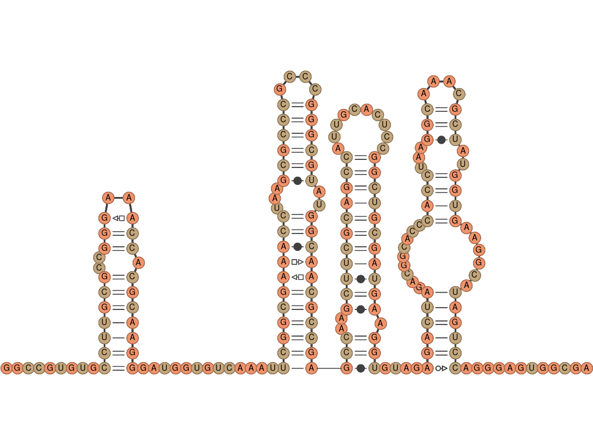
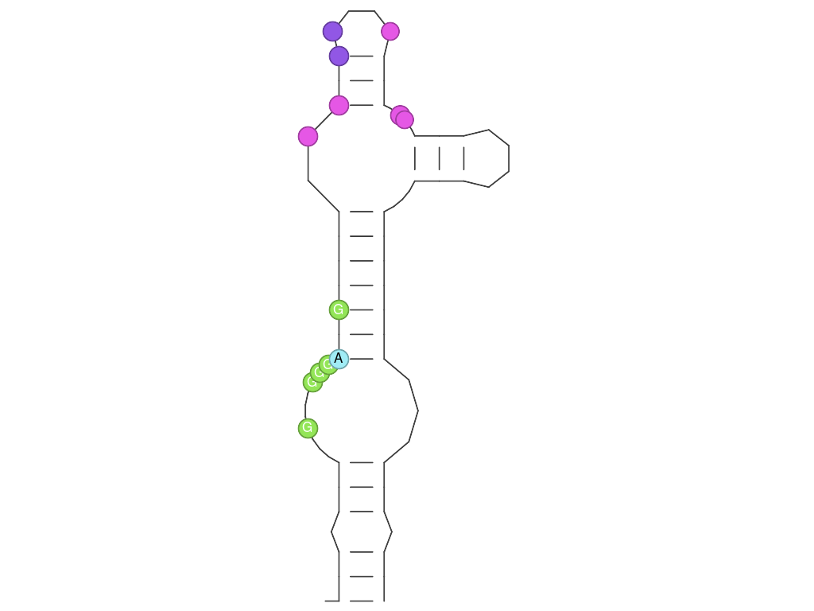
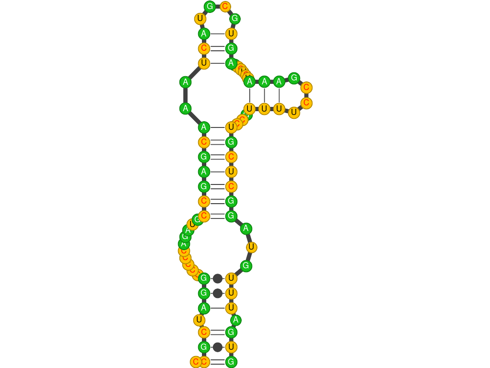
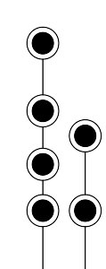
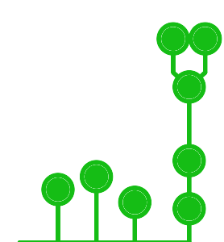
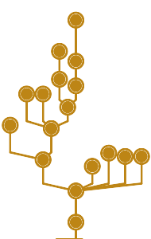
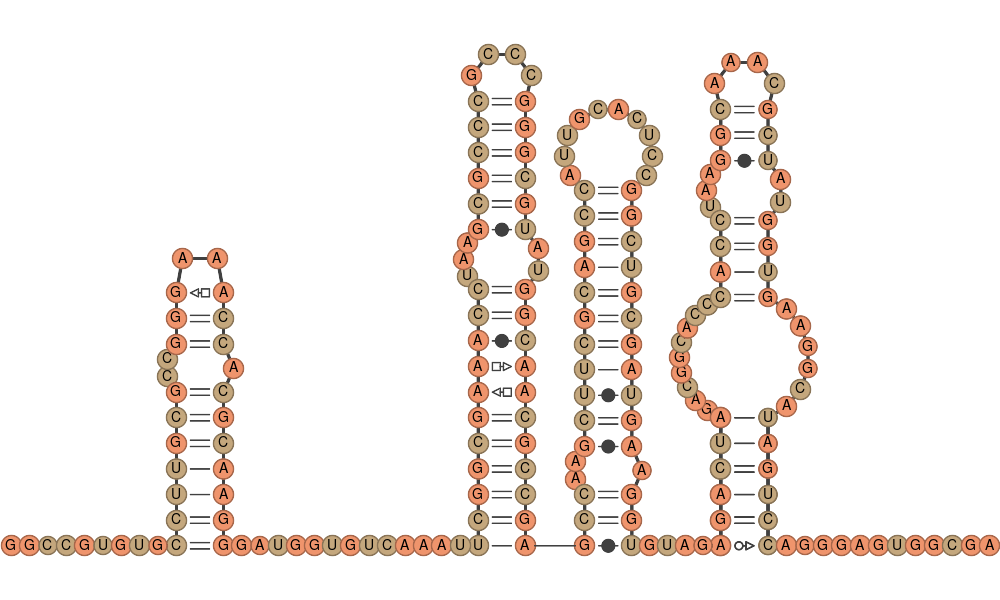

RNArtistCore
============

RNArtistCore is a commandline tool and a Kotlin library used to describe and plot RNA secondary structures. As a library it is used in the projects [RNArtist](https://github.com/fjossinet/RNArtist) and [RNArtistBackend](https://github.com/fjossinet/RNArtistBackEnd).



# Installation

You need to have the build tool [Maven](https://maven.apache.org) and a [Java distribution](https://www.oracle.com/java/technologies/javase-downloads.html) to be installed (type the commands ```mvn``` and ```java``` from a command line to check). 

Clone this repository and inside its root directory type:

<pre>mvn clean package</pre>

Once done, in the subdirectory named "target", you will find the file rnartistcore-{version}-jar-with-dependencies.jar. 

# RNArtistCore from the commandline

RNArtistCore provides a domain-specific language (DSL) to write scripts more easily. You can have a look at examples in the file scripts/dsl.kts

To run a script, you need to have the [kotlin command installed on you computer](https://kotlinlang.org/docs/tutorials/command-line.html).

To run a script, type the following command:

<pre>kotlin -cp target/rnartistcore-{version}-jar-with-dependencies.jar your_script.kts</pre>

## How to write your scripts

Using pseudo-code, here is the structure that your script has to follow:

```kotlin
drawing_algorithm {

  parameter_1 = "value"
  parameter_2 = value

  secondary_structure {

    parameter_3 = "value"
    parameter_4 = value

    rna {
        parameter_5 = value
        parameter_6 = "value"
    }
  
  }

}
```

As you can see, you need to describe an RNA molecule, on which is constructed a secondary structure, used by an algorithm to produce a drawing.

Here is a real example:

```kotlin
rnartist {
    file = "media/example1.svg"
    width = 300.0
    height = 800.0
    ss {
        bracket_notation =
            ".(((.(((..........(((((((..(((....)))......(((....)))...)))))))...))).)))"
    }
    theme {
        details {
            type = "helix"
            value = "full"
        }

        details {
            type = "junction"
            value = "full"
        }

        details {
            type = "single_strand"
            value = "full"
        }

        details {
            type = "secondary_interaction"
            value = "full"
        }

        details {
            type = "phosphodiester_bond"
            value = "full"
        }

        details {
            type = "R"
            location="12:10"
            value = "full"
        }

        details {
            type = "Y"
            location="25:10, 40:5"
            value = "full"
        }

        details {
            type = "r"
            location="12:10"
            value = "full"
        }

        color {
            type="A"
            value = "#A0ECF5"
        }

        color {
            type="a"
            value = "#000000"
        }

        color {
            type="U"
            value = "#9157E5"
        }

        color {
            type="G"
            value = "#93E557"
        }

        color {
            type="C"
            value = "#E557E5"
        }

    }
}
```



In the next paragraphs, we will detail the elements available to describe an RNA molecule, a secondary structure and a drawing algorithm.

### How to define an RNA molecule

Using the element ```rna```, you can create an RNA molecule from scratch. The parameters available are:

* **name**: the name of the molecule (default value: "A")
* **sequence**: the sequence of your molecule. If the parameter length is not provided, the sequence is mandatory
* **length**: the length of your sequence. If this parameter is provided, a random sequence will be computed. If the parameter sequence is not provided, the length is mandatory

Examples:

```kotlin
rna {
  name = "My Fav RNA"
  sequence = "GGGACCGCCCGGGAAACGGGCGAAAAACGAGGUGCGGGCACCUCGUGACGACGGGAGUUCGACCGUGACGCAUGCGGAAAUUGGAGGUGAGUUCGCGAAUACAAAAGCAAGCGAAUACGCCCUGCUUACCGAAGCAAGCG"
}
```

```kotlin
rna {
  name = "My Fav RNA 2"
  length = 50
}
```

```kotlin
rna {
  length = 200
}
```

### How to define a Secondary Structure

You have three different ways to define a seconday structure:
* from scratch using the element **ss**
* from a file using elements like **vienna**, **bpseq**, **ct**, **stockholm**
* from a public database using elements like **rfam**, **rnacentral**, **pdb**

***From scratch***

The parameters available are:
* **rna**: an rna molecule described with the **```rna```** element (see previous paragraph). If you don't provide any ```rna``` element, it will be computed for you with the default name and a random sequence fitting the base-pairing constraints.
* **bracket_notation**: the secondary structure described with the dot-bracket notation

Examples:

```kotlin
ss {
  
  rna {
    name = "My Fav RNA"
    length = 12
  }
  
  bracket_notation = "((((....))))"
  
}
```

```kotlin
ss {
  
  bracket_notation = "((((....))))"
  
}
```

***From a file***

You don't need to provide any ```rna``` element, it will be constructed automatically from the data stored in the file. 

To be able to use the PDB format, you need to have the RNAVIEW algorithm installed with the [Docker container assemble2](https://hub.docker.com/r/fjossinet/assemble2/). RNArtistCore will delegate to RNAVIEW the annotation of the 3D structure into a 2D.

The parameters available are:
* **file**: the absolute path and the name of your file
* **name**: if the file contains several molecular chains, this parameter allows to precise the one needed. If no name is provided, all the molecular chains will be processed.

Examples:
```kotlin
ss {
  bpseq {
    file = "/home/bwayne/myrna.bpseq"
  }
}
```

```kotlin
ss {
  ct {
    file = "/home/bwayne/myrna.ct"
  }
}
```

```kotlin
ss {
  vienna {
    file = "/home/bwayne/myrna.vienna"
  }
}
```

```kotlin
ss {
  pdb {
    file = "/home/bwayne/myrna.pdb"
    name = "A"
  }
}
```


```kotlin
ss {
  stockholm {
    file = "/home/bwayne/RF00072.stk"
    name = "consensus"
  }
}
```

```kotlin
ss {
  stockholm {
    file = "/home/bwayne/RF00072.stk"
    name = "AJ009730.1/1-133"
  }
}
```

```kotlin
ss {
  stockholm {
    file = "/home/bwayne/RF00072.stk"
  }
}
```
***From a public database***

You don't need to provide any ```rna``` element, it will be constructed automatically from the data stored in the database entry.

The parameters available are:
* **id**: the id of your database entry
* **name**: if the entry contains several molecular chains, this parameter allows to precise the one needed.  If no name is provided, all the molecular chains will be processed.

Examples:

```kotlin
ss {
  rfam {
    id = "RF00072"
    name = "AJ009730.1/1-133"
  }
}
```

```kotlin
ss {
  rfam {
    id = "RF00072"
    name = "consensus"
  }
}
```

```kotlin
ss {
  rfam {
    id = "RF00072"
  }
}
```

```kotlin
ss {
  pdb {
    id = "1EHZ"
  }
}
```

```kotlin
ss {
  pdb {
    id = "1JJ2"
    name = "0"
  }
}
```

```kotlin
ss {
  pdb {
    id = "1JJ2"
  }
}
```

### How to define a drawing algorithm

Two algorithms are available:
* the one used by the graphical tool [RNArtist](https://github.com/fjossinet/RNArtist)
* booquet

Both algorithms need a secondary structure element (see previous paragraph) and save their results in an SVG file. If several molecular chains have been processed (from a file or a database entry), each drawing will be saved in its own SVG file. Each algorithm has its own parameters to configure the drawing process and the final result.

***The RNArtist algorithm***

The parameters available are:
* **file**: the absolute path and the name of the SVG output file
* **ss**: a secondary structure element (see above)
* **theme**: see below

The size of the picture will fit the size of the drawing (with a minimum size of 1024x768 to see the residue letters).

This algorithm can be configured with an element named **```theme```**. 

Inside ```theme```, you can add several times the following elements:
* **details**: define the resolution of the element
  * **value**: "full" to draw all the details
  * **type**: the type of the elements targeted
  * **location**: the location of the elements targeted
* **color**: define the color of the element
  * **value**: an HTML color code
  * **type**: the type of the elements targeted
  * **location**: the location of the elements targeted
* **line**: define the width of the line
  * **value**: a digit
  * **type**: the type of the elements targeted
  * **location**: the location of the elements targeted

The parameter **```type```** can have the following values:
  * "A", "U", "G", "C", "X", "N", "R", "Y": using capital letters for residues target the circle surrounding the residue letter. "N" is for any residue, "R" for purines, and "Y" for pyrimidines 
  * "a", "u", "g", "c", "x", "n", "ry", "y": using lowercase letters for residues target the letter inside the circle. "n" is for any residue, "r" for purines, and "y" for pyrimidines 
  * "helix"
  * "single_strand"
  * "junction"
  * "secondary_interaction"
  * "tertiary_interaction"
  * "phosphodiester_bond"
  * "interaction_symbol"
  * "pknot"

The parameter **```location```** needs to have the following format: "start_position_1:length, start_position_2:length, ..."

Examples:

```kotlin
rnartist {
    file = "media/example1.svg"
    ss {
        bracket_notation =
            ".(((.(((..........(((((((..(((....)))......(((....)))...)))))))...))).)))"
    }
    theme {
        details {
            type = "helix"
            value = "full"
        }

        details {
            type = "junction"
            value = "full"
        }

        details {
            type = "single_strand"
            value = "full"
        }

        details {
            type = "secondary_interaction"
            value = "full"
        }

        details {
            type = "phosphodiester_bond"
            value = "full"
        }

        details {
            type = "R"
            location="12:10"
            value = "full"
        }

        details {
            type = "Y"
            location="25:10, 40:5"
            value = "full"
        }

        details {
            type = "r"
            location="12:10"
            value = "full"
        }

        color {
            type="A"
            value = "#A0ECF5"
        }

        color {
            type="a"
            value = "#000000"
        }

        color {
            type="U"
            value = "#9157E5"
        }

        color {
            type="G"
            value = "#93E557"
        }

        color {
            type="C"
            value = "#E557E5"
        }

    }
}
```


```kotlin
rnartist {
    file = "media/example2.svg"
    ss {
        bracket_notation =
            ".(((.(((..........(((((((..(((....)))......(((....)))...)))))))...))).)))"

    }
    theme {
        details {
            type = "helix"
            value = "full"
        }

        details {
            type = "junction"
            value = "full"
        }

        details {
            type = "single_strand"
            value = "full"
        }

        details {
            type = "secondary_interaction"
            value = "full"
        }

        details {
            type = "phosphodiester_bond"
            value = "full"
        }

        details {
            type = "interaction_symbol"
            value = "full"
        }

        details {
            type = "tertiary_interaction"
            value = "none"
        }

        details {
            type = "N"
            value = "full"
        }

        details {
            type = "r"
            value = "full"
        }

        details {
            type = "y"
            value = "full"
        }

        color {
            type = "R"
            value = "#15BD1A"
        }

        color {
            type = "Y"
            value = "#FFC300"
        }

        color {
            type = "r"
            value = "#FFFFFF"
        }

        color {
            type = "u"
            value = "#000000"
        }

        color {
            type = "c"
            value = "#FE1102"
        }

        line {
            type = "phosphodiester_bond"
            value = 5.0
        }

        line {
            type = "secondary_interaction"
            value = 1.0
        }
    }
}
```



```kotlin
rnartist {
    file = "media/example3.svg"
    ss {
        pdb {
            file = "/Volumes/Data/Projets/RNArtistCore/samples/1u6b.pdb"
            name = "B"
        }

    }
    theme {
        details {
            type = "helix"
            value = "full"
        }

        details {
            type = "junction"
            value = "full"
        }

        details {
            type = "single_strand"
            value = "full"
        }

        details {
            type = "secondary_interaction"
            value = "full"
        }

        details {
            type = "phosphodiester_bond"
            value = "full"
        }

        details {
            type = "interaction_symbol"
            value = "full"
        }

        details {
            type = "N"
            value = "full"
        }

        details {
            type = "n"
            value = "full"
        }

        color {
            type = "R"
            value = "#EF946C"
        }

        color {
            type = "Y"
            value = "#C4A77D"
        }

        color {
            type = "n"
            value = "#000000"
        }

        line {
            type = "phosphodiester_bond"
            value = 2.0
        }

        line {
            type = "secondary_interaction"
            value = 4.0
        }
    }
}
```


***The Booquet algorithm***

This algorithm has less options than the rnartist one. The parameters available are:
* **file**: the absolute path and the name of the SVG output file
* **width**: the width of the view containing the drawing (default:300)
* **height**: the height of the view containing the drawingg (default:300)
* **color**: an HTML color code
* **line**: the width for the lines
* **junction_diameter**: the diameter of the circles
* **ss**: a secondary structure element (see above) 

The drawing will be automatically zoomed to fit the view.

```kotlin
booquet {
    file = "media/example4.svg"
    junction_diameter = 15.0
    color = "#000000"
    line = 1.0
    ss {
        rfam {
            id = "RF00072"
            name = "AJ009730.1/1-133"
        }
    }
}
```



```kotlin
booquet {
    file = "media/example5.svg"
    junction_diameter = 15.0
    color = "#15BD15"
    line = 5.0
    ss {
        vienna {
            file = "samples/rna.vienna"
        }
    }
}
```



```kotlin
booquet {
    file = "media/example6.svg"
    junction_diameter = 15.0
    color = "#BD8515"
    ss {
        ct {
            file = "samples/ASE_00010_from_RNA_STRAND_database.ct"
        }
    }
}
```



```kotlin
booquet {
    file = "media/example7.svg"
    junction_diameter = 15.0
    color = "#BD8515"
    width = 1200.0
    height = 800.0
    line = 0.5
    ss {
        pdb {
            file = "/Volumes/Data/Projets/RNArtistCore/samples/1jj2.pdb"
            name = "0"
        }
    }
}
```


```kotlin
booquet {
    file = "media/example8.svg"
    junction_diameter = 15.0
    color = "#BD1576"
    ss {
        bpseq {
            file = "samples/SRP_00001_from_RNA_STRAND_database.bpseq"
        }
    }
}
```




# RNArtistCore as a library

You need to have the build tool [Maven](https://maven.apache.org) installed. 
No stable release for now, only snapshots. To use RNArtistCore in a Java application, just add the below dependency in your file pom.xml:

```xml
    <repositories>
        <repository>
            <id>maven-snapshots</id>
            <url>http://oss.sonatype.org/content/repositories/snapshots</url>
            <layout>default</layout>
            <releases>
                <enabled>false</enabled>
            </releases>
            <snapshots>
                <enabled>true</enabled>
            </snapshots>
        </repository>
    </repositories>

    <dependencies>
        <dependency>
            <groupId>io.github.fjossinet.rnartist.core</groupId>
            <artifactId>rnartistcore</artifactId>
            <version>0.2.2-SNAPSHOT</version>
        </dependency>
    </dependencies>
```