RNArtistCore
============

RNArtistCore provides a DSL (Domain Specific Language) and a Kotlin library to describe and plot RNA secondary structures. As a library it is used in the projects [RNArtist](https://github.com/fjossinet/RNArtist) and [RNArtistBackend](https://github.com/fjossinet/RNArtistBackEnd).


<p float="left">
  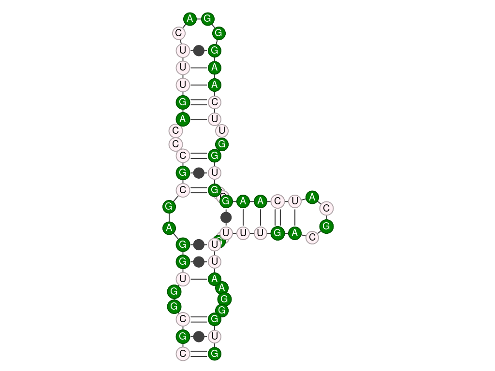
  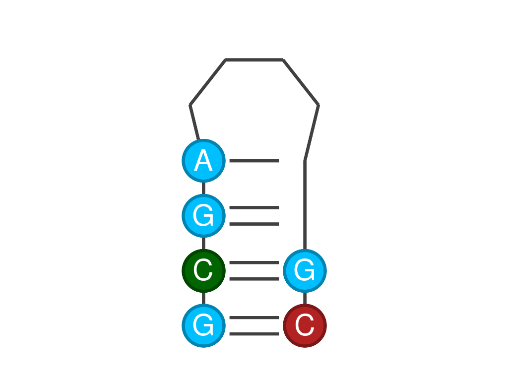
  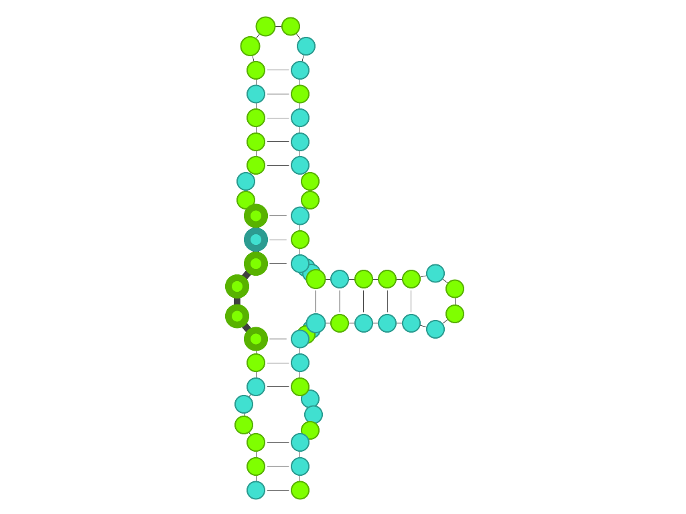
</p>

* [Installation](#installation)
* [The RNArtistCore DSL](#dsl)
  * [How to write your scripts](#script)
  * [The **```rna```** element](#molecule)
  * [The **```ss```** element](#ss)
  * [The drawing algorithm element](#drawing)
    * [The **```rnartist```** element](#rnartist)
      * [The **```data```** element](#data)
      * [The **```theme```** element](#theme)
        * [The **```color```** element](#color)
        * [The **```details```** element](#details)
        * [The **```hide```** element](#hide)
        * [The **```line```** element](#line)
    * [The **```booquet```** element](#booquet)
  * [Embedded Kotlin code](#kotlin)
* [The RNArtistCore Library](#library)

# <a name="installation"></a>Installation

You need to have the build tool [Maven](https://maven.apache.org) and a [Java distribution](https://www.oracle.com/java/technologies/javase-downloads.html) to be installed (type the commands ```mvn``` and ```java``` from a command line to check).

Clone this repository and inside its root directory type:

<pre>mvn clean package</pre>

Once done, in the subdirectory named "target", you will find the file rnartistcore-{version}-jar-with-dependencies.jar.

# <a name="dsl"></a>The RNArtistCore DSL

RNArtistCore exposes a domain-specific language (DSL) to write scripts more easily. You can have a look at examples in the file scripts/dsl.kts

To run a script, you need to have the [kotlin command installed on you computer](https://kotlinlang.org/docs/tutorials/command-line.html).

To run a script, type the following command:

<pre>kotlin -cp target/rnartistcore-{version}-jar-with-dependencies.jar your_script.kts</pre>

### <a name="script"></a>How to write your scripts

Using pseudo-code, here is the structure that your script has to fit with:

```kotlin
drawing_algorithm {

  parameter_1 = "value"
  parameter_2 = value

  secondary_structure {

    parameter_3 = "value"
    parameter_4 = value

    rna {
      parameter_5 = value
      parameter_6 = "value"
    }

  }

  theme {

  }

}
```

As you can see, you need to describe an RNA molecule, on which is constructed a secondary structure, used by an algorithm to produce a drawing. This drawing can be customized with a theme to suit your needs.

Here is a real example:

```kotlin
rnartist {
  file = "media/real_example.svg"
  ss {
    rna {
      sequence = "CAACAUCAUACGUACUGCGCCCAAGCGUAACGCGAACACCACGAGUGGUGACUGGUGCUUG"
    }
    bracket_notation =
      "(((..(((..(((..(((((....)))))..)))..(((((....)))))..)))...)))"
  }
  theme {
    details_lvl = 5

    color {
      type="A"
      value = "#A0ECF5"
    }

    color {
      type="a"
      value = "black"
    }

    color {
      type="U"
      value = "#9157E5"
    }

    color {
      type="G"
      value = "darkgreen"
    }

    color {
      type="C"
      value = "#E557E5"
    }

  }
}
```

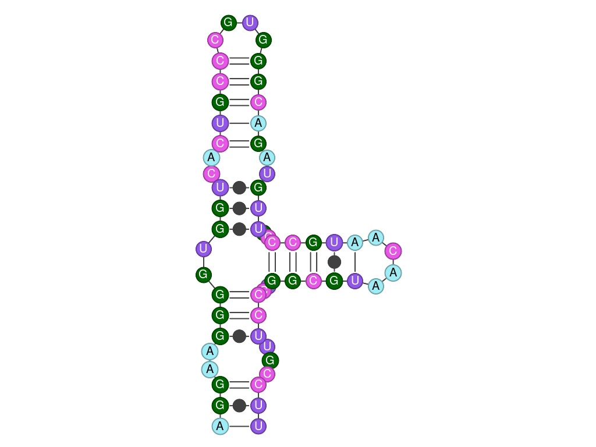

In the next paragraphs, we will detail the elements available to describe an RNA molecule, a secondary structure and a drawing algorithm.

### <a name="molecule"></a>The ```rna``` element

Using the element ```rna```, you can create an RNA molecule from scratch. The parameters available are:

* **name**: the name of the molecule (default value: **```A```**)
* **sequence**: the sequence of your molecule. If the parameter length is not provided, the sequence is mandatory
* **length**: the length of your sequence. If this parameter is provided, a random sequence will be computed. If the parameter sequence is not provided, the length is mandatory

Examples:

```kotlin
rna {
  name = "My Fav RNA"
  sequence = "GGGACCGCCCGGGAAACGGGCGAAAAACGAGGUGCGGGCACCUCGUGACGACGGGAGUUCGACCGUGA"
}
```

```kotlin
rna {
  name = "My Fav RNA 2"
  length = 50
}
```

```kotlin
rna {
  length = 200
}
```

### <a name="ss"></a>The ```ss``` element

You have three different ways to define a seconday structure:
* from scratch using the element **ss**
* from a file using elements like **vienna**, **bpseq**, **ct**, **stockholm**
* from a public database using elements like **rfam**, **rnacentral**, **pdb**

***From scratch***

The parameters available are:
* **rna**: an rna molecule described with the **```rna```** element (see previous paragraph). If you don't provide any **```rna```** element, it will be computed for you with the default name and a random sequence fitting the base-pairing constraints.
* **bracket_notation**: the secondary structure described with the dot-bracket notation

Examples:

```kotlin
ss {

  rna {
    name = "My Fav RNA"
    length = 12
  }

  bracket_notation = "((((....))))"

}
```

```kotlin
ss {

  bracket_notation = "((((....))))"

}
```

***From a file***

You don't need to provide any **```rna```** element, it will be constructed automatically from the data stored in the file.

To be able to use the PDB format, you need to have the RNAVIEW algorithm installed with the [Docker container assemble2](https://hub.docker.com/r/fjossinet/assemble2/). RNArtistCore will delegate to RNAVIEW the annotation of the 3D structure into a 2D.

The parameters available are:
* **file**: the absolute path and the name of your file
* **name**: if the file contains several molecular chains, this parameter allows to precise the one needed. If no name is provided, all the molecular chains will be processed.

Examples:
```kotlin
ss {
  bpseq {
    file = "/home/bwayne/myrna.bpseq"
  }
}
```

```kotlin
ss {
  ct {
    file = "/home/bwayne/myrna.ct"
  }
}
```

```kotlin
ss {
  vienna {
    file = "/home/bwayne/myrna.vienna"
  }
}
```

```kotlin
ss {
  pdb {
    file = "/home/bwayne/myrna.pdb"
    name = "A"
  }
}
```


```kotlin
ss {
  stockholm {
    file = "/home/bwayne/RF00072.stk"
    name = "consensus"
  }
}
```

```kotlin
ss {
  stockholm {
    file = "/home/bwayne/RF00072.stk"
    name = "AJ009730.1/1-133"
  }
}
```

```kotlin
ss {
  stockholm {
    file = "/home/bwayne/RF00072.stk"
  }
}
```
***From a public database***

You don't need to provide any **```rna```** element, it will be constructed automatically from the data stored in the database entry.

The parameters available are:
* **```id```**: the id of your database entry
* **```name```**: if the entry contains several molecular chains, this parameter allows to precise the one needed.  If no name is provided, all the molecular chains will be processed.

Examples:

```kotlin
ss {
  rfam {
    id = "RF00072"
    name = "AJ009730.1/1-133"
  }
}
```

```kotlin
ss {
  rfam {
    id = "RF00072"
    name = "consensus"
  }
}
```

```kotlin
ss {
  rfam {
    id = "RF00072"
  }
}
```

```kotlin
ss {
  pdb {
    id = "1EHZ"
  }
}
```

```kotlin
ss {
  pdb {
    id = "1JJ2"
    name = "0"
  }
}
```

```kotlin
ss {
  pdb {
    id = "1JJ2"
  }
}
```

### <a name="drawing"></a>The drawing algorithm element

Two algorithms are available:
* the one used by the graphical tool [RNArtist](https://github.com/fjossinet/RNArtist)
* booquet

Both algorithms need a secondary structure element (see previous paragraph) and save their results in SVG files. Each molecular chain will be exported in its own SVG file. Each algorithm has its own parameters to configure the drawing process and the final result.

<a name="rnartist"></a> ***The **```rnartist```** element***

The parameters available are:
* **```file```**: the absolute path and the name of the SVG output file. The name of the molecular chain will be merged to the file name.
* **```ss```**: a secondary structure element (see above)
* **```data```**: a dataset to map values to residues (see below)
* **```theme```**: to change the colors, details, line width,... for any object in the 2D (see below)

The size of the picture will fit the size of the drawing (with a minimum size of 1024x768 to see the residue characters).

<a name="data"></a> ____The **```data```** element____

Datasets can be linked to an RNA secondary structure. You can either fill the dataset within the script, or load it from a file.

```kotlin
rnartist {
    file = "example1.svg"
    ss {
        bracket_notation = "(((..(((..(((..(((((....)))))..)))..(((((....)))))..)))...)))"
    }
    data {
        "1" to 200.7
        "2" to 192.3
        "3" to 143.6
    }
}
```

```kotlin
rnartist {
    file = "example1.svg"
    ss {
        bracket_notation = "(((..(((..(((..(((((....)))))..)))..(((((....)))))..)))...)))"
    }
    data {
        file = "QuSHAPE_01_shape_mode_reactivities.txt"
    }
}
```

The values linked to each residue can be used as a selection criteria to define the colors, line width and details level (see below).

<a name="theme"></a> ____The **```theme```** element____

Using a **```theme```**, you can define your drawing options for any 2D objects, from single residues to entire structural domains like helices or junctions.

To quickly change the details level of your entire 2D, you can use the parameter named **```details_lvl```**. Five details levels are available:

```kotlin
rnartist {
    file = "media/details_lvl1.svg"
    ss {
        bracket_notation =
            "(((..(((..(((..(((((....)))))..)))..(((((....)))))..)))...)))"
    }
    theme {
        details_lvl = 1
    }
}
```

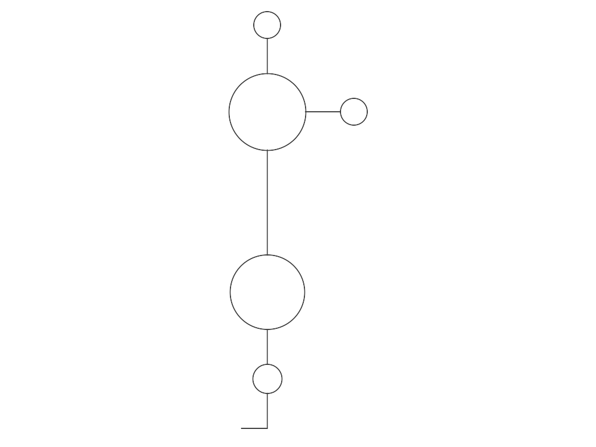

```kotlin
rnartist {
    file = "media/details_lvl2.svg"
    ss {
        bracket_notation =
            "(((..(((..(((..(((((....)))))..)))..(((((....)))))..)))...)))"
    }
    theme {
        details_lvl = 2
    }
}
```

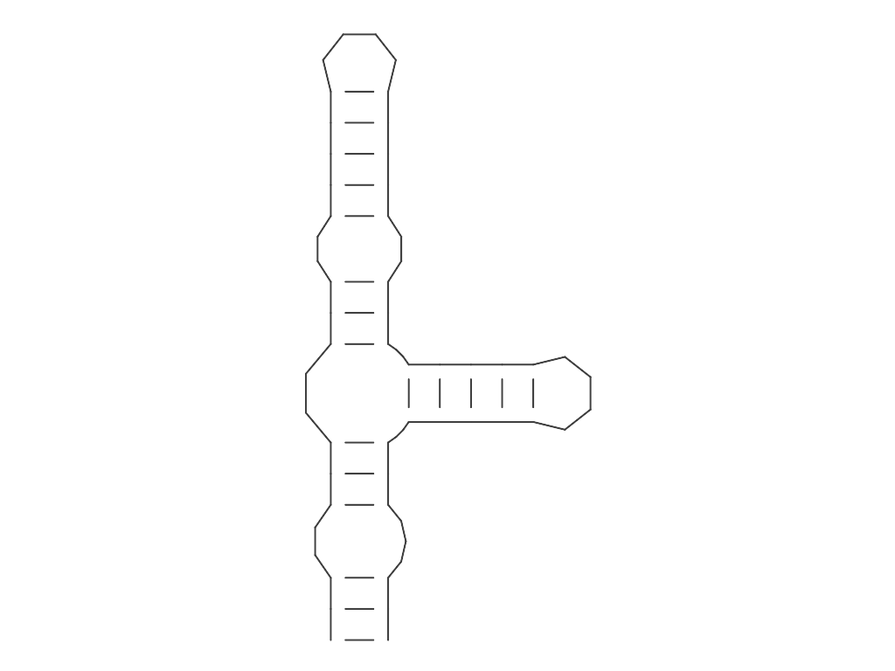

```kotlin
rnartist {
    file = "media/details_lvl3.svg"
    ss {
        bracket_notation =
            "(((..(((..(((..(((((....)))))..)))..(((((....)))))..)))...)))"
    }
    theme {
        details_lvl = 3
    }
}
```

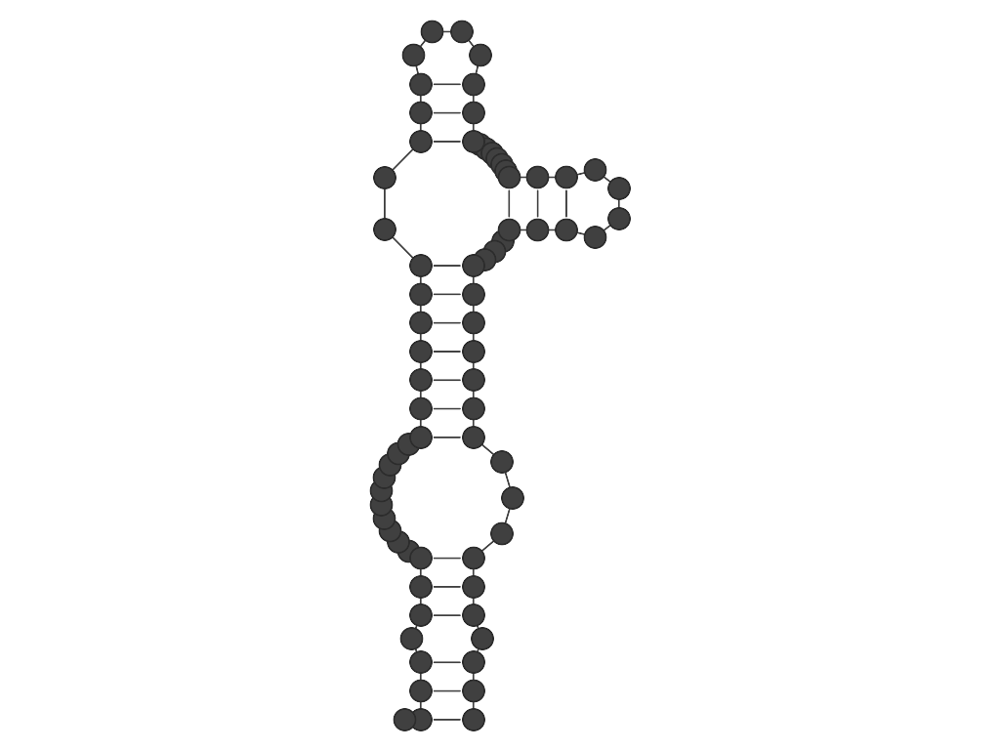

```kotlin
rnartist {
    file = "media/details_lvl4.svg"
    ss {
        bracket_notation =
            "(((..(((..(((..(((((....)))))..)))..(((((....)))))..)))...)))"
    }
    theme {
        details_lvl = 4
    }
}
```


```kotlin
rnartist {
    file = "media/details_lvl5.svg"
    ss {
        bracket_notation =
            "(((..(((..(((..(((((....)))))..)))..(((((....)))))..)))...)))"
    }
    theme {
        details_lvl = 5
    }
}
```

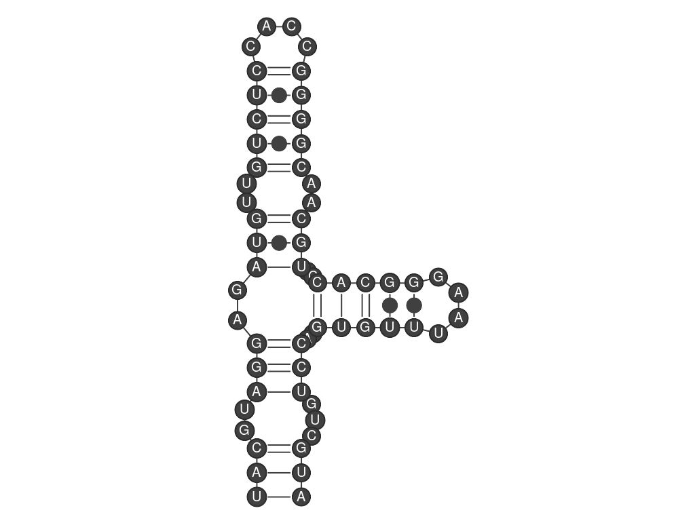

Inside a **```theme```**, you can also add several times the following elements:
* **```color```**: define the color for 2D objects
* **```details```**: define the details level for 2D objects
* **```hide```**: hide residues
* **```line```**: define the line width for 2D objects
<!--* **```highlight```**: highlight residues
  * **```type```**: can only be a lower or upper character (default is "N"). Lower or upper character will produce the same results (the character and the shape of the delected residues is hidden)
  * **```location```**: the location of the residues to hide
  * **```data```**: selection based on the values linked to the residues
  * **```color```**: an HTML color code or predefined color name (see below)
  * **```width```**: the line width-->


<a name="color"></a> ____The **```color```** element____

Parameters:
* **```value```**: an HTML color code or predefined color name (see below). If the parameter **```to```** is defined, this parameter defines the first color for the gradient.
* **```to```**: the last color in a gradient (HTML color code or predefined color name (see below))
* **```type```**: the type of the 2D objects targeted
* **```location```**: the location of the 2D objects targeted
* **```data```**: selection based on the values linked to the residues

The parameter **```type```** can have the following values:
* **```A```**, **```U```**, **```G```**, **```C```**, **```X```**, **```N```**, **```R```**, **```Y```**: capital characters for residues target the circle surrounding the residue character. **```N```** is for any residue, **```R```** for purines, and **```Y```** for pyrimidines
* **```a```**, **```u```**, **```g```**, **```c```**, **```x```**, **```n```**, **```r```**, **```y```**: lowercase characters for residues target the character inside the circle. **```n```** is for any residue, **```r```** for purines, and **```y```** for pyrimidines
* **```helix```**
* **```single_strand```**
* **```junction```**
* **```secondary_interaction```**
* **```tertiary_interaction```**
* **```phosphodiester_bond```**
* **```interaction_symbol```**
* **```pknot```**

If the parameter **```type```** is not defined, all the types available are targeted.

You can define several types in the same string using a space as separator: **```"single_strand R C interaction_symbol"```**

The parameter **```location```** needs to have the following format: **```start_position_1:length, start_position_2:length, ...```**. A 2D object is targeted if its own location is inside the one defined with this parameter.

You can define a color with its HTML color code or its name ([list of color names](https://en.wikipedia.org/wiki/Web_colors#/media/File:SVG_Recognized_color_keyword_names.svg)).

Examples:

```kotlin
rnartist {
    file = "media/all_red.svg"
    ss {
        bracket_notation =
            "(((..(((..(((..(((((....)))))..)))..(((((....)))))..)))...)))"
    }
    theme {
        details_lvl = 4

        color {
            value = "red"
        }

        color {
            type = "a c"
            value = "white"
        }

        color {
            type = "g u"
            value = "black"
            location = "10:10"
        }

    }
}
```

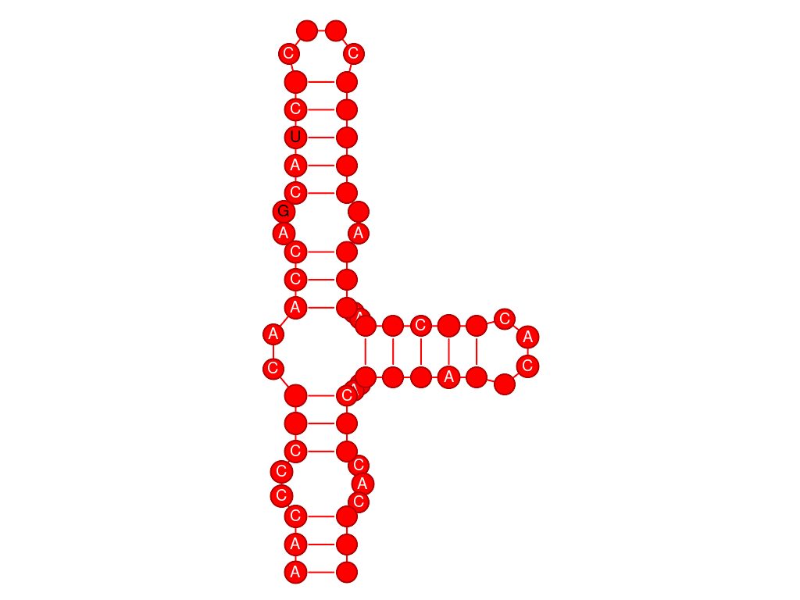

```kotlin
rnartist {
    file = "media/details_lvl5_colored.svg"
    ss {
        bracket_notation =
            "(((..(((..(((..(((((....)))))..)))..(((((....)))))..)))...)))"
    }
    theme {
        details_lvl = 5

        color {
            type = "Y"
            value = "lavenderblush"
        }

        color {
            type = "y"
            value = "black"
        }

        color {
            type = "R"
            value = "green"
        }
        
    }
}
```


If a dataset is linked to the RNA secondary structure, a colored gradient can be defined inside the **```color```** element. You need to use the parameters  **```value```** and  **```to```**. To restrict the distribution of values to be used, you can use the parameter  **```data```**. You can select values lower than a value (**```lt```**), greater than a value (**```gt```**) or between two values (**```between```**).

```kotlin
rnartist {
    file = "media/dataset.svg"
    ss {
        rna {
            sequence = "GCGAAAAAUCGC"
        }
        bracket_notation =
            "((((....))))"
    }
    data {
        "1" to 200.7
        "2" to 192.3
        "3" to 143.6
        "4" to 34.8
        "5" to 4.5
        "6" to 234.9
        "7" to 12.3
        "8" to 56.8
        "9" to 59.8
        "10" to 140.5
        "11" to 0.2
        "12" to 345.8
    }
    theme {
        details_lvl = 4
        color {
            type = "N"
            value = "lightyellow"
            to = "firebrick"
            data between 10.0..350.0
        }
        color {
            type = "n"
            value = "black"
            to = "white"
            data between 10.0..350.0
        }
        color {
            type = "N"
            value = "black"
            data lt 10.0
        }
        color {
            type = "n"
            value = "white"
            data lt 10.0
        }
    }
}
```

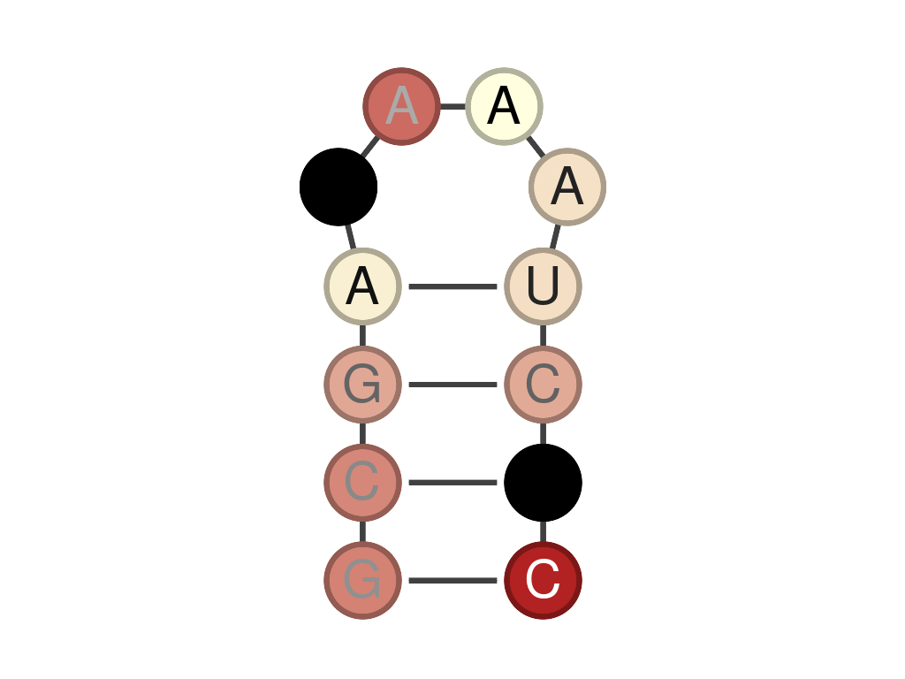

<a name="details"></a> ____The **```details```** element____

This element allows to decide if a 2D object can be drawn with full details or not. Full details means a combination of:
* the own rendering of the 2D object (if not drawn with full details, an helix is a simple line, a juntion is a circle, an interaction symbol will not render the LW symbols,...)
* allowing the children for this 2D object to be drawn (if not drawn with full details, an helix will not allow its phosphodiester bonds and secondary interactions to be drawn).

| 2D object       | "none"   | "full"   |
| :-------------: |:-------------:| ----------------|
| helix           | Line          | Render: <ul><li>phosphodiester_bond</li><li>secondary_interaction</li></ul> |
| junction        | Circle        |   Render: <ul><li>phosphodiester_bond</li><li>residues (A U G C N Y R)</li></ul> |
| single_strand   | Line          |    Render: <ul><li>phosphodiester_bond</li><li>residues (A U G C N Y R)</li></ul> |
| phosphodiester_bond   | No rendering          |    Line |
| secondary_interaction  | No rendering         |    Render: <ul><li>interaction_symbol</li><li>residues (A U G C N Y R)</li></ul> |
| interaction_symbol  | Line         |    LW symbols |
| residues (A U G C N Y R)  | Circle         |    Render: <ul><li>Circle</li><li>residue characters (a u g c n y r)</li></ul> |
| residue characters (a u g c n y r)  | No rendering         |   Character |

Examples:

```kotlin
rnartist {
    file = "media/helix_details1.svg"
    ss {
        bracket_notation =
            "..((..((((....))))..))"
    }
    theme {
        details_lvl = 1
    }
}
```
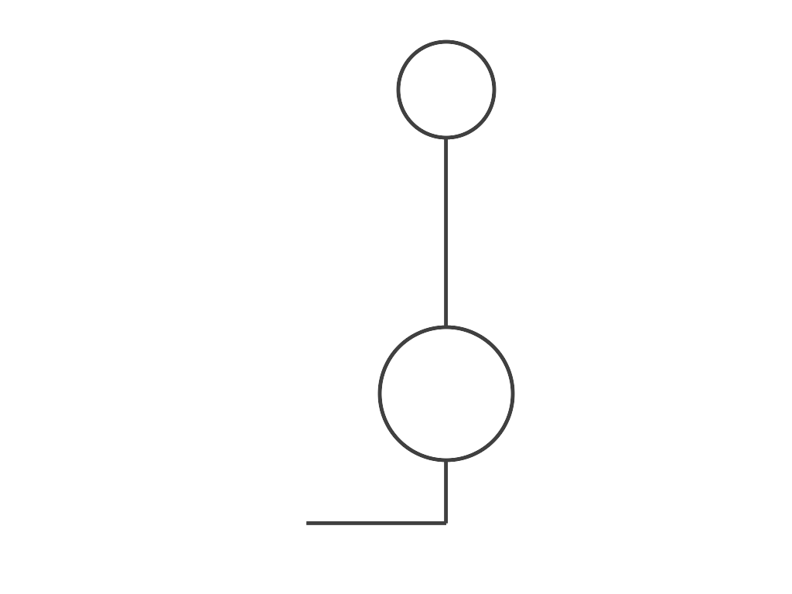

```kotlin
rnartist {
    file = "media/helix_details2.svg"
    ss {
        bracket_notation =
            "..((..((((....))))..))"
    }
    theme {
        details_lvl = 1

        details {
          type = "helix"
          value = "full"
          location="7:4,15:4"
        }
    }
}
```
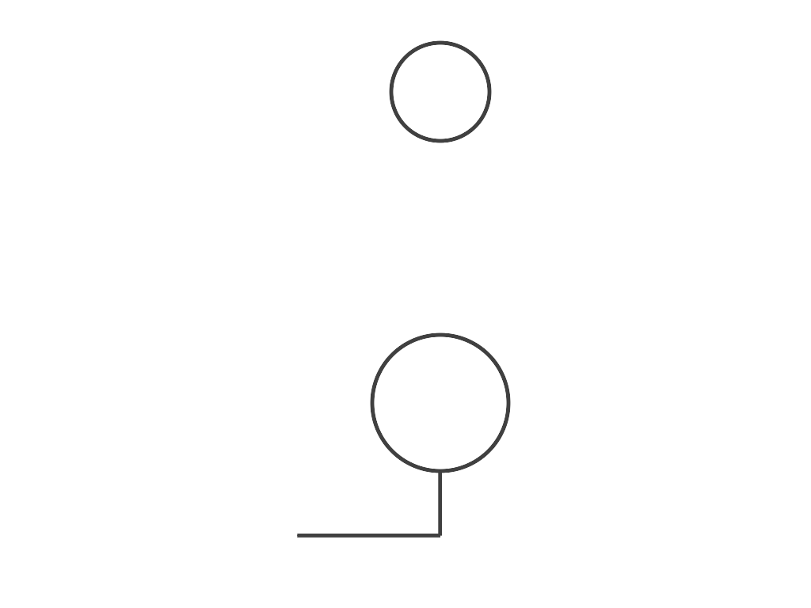

```kotlin
rnartist {
    file = "media/helix_details3.svg"
    ss {
        bracket_notation =
            "..((..((((....))))..))"
    }
    theme {
        details_lvl = 1

        details {
          type = "helix phosphodiester_bond"
          value = "full"
          location="7:4,15:4"
        }
    }
}
```
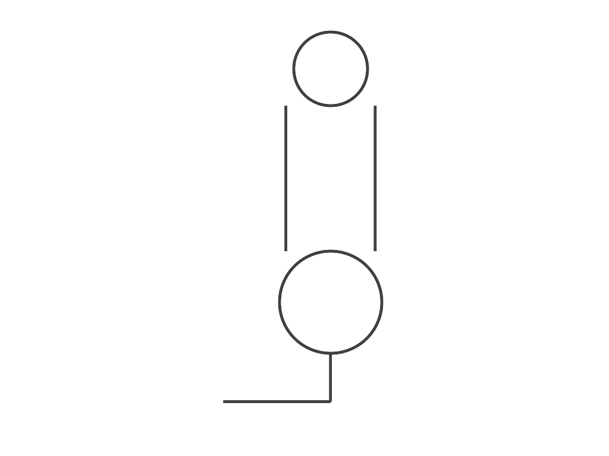

```kotlin
rnartist {
    file = "media/helix_details4.svg"
    ss {
        bracket_notation =
            "..((..((((....))))..))"
    }
    theme {
        details_lvl = 1

        details {
          type = "helix phosphodiester_bond secondary_interaction"
          value = "full"
          location="7:4,15:4"
        }
    }
}
```
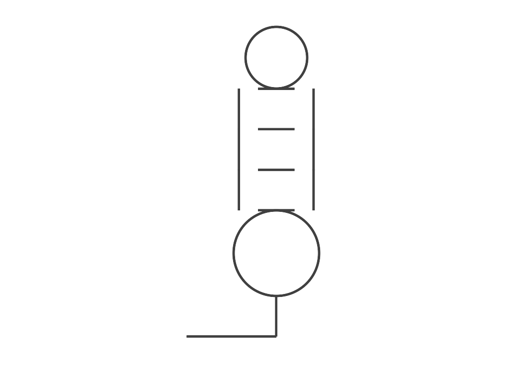

```kotlin
rnartist {
    file = "media/helix_details5.svg"
    ss {
        bracket_notation =
            "..((..((((....))))..))"
    }
    theme {
        details_lvl = 1

        details {
          type = "helix phosphodiester_bond secondary_interaction N"
          value = "full"
          location="7:4,15:4"
        }
    }
}
```
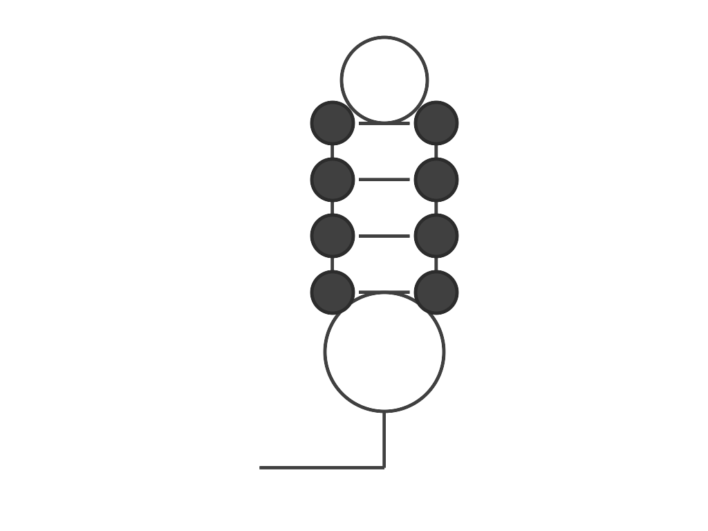

```kotlin
rnartist {
    file = "media/helix_details6.svg"
    ss {
        bracket_notation =
            "..((..((((....))))..))"
    }
    theme {
        details_lvl = 1

        details {
          type = "helix phosphodiester_bond secondary_interaction N n"
          value = "full"
          location="7:4,15:4"
        }
    }
}
```


You can then combine different details levels to have a rendering that fit your needs:

```kotlin
rnartist {
    file = "media/helix_combination_details.svg"
    ss {
        bracket_notation =
            "..((..((((....))))..))"
    }
    theme {
        details_lvl = 1

        details {
            type = "helix phosphodiester_bond"
            value = "full"
            location="7:4,15:4"
        }

        details {
            type = "secondary_interaction"
            value = "full"
            location="8,17"
        }

        details {
            type = "N"
            value = "full"
            location="8"
        }

        details {
            type = "secondary_interaction N"
            value = "full"
            location="9,16"
        }

        details {
            type = "n"
            value = "full"
            location="16"
        }
    }
}
```
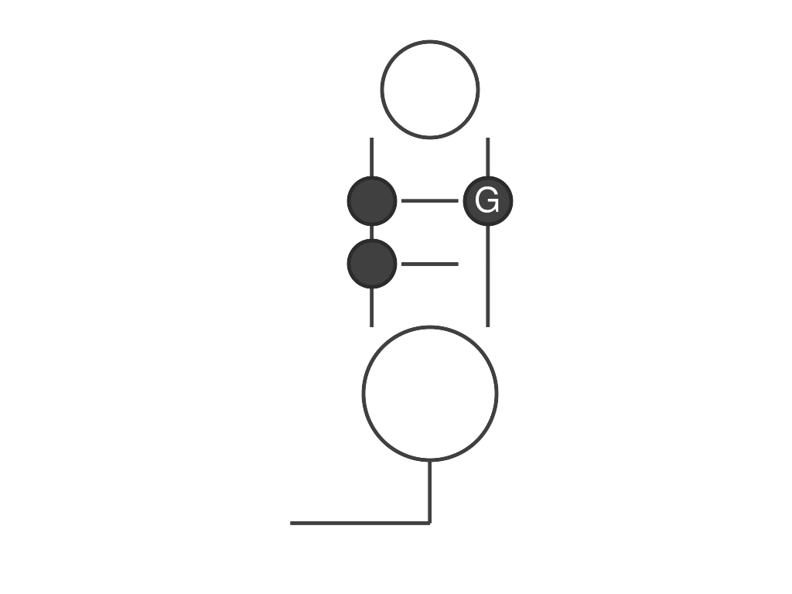

Parameters:
* **```value```**: **```"full"```** or **```"none"```**
* **```type```**: the type of the 2D objects targeted
* **```location```**: the location of the 2D objects targeted
* **```data```**: selection based on the values linked to the residues

The parameter **```type```** can have the following values:
* **```A```**, **```U```**, **```G```**, **```C```**, **```X```**, **```N```**, **```R```**, **```Y```**: capital characters for residues target the circle surrounding the residue character. **```N```** is for any residue, **```R```** for purines, and **```Y```** for pyrimidines
* **```a```**, **```u```**, **```g```**, **```c```**, **```x```**, **```n```**, **```r```**, **```y```**: lowercase characters for residues target the character inside the circle. **```n```** is for any residue, **```r```** for purines, and **```y```** for pyrimidines
* **```helix```**
* **```single_strand```**
* **```junction```**
* **```secondary_interaction```**
* **```tertiary_interaction```**
* **```phosphodiester_bond```**
* **```interaction_symbol```**
* **```pknot```**

If the parameter **```type```** is not defined, all the types available are targeted.

You can define several types in the same string using a space as separator: **```"single_strand R C interaction_symbol"```**

The parameter **```location```** needs to have the following format: **```start_position_1:length, start_position_2:length, ...```**. A 2D object is targeted if its own location is inside the one defined with this parameter.

Examples:

```kotlin
rnartist {
    file = "media/partially_detailed.svg"
    ss {
        bracket_notation =
            "(((..(((..(((..(((((....)))))..)))..(((((....)))))..)))...)))"
    }
    theme {
        details_lvl = 1

        details {
            location = "6:3,53:3"
            value = "full"
        }

        details {
            type ="helix secondary_interaction phosphodiester_bond"
            location = "16:6,24:6"
            value = "full"
        }

        details {
            location = "21:4"
            value = "full"
        }

    }
}
```

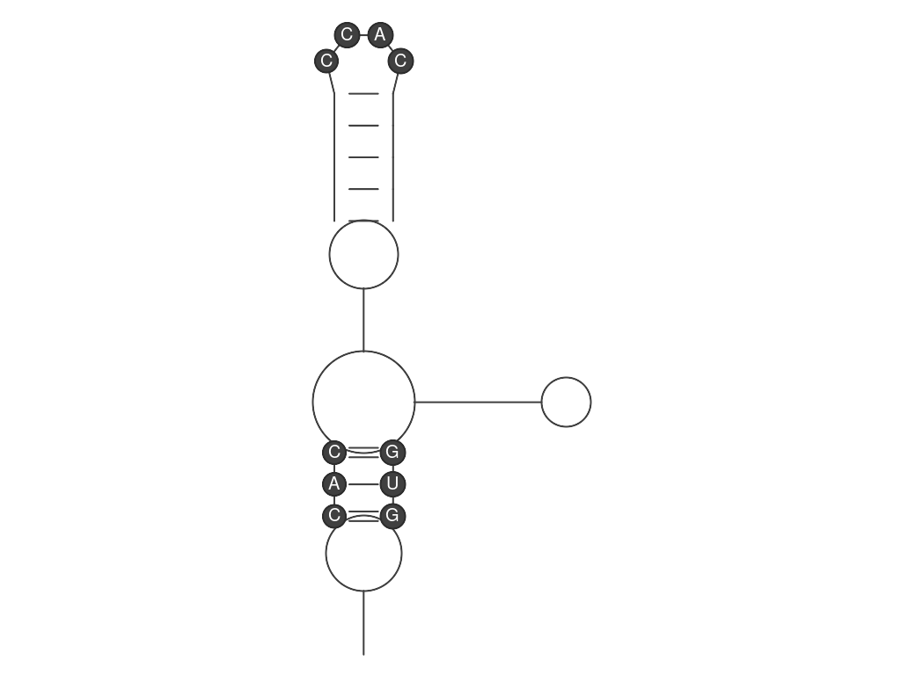

```kotlin
rnartist {
    file = "media/hide_purines.svg"
    ss {
        bracket_notation =
            ".(((.(((..........(((((((..(((....)))......(((....)))...)))))))...))).)))"
    }
    theme {
        details_lvl = 5

        details {
            type = "r R"
            location="12:20"
            value = "none"
        }

        color {
            type = "C"
            value = "deepskyblue"
        }

        color {
            type = "U"
            value = "darkgreen"
        }

    }
}
```

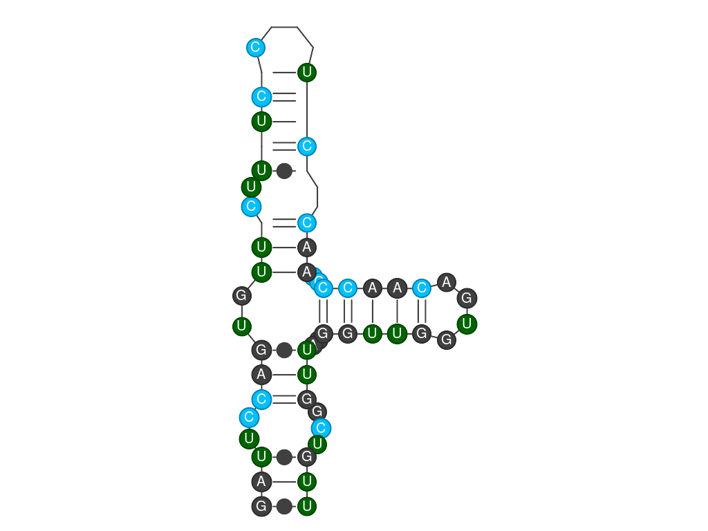

If a dataset is linked to the RNA secondary structure, the values can be used as a selection criteria. Using the parameter  **```data```**, you can select values lower than a value (**```lt```**), greater than a value (**```gt```**) or between two values (**```between```**).

```kotlin
rnartist {
    file = "media/dataset_hide.svg"
    ss {
        bracket_notation =
            "((((....))))"
    }
    data {
        "1" to 200.7
        "2" to 192.3
        "3" to 143.6
        "4" to 34.8
        "5" to 4.5
        "6" to 234.9
        "7" to 12.3
        "8" to 56.8
        "9" to 59.8
        "10" to 140.5
        "11" to 0.2
        "12" to 345.8
    }
    theme {
        details_lvl = 4

        details {
            type = "N"
            value = "none"
            data between 10.0..350.0
        }

        details {
            type = "n"
            value = "none"
            data between 10.0..350.0
        }

        color {
            type = "R"
            value = "deepskyblue"
        }

        color {
            type = "Y"
            value = "darkgreen"
        }
    }
}
```

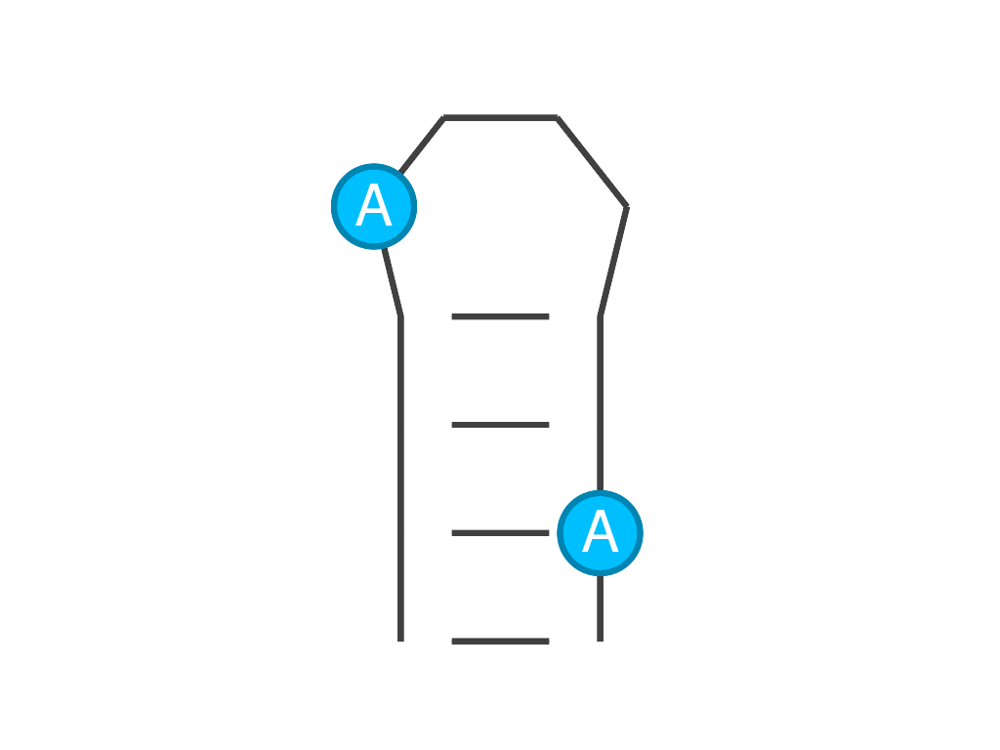

<a name="hide"></a> ____The **```hide```** element____

Parameters:
* **```type```**: can only be a lower or upper character (default is **```N```**). Lower or upper character will produce the same results (the character and the shape for the selected residues are both hidden)
* **```location```**: the location of the residues to hide
* **```data```**: selection based on the values linked to the residues

The parameter **```location```** needs to have the following format: **```start_position_1:length, start_position_2:length, ...```**. A 2D object is targeted if its own location is inside the one defined with this parameter.

If a dataset is linked to the RNA secondary structure, the values can be used as a selection criteria. Using the parameter  **```data```**, you can select values lower than a value (**```lt```**), greater than a value (**```gt```**) or between two values (**```between```**).

```kotlin
rnartist {
  file = "media/hide_pyrimidines.svg"
  ss {
    rna {
      sequence = "GCGAAAAAUCGC"
    }
    bracket_notation =
      "((((....))))"
  }
  data {
    "1" to 200.7
    "2" to 192.3
    "3" to 143.6
    "4" to 34.8
    "5" to 4.5
    "6" to 234.9
    "7" to 12.3
    "8" to 56.8
    "9" to 59.8
    "10" to 140.5
    "11" to 0.2
    "12" to 345.8
  }
  theme {
    details_lvl = 5

    hide {
      location="5:4"
    }

    hide {
      type = "Y"
      data lt 150.0
    }

    color {
      type = "R"
      value = "deepskyblue"
    }

    color {
      type = "Y"
      value = "darkgreen"
    }

    color {
      type = "Y"
      value = "firebrick"
      data gt 200.0
    }

  }
}
```


<a name="line"></a> ____The **```line```** element____

Parameters:
* **```value```**: the line width
* **```type```**: the type of the 2D objects targeted
* **```location```**: the location of the 2D objects targeted

The parameter **```type```** can have the following values:
* **```A```**, **```U```**, **```G```**, **```C```**, **```X```**, **```N```**, **```R```**, **```Y```**: capital characters for residues target the circle surrounding the residue character. **```N```** is for any residue, **```R```** for purines, and **```Y```** for pyrimidines
* **```a```**, **```u```**, **```g```**, **```c```**, **```x```**, **```n```**, **```r```**, **```y```**: lowercase characters for residues target the character inside the circle. **```n```** is for any residue, **```r```** for purines, and **```y```** for pyrimidines
* **```helix```**
* **```single_strand```**
* **```junction```**
* **```secondary_interaction```**
* **```tertiary_interaction```**
* **```phosphodiester_bond```**
* **```interaction_symbol```**
* **```pknot```**

If the parameter **```type```** is not defined, all the types available are targeted.

You can define several types in the same string using a space as separator: **```"single_strand R C interaction_symbol"```**

The parameter **```location```** needs to have the following format: **```start_position_1:length, start_position_2:length, ...```**. A 2D object is targeted if its own location is inside the one defined with this parameter.

If a dataset is linked to the RNA secondary structure, the values can be used as a selection criteria. Using the parameter  **```data```**, you can select values lower than a value (**```lt```**), greater than a value (**```gt```**) or between two values (**```between```**).

Examples:

```kotlin
rnartist {
  file = "media/lines.svg"
  ss {
    bracket_notation =
      "(((..(((..(((..(((((....)))))..)))..(((((....)))))..)))...)))"
  }
  theme {
    details_lvl = 5

    color {
      type = "Y y"
      value = "chartreuse"
    }

    color {
      type = "R r"
      value = "turquoise"
    }

    line {
      type = "phosphodiester_bond interaction_symbol"
      value = 0.1
    }

    line {
      type = "phosphodiester_bond N"
      value = 5.0
      location = "8:6"
    }

  }
}
```


<a name="booquet"></a> ***The **```booquet```** element***

This algorithm has less options than the rnartist one. The parameters available are:
* **```file```**: the absolute path and the name of the SVG output file
* **```width```**: the width of the view containing the drawing (default: 600)
* **```height```**: the height of the view containing the drawingg (default: 600)
* **```color```**: an HTML color code or color name
* **```line```**: the width for the lines
* **```junction_diameter```**: the diameter of the circles
* **```ss```**: a secondary structure element (see above)

The drawing will be automatically zoomed to fit the view.

```kotlin
booquet {
  file = "media/booquet_from_rfam.svg"
  junction_diameter = 15.0
  color = "midnightblue"
  line = 1.0
  ss {
    rfam {
      id = "RF00072"
      name = "AJ009730.1/1-133"
    }
  }
}
```


```kotlin
booquet {
  file = "media/booquet_from_vienna.svg"
  junction_diameter = 15.0
  color = "olive"
  line = 3.0
  ss {
    vienna {
      file = "samples/rna.vienna"
    }
  }
}
```


```kotlin
booquet {
  file = "media/booquet_from_ct.svg"
  junction_diameter = 15.0
  color = "darkorchid"
  ss {
    ct {
      file = "samples/ASE_00010_from_RNA_STRAND_database.ct"
    }
  }
}
```


```kotlin
booquet {
  file = "media/booquet_from_pdb.svg"
  junction_diameter = 15.0
  color = "darkmagenta"
  width = 1200.0
  height = 800.0
  line = 0.5
  ss {
    pdb {
      file = "/Volumes/Data/Projets/RNArtistCore/samples/1jj2.pdb"
      name = "0"
    }
  }
}
```


### <a name="kotlin"></a>How to embed Kotlin code

If you know Kotlin, you can embed Kotlin instructions to power your script.

```kotlin
rnartist {
  file = "media/kotlin_powered.svg"
  ss {
    bracket_notation =
      "(((..(((..(((..(((((....)))))..)))..(((((....)))))..)))...)))"
  }
  data {
    (1..secondaryStructures[0].length).forEach {
      "${it}" to Math.random()
    }
  }
  theme {
    details_lvl = 5

    color {
      type = "R"
      value = "lightyellow"
      to = "firebrick"
    }

    color {
      type = "r"
      value = "black"
      to = "white"
    }

    hide {
      type = "Y"
    }

  }
}
```


# <a name="library"></a>The RNArtistCore library

You need to have the build tool [Maven](https://maven.apache.org) installed.
No stable release for now, only snapshots. To use RNArtistCore in a Java application, just add the below dependency in your file pom.xml:

```xml
    <repositories>
  <repository>
    <id>maven-snapshots</id>
    <url>http://oss.sonatype.org/content/repositories/snapshots</url>
    <layout>default</layout>
    <releases>
      <enabled>false</enabled>
    </releases>
    <snapshots>
      <enabled>true</enabled>
    </snapshots>
  </repository>
</repositories>

<dependencies>
<dependency>
  <groupId>io.github.fjossinet.rnartist.core</groupId>
  <artifactId>rnartistcore</artifactId>
  <version>0.2.5-SNAPSHOT</version>
</dependency>
</dependencies>
```