RNArtistCore
============


RNArtistCore provides:
* an easy language (a.k.a "Domain Specific Language") to describe in scripts how you would like to draw your RNA 2Ds 
* a commandline tool to apply your drawing scripts on thousands of RNA 2Ds described in usual formats (CT, BPSEQ, VIENNA,....) or RNA 2Ds derived from 3Ds described in PDB format 

RNArtistCore can also be used as a library. It leverages the development of graphical tools dedicated to the visualization and exploration of RNA 2Ds, like [RNArtist](https://github.com/fjossinet/RNArtist).

The largest part of this documentation explains the [syntax to write your own drawing script](#dsl). But first, how to install and run RNArtistCore? 

## Prerequisites and installation

You need to have java installed on your computer and executable in a terminal. Two options to install RNArtistCore on your computer:
* download the last release available [here](https://github.com/fjossinet/RNArtistCore/releases) and unzip the zip file
* download the source code from Github. You will need the tool [maven](https://maven.apache.org/) and a Java Development Kit to be installed. In the project directory, type: <pre>mvn clean package</pre> The zip file will be created in the target subdirectory. 

## RNArtistCore from the commandline

To display the help information, you need to type the following command from a terminal:

<pre>
java -jar /path/to/your/rnartistcore-X.X.X-jar-with-dependencies.jar
</pre>

```text
RNArtistCore: a commandline tool to create and plot RNA 2D structures
=====================================================================

Usage:
------
If you already have an RNArtistCore script:

    java -jar rnartistcore-X.X.X-jar-with-dependencies.jar /path/to/your/script
    
If you don't have any RNArtistCore script:

* to compute the 2D plot for a single local structural file: 
    java -jar rnartistcore-X.X.X-jar-with-dependencies.jar [options] -f /path/to/your/structural_file
    
* to compute the 2D plots for several local structural files:  
    java -jar rnartistcore-X.X.X-jar-with-dependencies.jar [options] -d /path/to/the/root_folder/
    
* to compute the 2D plot for a database entry: 
    java -jar rnartistcore-X.X.X-jar-with-dependencies.jar [options] -e database_entry_id -o output_directory

Primary options (to define the location of your structural data):
-----------------------------------------------------------------
-f <arg>                Compute the 2D plot for a single structural file whose path is given as argument.
                        An RNArtistCore script with default parameters will be created in the same folder as the structural file.

-d <arg>                Compute the 2D plots from structural files stored in subfolders inside 
                        the root folder given as argument. If some files have already been processed, they will be ignored.

-e <arg> -o <arg>       Compute the 2D plot for a a database entry (PDB, RNACentral and Rfam supported). 
                        The argument for option -e has to be a valid ID for the database (like 1EHZ for PDB, RF00177 for Rfam or URS00000CFF65 for RNACentral).
                        An RNArtistCore script with default parameters will be created in the folder defined with the mandatory option -o.

Secondary options (to change some default parameters in the script):
--------------------------------------------------------------------
--no-png                The RNArtistCore script will not export its 2D plot(s) in PNG files. This option should not be used to 
                        create a database fully compliant with the graphical tool RNArtist. RNArtist needs PNG files to preview the 2Ds.


--with-svg              The RNArtistCore script will export its 2D plot(s) in SVG files

--from <arg>            If you're batch processing several structural files, this option allow to restart process from the file whose name without suffix 
                        is given as argument (if file named my_rna_67.vienna, then you need to type --from my_rna_67).
                        If some files have already been processed after this start file, they will be recomputed.

--min-color <arg>       Define the first color for the gradient color. The gradient color is used to 
                        incorporate quantitative values into 2D plots (default: lightyellow)

--max-color <arg>       Define the last color for the gradient color. The gradient color is used to 
                        incorporate quantitative values into 2D plots (default: firebrick)

--min-value [<arg>]     Define the min value to be used to compute the gradient color between 
                        min-color and max-color (default: 0.0)

--max-value [<arg>]     Define the max value to be used to compute the gradient color between 
                        min-color and max-color (default: 1.0)
```

As described in the help information, you can either:

* run an RNArtistCore script. RNArtistCore will execute the instructions described in this script.
* compute the 2D from a database entry. RNArtistCore will create and run a script whose name matches the entry ID and whose location is defined with the mandatory option -o. You can then edit this script to fit your peculiarities and re-run it from the commandline.
* compute the 2D from a single local structural file. RNArtistCore will create and run a script with the same name and location as the structural file. You can then edit this script to fit your peculiarities and re-run it from the commandline.
* compute the 2Ds from several local structural files. To do this, your files has to be organized like the following:
<pre>
root_folder (no structural files in the root folder)
 |
 |__subfolder_1
 |    |
 |    |_ file_1.vienna
 |    |_ file_2.vienna
 |    
 |__subfolder_2
      |
      |_ file_1.vienna
      |_ file_2.vienna
</pre>

To produce the drawings for all the structural files, type:
<pre>java -jar /path/to/your/rnartistcore-X.X.X-jar-with-dependencies.jar -d /path/to/your/root_folder</pre>

This will generate an RNartistCore script with default parameters for each structural file (with the same name and location). One generated, each script will be evaluated to plot and save each 2D in a 250x250 PNG file. 
Your root folder in now a database fully compliant with the graphical tool [RNArtist](https://github.com/fjossinet/RNArtist).

If you just want to produce your drawings with the default parameters, you can save them in 1000x1000 SVG files. To do so, you need to use the option ```--with-svg```. If you're sure to have no need of [RNArtist](https://github.com/fjossinet/RNArtist), you can use the options ```--with-svg --no-png```.

You can kill the process and restart from any file using the following command:
<pre>java -jar rnartistcore-X.X.X-jar-with-dependencies.jar -d --from name_of_a_file_without_suffix /path/to/your/root_folder</pre>

For example, if you have a structure described in a file named my_rna_325B67.vienna, you can restart the process from this file by typing:
<pre>java -jar rnartistcore-X.X.X-jar-with-dependencies.jar -d --from my_rna_325B67 /path/to/your/root_folder</pre>

All the output files (scripts, images) starting from this file will be overwritten.

After a while (RNArtistCore searches for a good non-overlapping layout for each drawing), you will get the folllowing:

<pre>
root_folder
 |
 |__subfolder_1.kts
 |__subfolder_1
 |    |
 |    |_ file_1.vienna
 |    |_ file_1.kts
 |    |_ file_2.vienna
 |    |_ file_2.kts
 |
 |__subfolder_2.kts
 |__subfolder_2
 |    |
 |    |_ file_1.vienna
 |    |_ file_1.kts
 |    |_ file_2.vienna
 |    |_ file_2.kts
 |
 |__drawings
       |
       |__subfolder_1
       |    |
       |    |_ file_1.png
       |    |_ file_1.svg
       |    |_ file_2.png
       |    |_ file_2.svg
       |
       |__subfolder_2
            |
            |_ file_1.png
            |_ file_1.svg
            |_ file_2.png
            |_ file_2.svg
</pre>

All SVG files are 1000x1000 and all PNG files are 250x250. You can load the SVG files in your fav editor (Inkscape, Affinity Designer, Illustrator,...).

If you have generated PNG files (meaning that you did not use the option ```--no-png```), you can load your root folder from within [RNArtist](https://github.com/fjossinet/RNArtist) to use it as a browsable and editable database. The PNG files are then used as previews in RNArtist.

# <a name="library"></a>RNArtistCore as a library

RNArtistCore can be added as a dependency into your own projects. No stable release for now, only snapshots. To use RNArtistCore in your Java/Kotlin application, just add the below dependency in your file pom.xml:

```xml
  <repositories>
      <repository>
        <id>maven-snapshots</id>
        <url>http://oss.sonatype.org/content/repositories/snapshots</url>
        <layout>default</layout>
        <releases>
          <enabled>false</enabled>
        </releases>
        <snapshots>
          <enabled>true</enabled>
        </snapshots>
      </repository>
  </repositories>
  
  <dependencies>
    <dependency>
      <groupId>io.github.fjossinet.rnartist</groupId>
      <artifactId>rnartistcore</artifactId>
      <version>0.3.4-SNAPSHOT</version>
    </dependency>
  </dependencies>
```
# <a name="dsl"></a>How to write your drawing script?

RNArtistCore exposes a language to write your drawing instructions more easily. All the examples described in this README are available in the file [scripts/readme_plots.kts](scripts/readme_plots.kts). 

Please note that this is still a work under development and that all instructions are not stable. You can take a look at the [changelog](Changelog.md) for details concerning the modifications. 

* [Important syntax rules](#important-syntax-rules)
* [The outputs of a script](#script-outputs)
* [The **```rnartist```** element](#rnartist)
* [The **```svg```** and **```png```** elements](#output) 
* [The **```ss```** element](#ss)
  * [The **```parts```** element](#parts)
  * [The **```bn```** element](#bn)
  * [The ```bpseq```, ```ct```, ```vienna```, ```pdb``` and ```stockholm``` elements](#file)
  * [The ```rfam```,  ```pdb``` and ```rnacentral``` elements](#database)
* [The **```theme```** element](#theme)
  * [The **```details```** and **```scheme```** properties](#details)
  * [The **```color```** element](#color)
  * [The **```show```** element](#show)
  * [The **```hide```** element](#hide)
  * [The **```line```** element](#line)
* [The **```layout```** element](#layout)
* [The **```data```** element](#data)

Roughly, an RNArtistCore script is made with different sections:

```kotlin
rnartist {

  svg {
    //how to export the 2D in an SVG file 
  }

  png {
    //how to export the 2D in a PNG file
  }

  ss {
    //the description of your 2D (bracket notation, parts or external file)     
  }

  data {
    //quantitative values to link to your 2D (listed here or external file)
  }

  theme {
    //how to paint your 2D
  }

  layout {
    //how to layout your 2D
  }

}
```

Here is a more concrete example:

```kotlin
rnartist {
  
  svg {
    path = "rnartist_outputs/"
  }
  
  ss {
    bn {
      seq = "CAACAUCAUACGUACUGCGCCCAAGCGUAACGCGAACACCACGAGUGGUGACUGGUGCUUG"
      value =
        "(((..(((..(((..(((((....)))))..)))..(((((....)))))..)))...)))"
      name = "concrete_example"
    }
  }
  theme {
      details {
        value = 5
      }

      color {
        type="A"
        value = "#A0ECF5"
      }

      color {
        type="a"
        value = "black"
      }

      color {
        type="U"
        value = "#9157E5"
      }

      color {
        type="G"
        value = "darkgreen"
      }

      color {
        type="C"
        value = "#E557E5"
      }
    }

  }
}
```


## <a name="important-syntax-rules"></a> ***Important syntax rules***

* a path has to be defined using the invariant separator "/", even if you're using Windows. For example:

```kotlin
rnartist {
  svg {
    path = "C:/Users/me/svg/"    
  }
  
  ss {
    vienna {
      file = "C:/Users/me/vienna/test.vienna"
    }
  }
}
```
* if a path doesn't start with "/" (Linux/MacOS) or "[A-Z]:/" (Windows), it is considered as a relative path (meaning that it is added to the absolute path of the rnartistcore jar file used to run the script).
* the data element has to be defined before any layout or theme element
* only a single layout, theme or data element is expected inside an rnartist element. The syntax will evolve to allow several data elements (one per dataset) with the ability to choose the dataset to be used.
* if several 2Ds are loaded at once, beside the SVG/PNG exports, RNArtistCore will also generate a copy of the running script for each 2D computed. If your input for the 2D was a file (Vienna for exemple), this script will have the same name and location. If the 2D was described inside the script (using a bracket notation for example), the file will have the same location than the rnartistcore jar and the name you gave to the 2D in the script. Each script will have the same instructions than the original one, except that it will only target a single 2D. You can then modify this script (layout, theme, output size,...) and run it without impacting the other 2Ds.

## <a name="script-outputs"></a> ***The outputs of a script***

In parallel with the SVG/PNG files, a running script creates a new RNArtistCore script for each 2D processed, with the same name and location as the structural file (and with a .kts suffix). 

Each script created contains the same instructions than the running script but target a single 2D. It is supplemented with the description of the non-overlapping layout computed for this 2D. 

If the running script was already named and located as the structural file, it will be updated to store the description of the non-overlapping layout computed. 

If the 2D was described inside the script (using a bracket notation for example), the new script will have the same location than the rnartistcore jar and the name you gave to the 2D in the running script.

## <a name="rnartist"></a> ***The **```rnartist```** element***

The parameters available for this algorithm are:
* **```svg``` or ```png```** (mandatory): the element to define how to save the drawing in an SVG or PNG file
* **```ss```** (mandatory): a secondary structure element
* **```theme```**: element to change the colors, details, line width,... for any object in the 2D
* **```layout```**: element to change the default layouts for the junctions
* **```data```**: element to link a dataset to the 2D

### <a name="output"></a>The ```svg``` and ```png``` elements

The parameters available are:

* **path** (mandatory): the path for the saving directory. The file will be created in this directory and its name will correspond to the name of the input file or the name of the molecule if the 2D was not described in a local file (see below).

```kotlin
rnartist {
  svg {
    path = "media/"    
  }
  
  ss {
    bn {
      value = "((((....))))"
    }
  }
}
```

### <a name="ss"></a>The ```ss``` element

You have different ways to define a secondary structure:
* by describing all the structural elements yourself using the element **```parts```**
* from a bracket notation using the element **```bn```**
* from a file using the elements **```vienna```**, **```bpseq```**, **```ct```**, or **```stockholm```**
* from a public database using the elements **```rfam```**, **```rnacentral```**, or **```pdb```**

#### <a name="parts"></a>The ```parts``` element

Inside an element ```parts```, you need to describe your 2D with the elements ```rna``` and ```helix``` 

The element ```rna``` needs at least an attribute seq or an attribute length:
* **seq** (mandatory in no length): the sequence of your molecule. If this parameter is not defined, a random sequence is computed. Each execution of the script will compute a different sequence.
* **length** (mandatory if no seq): the length of your molecule. If this parameter is defined, a random sequence is computed. Each execution of the script will compute a different sequence.
* **name**: the name of the molecule (default: **```A```**)

The ```helix``` element needs at least a location:
* **name**: the name of the helix
* **location** (mandatory): the location of the helix

The parameter **```location```** needs to have the following format:

```kotlin
location {
    1 to 10
    30 to 40
}
```
In this example, the location is made with absolute positions from 1 to 10 and 30 to 40 (inclusive). An object 2D is targeted if its own location is inside the one defined with this parameter.

```kotlin
rnartist {

  png {
    path = "media/"
  }

  ss {
    parts {
      rna {
        seq = "ACAUAGCGUUCGCGCGUGUUCCUGUAGUUAAACUUAGAGUAUCUGUACUUAGAAUUAAUGUUGGAGGCCCAACAAUGGGUGUGGAUCAAUCGUAGUUAUUU"
        name = "rna_and_helix_elements"
      }
      helix {
        name = "H1"
        location {
          1 to 3
          17 to 19
        }
      }
      helix {
        name = "H2"
        location {
          6 to 8
          13 to 15
        }
      }
      helix {
        name = "H3"
        location {
          23 to 25
          39 to 41
        }
      }
      helix {
        name = "H4"
        location {
          28 to 30
          35 to 37
        }
      }
      helix {
        name = "H5"
        location {
          45 to 47
          80 to 82
        }
      }
      helix {
        name = "H6"
        location {
          48 to 50
          64 to 66
        }
      }
      helix {
        name = "H7"
        location {
          53 to 55
          60 to 62
        }
      }
      helix {
        name = "H8"
        location {
          69 to 71
          76 to 78
        }
      }
      helix {
        name = "H9"
        location {
          83 to 85
          99 to 101
        }
      }
      helix {
        name = "H10"
        location {
          88 to 90
          95 to 97
        }
      }
    }
  }

  theme {
    details {
      value = 1
    }
  }
}
```

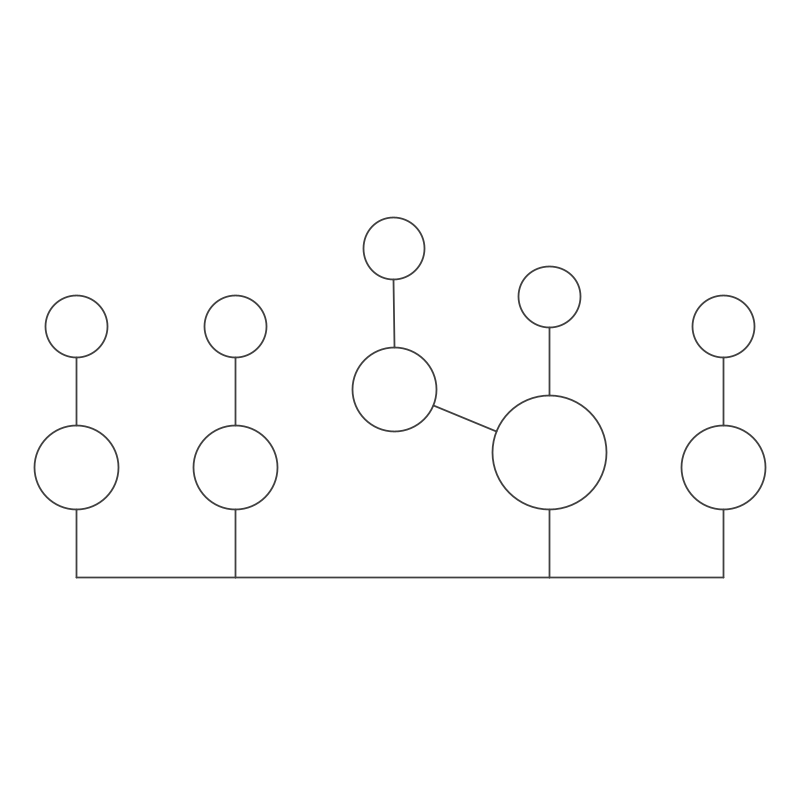

#### <a name="bn"></a>The ```bn``` element

The parameters available are:
* **value** (mandatory): the secondary structure described with the dot-bracket notation
* **name**: the name of the molecule (default: **```A```**)
* **seq**: the sequence of your molecule. If this parameter is not defined, a random sequence is computed. Each execution of the script will compute a different sequence.

```kotlin
rnartist {
  svg {
    path = "media/"
  }
  
  ss {
    bn {
      value = "((((....))))"
    }
  }
}
```

```kotlin
rnartist {
  svg {
    path = "media/"
  }
  
  ss {
    bn {
      value = "((((....))))"
      name = "My Fav RNA"
    }
  }
}
```

```kotlin
rnartist {
  svg {
    path = "media/"
  }
  
  ss {
    bn {
      value = "((((....))))"
      seq = "GGGGAAAACCCC"
      name = "My Fav RNA"
    }
  }
}
```

#### <a name="file"></a>The ```bpseq```, ```ct```, ```vienna```, ```pdb``` and ```stockholm``` elements

The secondary structure will be constructed from the data stored in the file.

The parameters are:
* **file** or **path** (mandatory): the file property defines the absolute path of a single input file. The path property defines the absolute path of a folder containing input files. 
* **name**: if the file contains several rnas, this parameter allows to precise the one you want to use. If no name is provided, all rnas will be processed. Concerning the Stockholm format, you can use the name "consensus" to plot the consensus structure.

```kotlin
rnartist {
  png {
    path = "media/"
  }

  ss {
    bpseq {
      file = "myrna.bpseq"
    }
  }
}
```

```kotlin
rnartist {
  png {
    path = "media/"
  }

  ss {
    vienna {
      path = "/Users/bwayne/project_1/my_vienna_files/"
    }
  }
}
```

```kotlin
rnartist {
  png {
    path = "media/"
  }

  ss {
    pdb {
      file = "myrna.pdb"
      name = "A"
    }
  }
}
```


```kotlin
rnartist {
  png {
    path = "media/"
  }

  ss {
    stockholm {
      file = "./my_files/RF00072.stk"
      name = "consensus"
    }
  }
}
```

```kotlin
rnartist {
  png {
    path = "media/"
  }

  ss {
    stockholm {
      file = "C:/project/RF00072.stk"
      name = "AJ009730.1/1-133"
    }
  }
}
```

### <a name="database"></a>The ```rfam```,  ```pdb``` and ```rnacentral``` elements

The secondary structure will be constructed from the data stored in a database entry.

The parameters are:
* **```id```** (mandatory): the id of your database entry
* **```name```**: if the entry contains several rnas, this parameter allows to precise the one you want to use. If no name is provided, all the rnas will be processed.  Concerning Rfam, you can use the name "consensus" to plot the consensus structure.

```kotlin
ss {
  rfam {
    id = "RF00072"
    name = "AJ009730.1/1-133"
  }
}
```

```kotlin
ss {
  rfam {
    id = "RF00072"
    name = "consensus"
  }
}
```

```kotlin
ss {
  pdb {
    id = "1EHZ"
  }
}
```

```kotlin
ss {
  pdb {
    id = "1JJ2"
    name = "0"
  }
}
```

```kotlin
ss {
  rnacentral {
      id = "URS00000CFF65"
  }
}
```

The element ```rfam``` can contain an attribute named ```use alignment numbering```. If this attribute is set, the locations described in the script will be understood as locations in the original alignment.

```kotlin
ss {
  rfam {
    id = "RF00072"
    name = "consensus"
    use alignment numbering
  }
}
```

## <a name="theme"></a>The **```theme```** element

Using this element, you choose the rendering level for any object in the 2D drawing, from single residues to entire structural domains.
Each object can be lowly or highly rendered. In general, an object 2D produces a simple shape when it is lowly rendered and it doesn't allow its children to be rendered.

Object 2D | Referenced as            |                parent                |                   children                    | lowly rendered | highly rendered
--- |--------------------------|------------------------------------|---------------------------------------------|--------------|---------------
Helix | helix                    |                  2D                  | Secondary Interaction<br/>Phosphodiester Bond |  single line   | children rendering
Junction | junction                 |                  2D                  |     Residue Shape<br/>Phosphodiester Bond     |     circle     | children rendering
Single Strand | single_strand            |                  2D                  |     Residue Shape<br/>Phosphodiester Bond     |  single line   | children rendering
Secondary Interaction | secondary_interaction    |                Helix                 |     Residue Shape<br/>Interaction Symbol      |     | children rendering
Tertiary Interaction | tertiary_interaction     |                  2D                  |              Interaction Symbol               |  single line   | children rendering
Phosphodiester Bond | phosphodiester_bond      | Helix<br/>Junction<br/>Single Strand |                                               |      single line | single line
Residue Shape | N, X, A, U, G, C, R or Y | Secondary Interaction<br/>Junction<br/>Single Strand |               Residue Character               |                | shape (circle) + children rendering
Residue Character | n, x, a, u, g, c, r or y | Residue Shape|                                               |                |  character
Interaction Symbol | interaction_symbol       | Secondary Interaction<br/>Tertiary Interaction |                                               |  single line   | symbol (triangle, circle, square, double lines,...)

Concerning junctions, you can be more specific:

Object 2D | Referenced as |
--- |---------------|
Apical Loops | apical_loop   |
Inner Loops | inner_loop    |
3-Way Junctions | 3_way         |
4-Way Junctions | 4_way         |

Concerning objects 2D that can have different types of parent (Phosphodiester Bond, Residue Shape), the character @ allows you to be more specific:

Object 2D | Referenced as             |
--- |---------------------------|
Phosphodiester Bond in Helices | phosphodiester_bond@helix |
Adenine Shapes in Junctions | A@junction                |
Purine Characters in Inner loops | r@inner_loop              |
and so on.... |                           |

A **```theme```** element can contains a single **```details```** element (to quickly render the entire 2D) and one or several **```color```**, **```line```**, **```show```** and/or **```hide```** elements:
* **```color```**: defines the color for objects 2D
* **```show```**: highly render objects 2D
* **```hide```**: lowly render objects 2D
* **```line```**: set the line width for objects 2D

The order of the elements ```color```, ```show```, ```hide``` and ```line``` is taken into account inside the element ```theme```. 

### <a name="details"></a> The **```details```** and **```scheme```** elements

The **```scheme```** element allows to map a color scheme on the full 2D. It can be:
* Persian Carolina
* Snow Lavender
* Fuzzy French
* Chestnut Navajo
* Irresistible Turquoise
* Charm Jungle
* Atomic Xanadu
* Pale Coral
* Maximum Salmon
* Pacific Dream
* New York Camel
* Screamin' Olive
* Baby Lilac
* Celeste Olivine
* Midnight Paradise
* African Lavender
* Charcoal Lazuli
* Pumpkin Vegas

To quickly change the rendering level of an entire 2D, you can use the element named **```details```**. Five details levels are available:

Details level | Helix | Junction | Single Strand | Phosphodiester Bond  | Secondary Interaction | Residue Shape | Residue Character | Interaction Symbol |
---|-------|----------|---|---|-----------------------|---|---|---|
1| Low   | Low      |Low |Low | Low                   |Low |Low |Low |
2| High  | High      |High |High | High                  |Low |Low |Low |
3| High   | High      |High |High | High                  |High |Low |Low |
4| High   | High      |High |High | High                  |High |High |Low |
5| High   | High      |High |High | High                  |High |High |High |

_____Level 1_____

```kotlin
rnartist {
  png {
    path = "media/"
  }
  ss {
    bn {
      value =
        "(((..(((..(((..(((((....)))))..)))..(((((....)))))..)))...)))"
      name = "details_lvl1"
    }
  }
  theme {
    details {
        value = 1
    }

    color {
      type = "helix"
      value = "red"
    }

    color {
      type = "junction"
      value = "green"
    }
    
  }
}
```

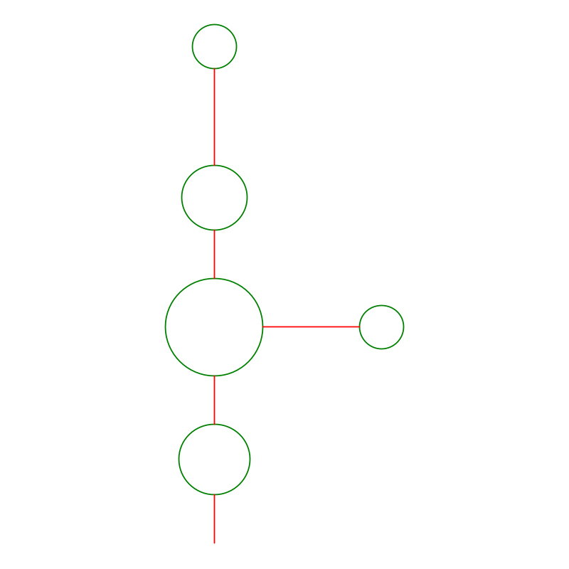

_____Level 2_____

```kotlin
rnartist {
  png {
    path = "media/"
  }
  ss {
    bn {
      value =
        "(((..(((..(((..(((((....)))))..)))..(((((....)))))..)))...)))"
      name = "details_lvl2"
    }
  }
  theme {
    details {
      value = 2
    }
    
    color { 
      type = "helix"
      value = "red"
    }

    color {
      type = "junction"
      value = "green"
    }
  }
}
```


_____Level 3_____

```kotlin
rnartist {
  png {
    path = "media/"
  }
  ss {
    bn {
      value =
        "(((..(((..(((..(((((....)))))..)))..(((((....)))))..)))...)))"
      name = "details_lvl3"
    }
  }
  theme {
    details {
      value = 3
    }
    scheme {
        value = "Pumpkin Vegas"
    }
  }
}
```


_____Level 4_____

```kotlin
rnartist {
  png {
    path = "media/"
  }
  ss {
    bn {
      value =
        "(((..(((..(((..(((((....)))))..)))..(((((....)))))..)))...)))"
      name = "details_lvl4"
    }
  }
  theme {
    details {
      value = 4
    }
    scheme {
      value = "Pumpkin Vegas"
    }
  }
}
```


_____Level 5_____

```kotlin
rnartist {
  png {
    path = "media/"
  }
  ss {
    bn {
      value =
        "(((..(((..(((..(((((....)))))..)))..(((((....)))))..)))...)))"
      name = "details_lvl5"
    }
  }
  theme {
    details {
      value = 5
    }
    scheme {
      value = "Pumpkin Vegas"
    }
  }
}
```

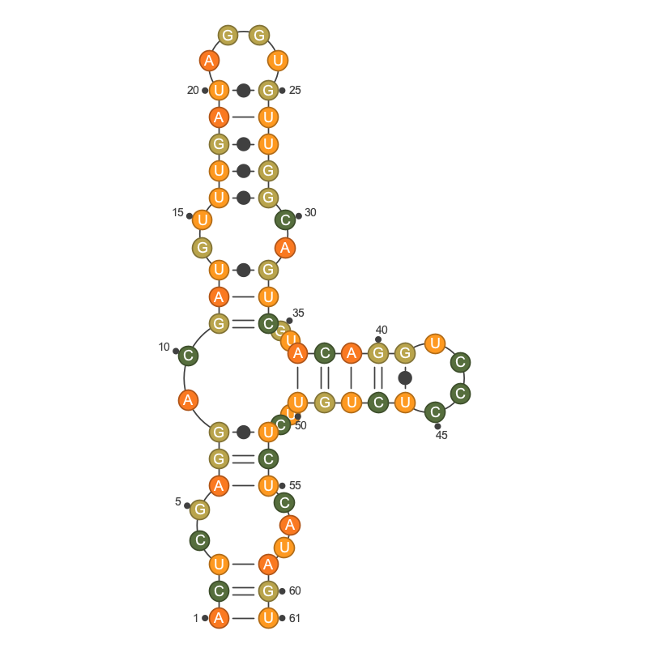

### <a name="color"></a> The **```color```** element

Parameters:
* **```value```**: an HTML color code or predefined [color names](https://en.wikipedia.org/wiki/Web_colors#//project/media/File:SVG_Recognized_color_keyword_names.svg). If the parameter **```to```** is defined, this parameter defines the first color for the gradient.
* **```to```**: the last color in a gradient (HTML color code or predefined [color names](https://en.wikipedia.org/wiki/Web_colors#//project/media/File:SVG_Recognized_color_keyword_names.svg))
* **```type```**: the type of objects 2D targeted (check this [table](#theme) for details)
* **```location```**: the location of objects 2D targeted
* **```data```**: selection based on the values linked to the residues  (see explanation for this element below)
  
If the parameter **```type```** is not defined, all types are targeted. You can define several types in the same string using a space as separator: **```"single_strand R C interaction_symbol"```**

The parameter **```location```** needs to have the following format:

```kotlin
location {
    1 to 10
    30 to 40
}
```
In this example, the location is made with absolute positions from 1 to 10 and 30 to 40 (inclusive). An object 2D is targeted if its own location is inside the one defined with this parameter.

```kotlin
rnartist {
  png {
    path = "media/"
  }
  ss {
    bn {
      seq = "CAGAUAAGAAGGUUCCCCGAUAUGUUGGGCAACCAAAGAAUUCAUGUUCUUCCUUUGUUUG"
      value =
        "(((..(((..(((..(((((....)))))..)))..(((((....)))))..)))...)))"
      name = "nice_colors"
    }
  }
  theme {
    details {
        value = 5
    }

    color {
      type = "Y"
      value = "lavenderblush"
    }

    color {
      type = "y"
      value = "black"
    }

    color {
      type = "R"
      value = "red"
    }

    color {
      type = "r"
      value = "white"
    }

    color {
      type = "G g"
      value = "#ed781f"
      location {
        5 to 20
      }
    }
  }
}
```

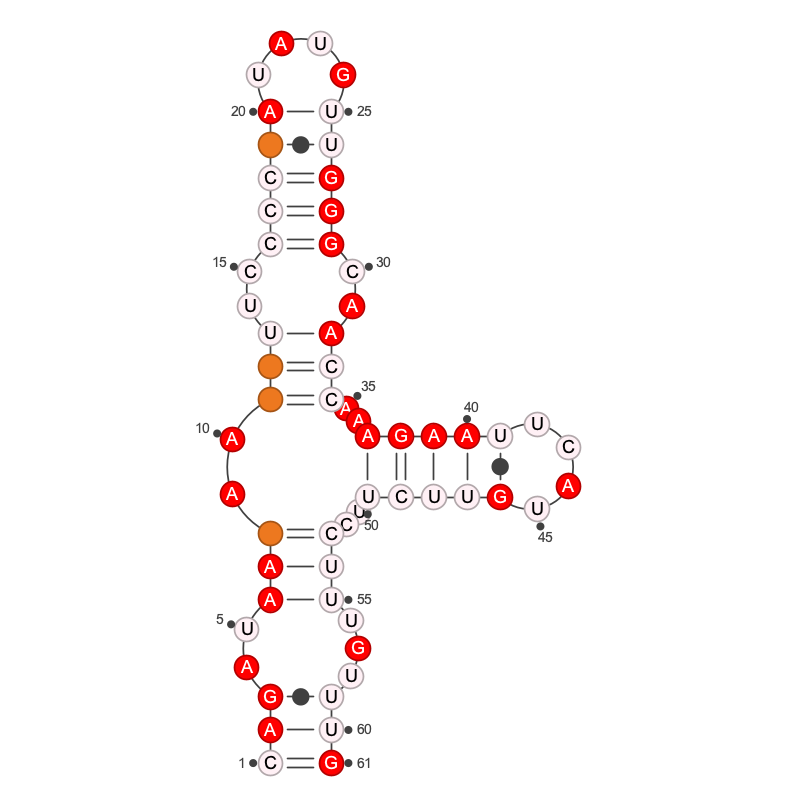

### <a name="show"></a> The **```show```** element

This element allows to highly render a 2D object.

Parameters:
* **```type```**: the type of objects 2D targeted (check this [table](theme) for details)
* **```location```**: the location of 2D objects targeted
* **```data```**: selection based on the values linked to the residues (see explanation for this element below)

An empty ```show``` element will do nothing.

If the parameter **```type```** is not defined, all types are targeted. You can define several types in the same string using a space as separator: **```"single_strand R C interaction_symbol"```**

The parameter **```location```** needs to have the following format:

```kotlin
location {
    1 to 10
    30 to 40
}
```
In this example, the location is made with absolute positions from 1 to 10 and 30 to 40 (inclusive). A 2D object is targeted if its own location is inside the one defined with this parameter.

### <a name="hide"></a> The **```hide```** element

The ```hide``` element does the opposite of the ```show``` element.

Parameters:
* **```type```**: the type of objects 2D targeted (check this [table](theme) for details)
* **```location```**: the location of objects 2D targeted
* **```data```**: selection based on the values linked to the residues (see explanation for this element below)

An empty ```hide``` element will do nothing.

If the parameter **```type```** is not defined, all types are targeted. You can define several types in the same string using a space as separator: **```"single_strand R C interaction_symbol"```**

The parameter **```location```** needs to have the following format:

```kotlin
location {
    1 to 10
    30 to 40
}
```
In this example, the location is made with absolute positions from 1 to 10 and 30 to 40 (inclusive). A 2D object is targeted if its own location is inside the one defined with this parameter.

Depending of the value of the ```details``` element, you will need to use elements ```show``` or  ```hide``` to get the result you want. In the following examples, we start with the details level 5 for the full 2D and we hide less and less children elements of a single helix defined by its location.

```kotlin
rnartist {
  png {
    path = "media/"
  }

  ss {
    bn {
      seq = "CUUACUCGAGUGACCUUGCUUG"
      value = "..((..((((....))))..))"
      name = "helix_lvl0"
    }
  }

  theme {
    details {
      value = 5
    }

    scheme {
      value = "Celeste Olivine"
    }

    hide {
      type = "helix"
      location {
        7 to 10
        15 to 18
      }
    }
  }
}
```
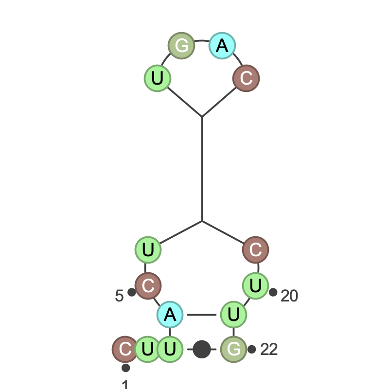

```kotlin
rnartist {
  png {
    path = "media/"
  }

  ss {
    bn {
      seq = "CUUACUCGAGUGACCUUGCUUG"
      value = "..((..((((....))))..))"
      name = "helix_lvl1"
    }
  }

  theme {
    details {
      value = 5
    }

    scheme {
      value = "Celeste Olivine"
    }

    hide {
      type = "secondary_interaction"
      location {
        7 to 10
        15 to 18
      }
    }
  }
}
```


```kotlin
rnartist {
  png {
    path = "media/"
  }

  ss {
    bn {
      seq = "CUUACUCGAGUGACCUUGCUUG"
      value = "..((..((((....))))..))"
      name = "helix_lvl2"
    }
  }

  theme {
    details {
      value = 5
    }

    scheme {
      value = "Celeste Olivine"
    }

    hide {
      type = "N interaction_symbol"
      location {
        7 to 10
        15 to 18
      }
    }
  }
}
```


```kotlin
rnartist {
  png {
    path = "media/"
  }

  ss {
    bn {
      seq = "CUUACUCGAGUGACCUUGCUUG"
      value = "..((..((((....))))..))"
      name = "helix_lvl3"
    }
  }

  theme {
    details {
      value = 5
    }

    scheme {
      value = "Celeste Olivine"
    }

    hide {
      type = "n interaction_symbol"
      location {
        7 to 10
        15 to 18
      }
    }
  }
}
```


```kotlin
rnartist {
  png {
    path = "media/"
  }

  ss {
    bn {
      seq = "CUUACUCGAGUGACCUUGCUUG"
      value = "..((..((((....))))..))"
      name = "helix_lvl4"
    }
  }

  theme {
    details {
      value = 5
    }

    scheme {
      value = "Celeste Olivine"
    }

    hide {
      type = "interaction_symbol"
      location {
        7 to 10
        15 to 18
      }
    }
  }
}
```
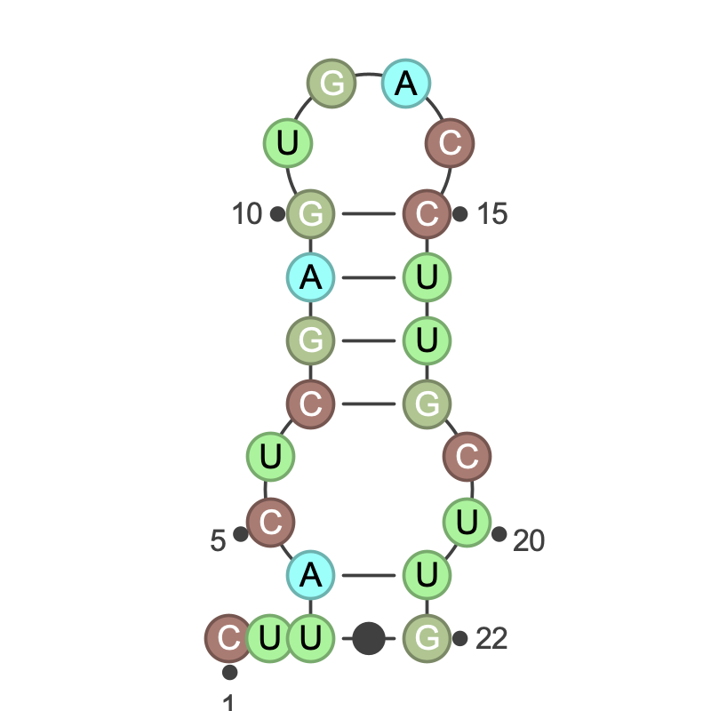

```kotlin
rnartist {
  png {
    path = "media/"
  }

  ss {
    bn {
      seq = "CUUACUCGAGUGACCUUGCUUG"
      value = "..((..((((....))))..))"
      name = "helix_lvl5"
    }
  }

  theme {
    details {
      value = 5
    }

    scheme {
      value = "Celeste Olivine"
    }
  }
}
```


Now we set the 2D at details level 2 and we add new elements to be draw with ```show``` elements:

```kotlin
rnartist {
  png {
    path = "media/"
  }

  ss {
    bn {
      seq = "CUUACUCGAGUGACCUUGCUUG"
      value = "..((..((((....))))..))"
      name = "helix_hidden_parts"
    }
  }

  theme {
    details {
      value = 2
    }

    scheme {
      value = "African Lavender"
    }

    show {
      type = "helix phosphodiester_bond secondary_interaction"
      location {
        7 to 8
        10 to 10
        15 to 15
        17 to 18
      }
    }

    show {
      type = "N"
      location {
        7 to 8
        17 to 18
      }
    }
  }
}
```

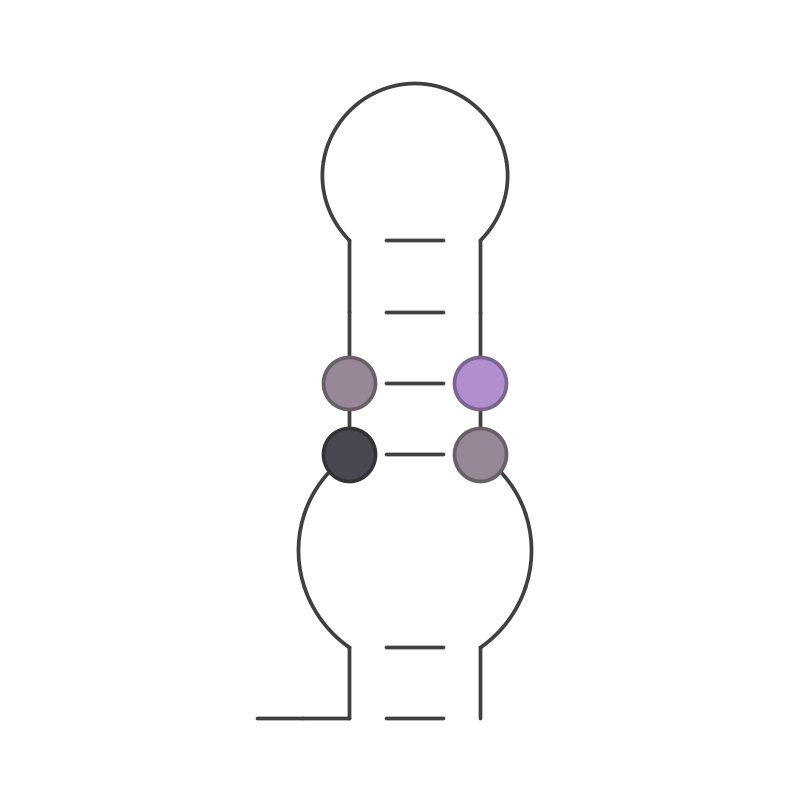

### <a name="line"></a> The **```line```** element

Parameters:
* **```value```**: the line width
* **```type```**: the type of objects 2D targeted (check this [table](theme) for details)
* **```location```**: the location of objects 2D targeted

If the parameter **```type```** is not defined, all types are targeted. You can define several types in the same string using a space as separator: **```"single_strand R C interaction_symbol"```**

The parameter **```location```** needs to have the following format:

```kotlin
location {
    1 to 10
    30 to 40
}
```
In this example, the location is made with absolute positions from 1 to 10 and 30 to 40 (inclusive). A 2D object is targeted if its own location is inside the one defined with this parameter.

## <a name="layout"></a> The **```layout```** element

The rnartist drawing algorithm computes the layout to avoid overlapping of objects 2D. One of the parameter used is the default orientation of the helices linked to each type of junction (inner loops, 3-way junctions,...). Each junction is linked to an "in" helix (the red arrow in the diagram below) and to "out" helices (black arrows). The orientation for each "out" helix is defined according to the directions of a compass, the "in" helix making the south direction.


You can change the default layout for each type of junction by adding one or several **```junction```** elements to the layout. A **```junction```** element contains the following parameters:
* **```type```**: the type of the junction (1 for apical loops, 2 for inner loops, 3 for 3-way junctions,...)
* **```location```**: the location of objects 2D targeted
* **```out_ids```**: the compass directions for the leaving helices

If the parameter ```type``` is set, all the junctions for this type are targeted. The new layout will be used before the non-overlapping 2D plot. 
If the parameter ```location``` is set, the layout will be applied after the non-overlapping plot. For the junction targeted, the drawing engine will not take care of overlapping elements anymore.

In the following examples, you can see the different results when we modify the layout for all the 3-way junctions.

```kotlin
rnartist {
  png {
    path = "media/"
  }
  ss {
    bn {
      value = "(((..(((..(((..(((((....))))).(((..(((..(((..(((((....)))))..)))..(((((....)))))..)))...))).)))..(((((....)))))..)))...)))...(((..(((.(((..(((..(((..(((((....)))))..)))..(((((....)))))..)))...)))...(((..(((..(((..(((((....)))))..)))..(((((....)))))..)))...))).(((((....)))))..)))...)))"
      name = "3way_0"
    }
  }
  theme {
    details {
      value = 1
    }
  }
}
```


```kotlin
rnartist {
  png {
    path = "media/"
  }
  ss {
    bn {
      value = "(((..(((..(((..(((((....))))).(((..(((..(((..(((((....)))))..)))..(((((....)))))..)))...))).)))..(((((....)))))..)))...)))...(((..(((.(((..(((..(((..(((((....)))))..)))..(((((....)))))..)))...)))...(((..(((..(((..(((((....)))))..)))..(((((....)))))..)))...))).(((((....)))))..)))...)))"
      name = "3way_1"
    }
  }
  theme {
    details {
      value = 1
    }
  }

  layout {

    junction {
      type = 3
      out_ids ="nnw nne"
    }

  }
}
```

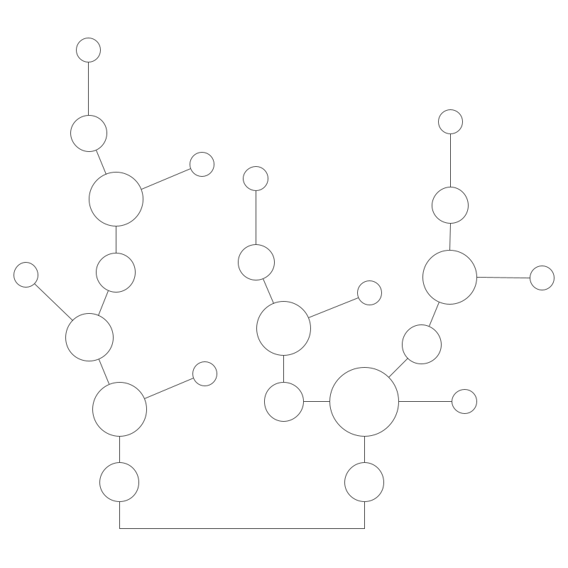

```kotlin
rnartist {
  png {
    path = "media/"
  }
  ss {
    bn {
      value = "(((..(((..(((..(((((....))))).(((..(((..(((..(((((....)))))..)))..(((((....)))))..)))...))).)))..(((((....)))))..)))...)))...(((..(((.(((..(((..(((..(((((....)))))..)))..(((((....)))))..)))...)))...(((..(((..(((..(((((....)))))..)))..(((((....)))))..)))...))).(((((....)))))..)))...)))"
      name = "3way_2"
    }
  }
  theme {
    details {
      value = 1
    }
  }

  layout {

    junction {
      type = 3
      out_ids ="nw ne"
    }

  }
}
```


```kotlin
rnartist {
  png {
    path = "media/"
  }
  ss {
    bn {
      value = "(((..(((..(((..(((((....))))).(((..(((..(((..(((((....)))))..)))..(((((....)))))..)))...))).)))..(((((....)))))..)))...)))...(((..(((.(((..(((..(((..(((((....)))))..)))..(((((....)))))..)))...)))...(((..(((..(((..(((((....)))))..)))..(((((....)))))..)))...))).(((((....)))))..)))...)))"
      name = "3way_3"
    }
  }
  theme {
    details {
      value = 1
    }
  }

  layout {

    junction {
      type = 3
      out_ids ="wnw ene"
    }

  }
}
```

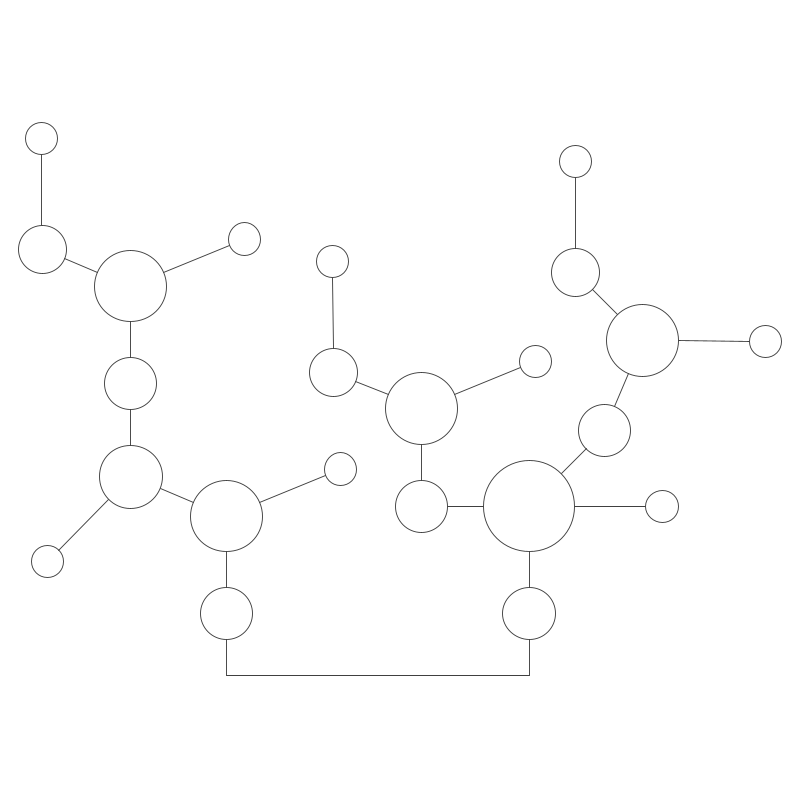

```kotlin
rnartist {
  png {
    path = "media/"
  }
  ss {
    bn {
      value = "(((..(((..(((..(((((....))))).(((..(((..(((..(((((....)))))..)))..(((((....)))))..)))...))).)))..(((((....)))))..)))...)))...(((..(((.(((..(((..(((..(((((....)))))..)))..(((((....)))))..)))...)))...(((..(((..(((..(((((....)))))..)))..(((((....)))))..)))...))).(((((....)))))..)))...)))"
      name = "3way_4"
    }
  }
  theme {
    details {
      value = 1
    }
  }

  layout {

    junction {
      type = 3
      out_ids ="w e"
    }

  }
}
```

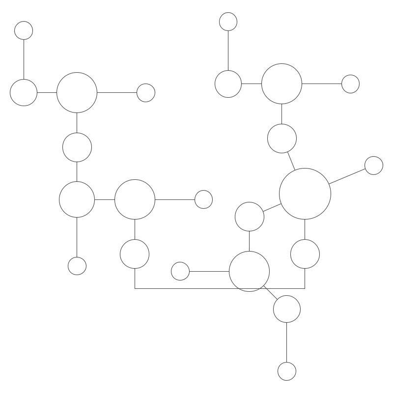

```kotlin
rnartist {
  png {
    path = "media/"
  }
  ss {
    bn {
      value = "(((..(((..(((..(((((....))))).(((..(((..(((..(((((....)))))..)))..(((((....)))))..)))...))).)))..(((((....)))))..)))...)))...(((..(((.(((..(((..(((..(((((....)))))..)))..(((((....)))))..)))...)))...(((..(((..(((..(((((....)))))..)))..(((((....)))))..)))...))).(((((....)))))..)))...)))"
      name = "3way_5"
    }
  }
  theme {
    details {
      value = 1
    }
  }

  layout {

    junction {
      type = 3
      out_ids ="w n"
    }

  }
}
```

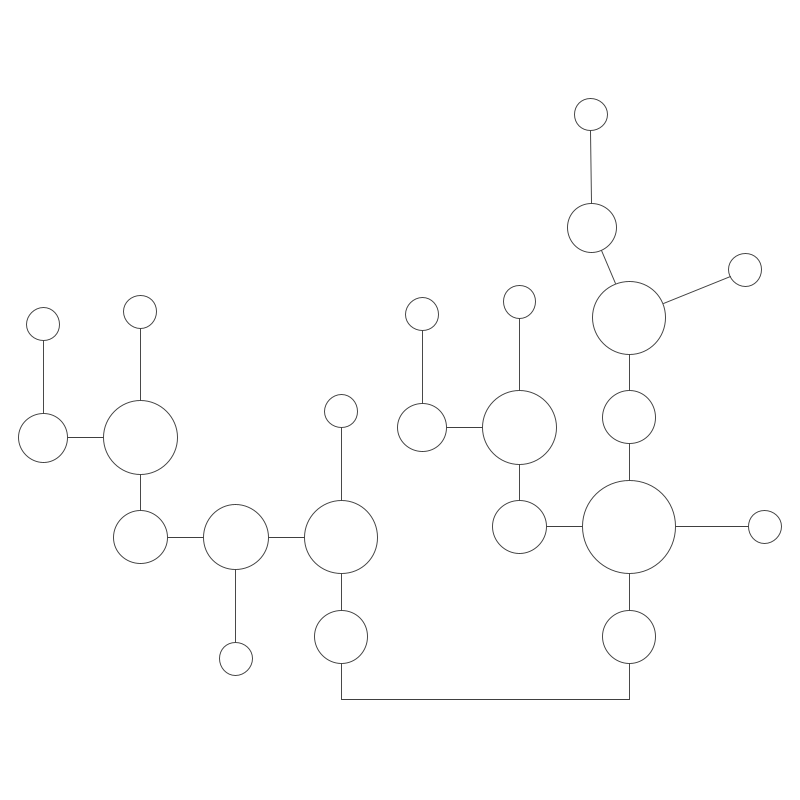

```kotlin
rnartist {
  png {
    path = "media/"
  }
  ss {
    bn {
      value = "(((..(((..(((..(((((....))))).(((..(((..(((..(((((....)))))..)))..(((((....)))))..)))...))).)))..(((((....)))))..)))...)))...(((..(((.(((..(((..(((..(((((....)))))..)))..(((((....)))))..)))...)))...(((..(((..(((..(((((....)))))..)))..(((((....)))))..)))...))).(((((....)))))..)))...)))"
      name = "3way_6"
    }
  }
  theme {
    details {
      value = 1
    }
  }

  layout {

    junction {
      type = 3
      out_ids ="n e"
    }

  }
}
```


And now with full details:

```kotlin
rnartist {
  png {
    path = "media/"
  }
  ss {
    bn {
      value = "(((..(((..(((..(((((....))))).(((..(((..(((..(((((....)))))..)))..(((((....)))))..)))...))).)))..(((((....)))))..)))...)))...(((..(((.(((..(((..(((..(((((....)))))..)))..(((((....)))))..)))...)))...(((..(((..(((..(((((....)))))..)))..(((((....)))))..)))...))).(((((....)))))..)))...)))"
      name = "3way_full_details"
    }
  }
  theme {
    details {
      value = 3
    }

    scheme {
      value = "Atomic Xanadu"
    }
  }

  layout {

    junction {
      type = 3
      out_ids ="wnw n"
    }

  }
}
```

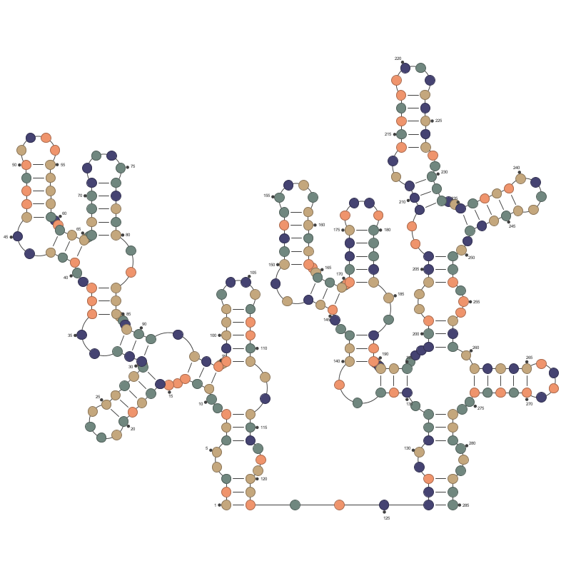

With the last example, you can see that everything is fine except for the 3-way junction on the right-most side. We're adding a specific layout for this junction to get a better plot

```kotlin
rnartist {
  png {
    path = "media/"
  }
  ss {
    bn {
      value = "(((..(((..(((..(((((....))))).(((..(((..(((..(((((....)))))..)))..(((((....)))))..)))...))).)))..(((((....)))))..)))...)))...(((..(((.(((..(((..(((..(((((....)))))..)))..(((((....)))))..)))...)))...(((..(((..(((..(((((....)))))..)))..(((((....)))))..)))...))).(((((....)))))..)))...)))"
      name = "3way_full_details_fixed"
    }
  }
  theme {
    details {
      value = 3
    }

    scheme {
      value = "Atomic Xanadu"
    }
  }
  layout {
    junction {
      type = 3
      out_ids = "wnw n"
    }
    junction {
      location {
        206 to 209
        232 to 235
        248 to 251
      }
      out_ids = "n e"
    }
  }
}
```


## <a name="data"></a> The **```data```** element

Datasets can be linked to an RNA secondary structure. You can either define the entire dataset directly inside the script, or load it from a local file.
The ```data``` element has to be defined **before** the elements theme and layout.

```kotlin
rnartist {
    svg {
      path = "/media/"
    }
    ss {
        bn {
            value = "(((..(((..(((..(((((....)))))..)))..(((((....)))))..)))...)))"    
        } 
    }
    data {
        1 to 200.7
        2 to 192.3
        3 to 143.6
    }
}
```

```kotlin
rnartist {
    svg {
      path = "/media/"
    }
    ss {
      bn {
        value = "(((..(((..(((..(((((....)))))..)))..(((((....)))))..)))...)))"
      }
    }
    data {
        file = "/project/QuSHAPE_01_shape_mode_reactivities.txt"
    }
}
```

The structure of a local file describing a dataset is really simple. It's a text file where each line describes the absolute_position in the RNA and its linked experimental value. The two fields are separated with a space character:

```
1 30.2
2 56.8
10 2.0
127 18.7
```

The values linked to each residue can be used as a selection criteria to define the colors, line width and details level.

If you know Kotlin, you can embed Kotlin instructions to power your script.

```kotlin
rnartist {
  svg {
    path = "/media/"
  }
  ss {
    bn {
      value = "(((..(((..(((..(((((....)))))..)))..(((((....)))))..)))...)))"
    }
  }
  data {
    (1..secondaryStructures[0].length).forEach {
      "${it}" to Math.random()
    }
  }
  theme {
      details {
        value = 5
      }

      color {
        type = "R"
        value = "lightyellow"
        to = "firebrick"
      }

      color {
        type = "r"
        value = "black"
        to = "white"
      }

      hide {
        type = "Y"
      }
    }

  }
}
```


If a dataset is linked to the RNA secondary structure, a colored gradient can be defined inside the **```color```** element. You need to use the parameters  **```value```** and  **```to```**. To restrict the distribution of values to be used, you can use the parameter  **```data```**. You can select values lower than a value (**```lt```**), greater than a value (**```gt```**) or between two values (**```between```**).

```kotlin
rnartist {
  ss {
    bn {
      seq = "GCGAAAAAUCGC"
      value =
        "((((....))))"
      name = "dataset"
    }
  }
  data {
    1 to 200.7
    2 to 192.3
    3 to 143.6
    4 to 34.8
    5 to 4.5
    6 to 234.9
    7 to 12.3
    8 to 56.8
    9 to 59.8
    10 to 140.5
    11 to 0.2
    12 to 345.8
  }
  theme {
    details {
      value = 4
    }
    
    color {
      type = "N"
      value = "lightyellow"
      to = "firebrick"
      data between 10.0..350.0
    }
    color {
      type = "n"
      value = "black"
      to = "white"
      data between 10.0..350.0
    }
    color {
      type = "N"
      value = "black"
      data lt 10.0
    }
    color {
      type = "n"
      value = "white"
      data lt 10.0
    }
  }
}
```


# Notes

On a Raspberry Pi, if you get this message when running the script plot_2ds.sh:

```OpenJDK Server VM warning: No monotonic clock was available - timed services may be adversely affected if the time-of-day clock changes```

RNArtistcore will hang on. This is not related to RNArtistCore, but you need to update the library libseccomp2 for your RPi. To do so, you can :
* get this file http://ftp.debian.org/debian/pool/main/libs/libseccomp/libseccomp2_2.5.1-1_armhf.deb
* type: ```sudo dpkg -i libseccomp2_2.5.1-1_armhf.deb```
* and it should work...


