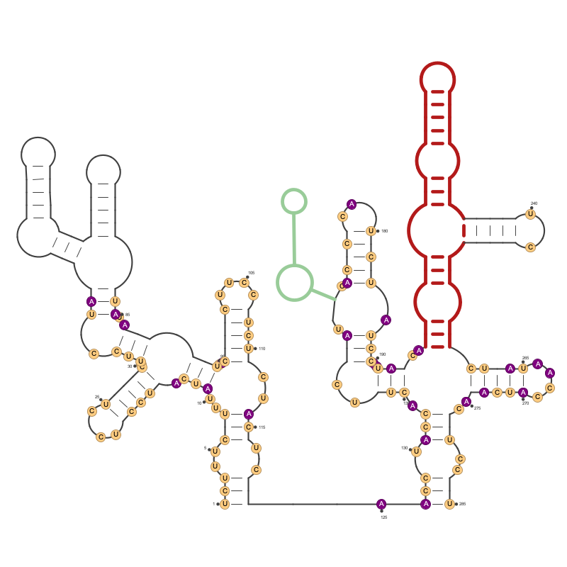
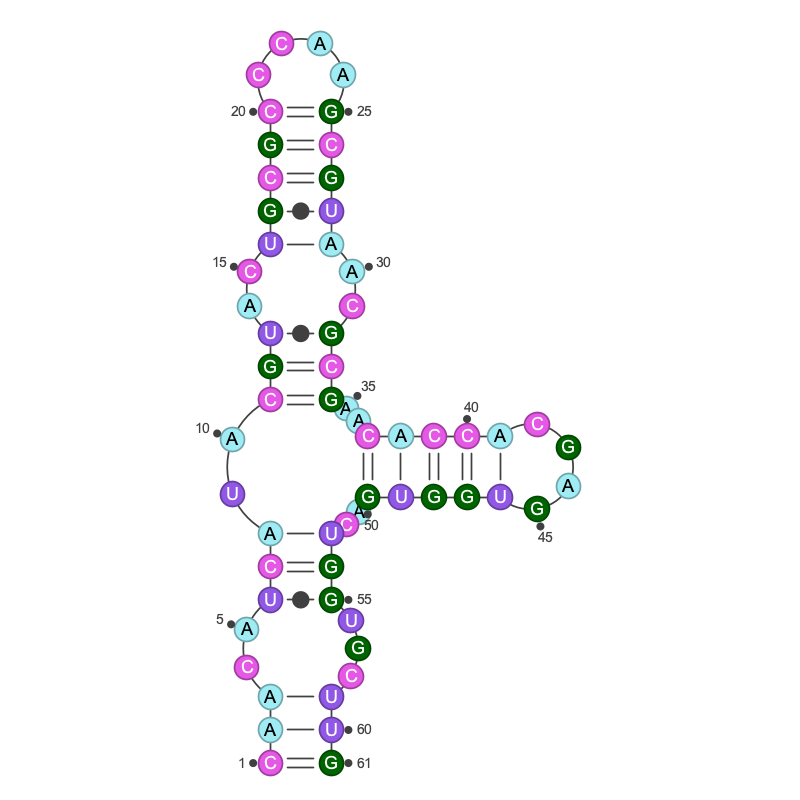
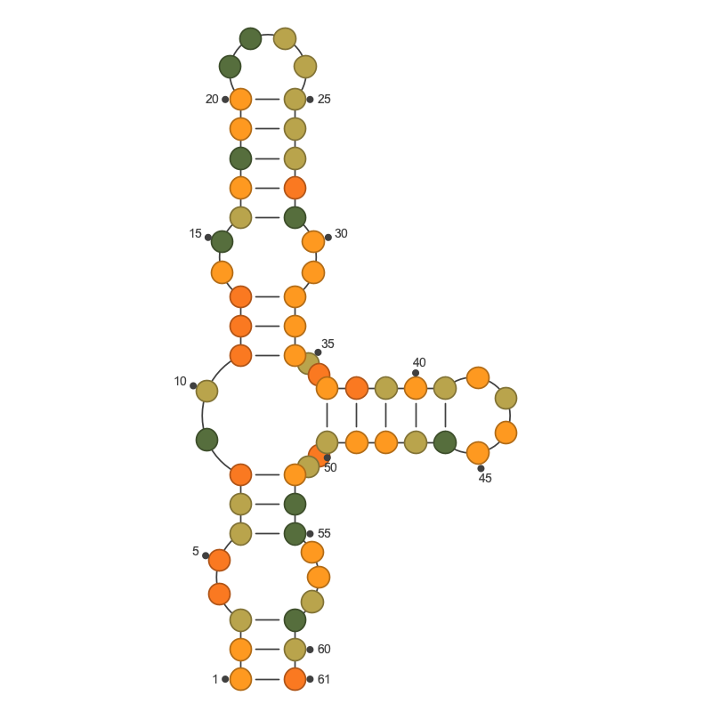
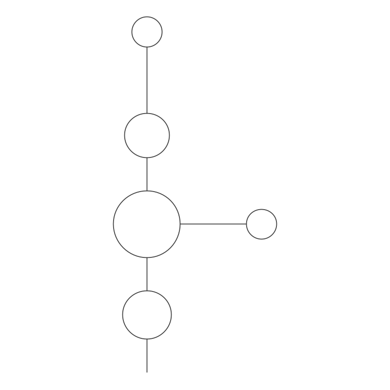
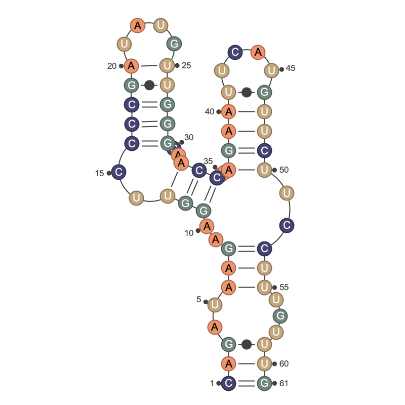
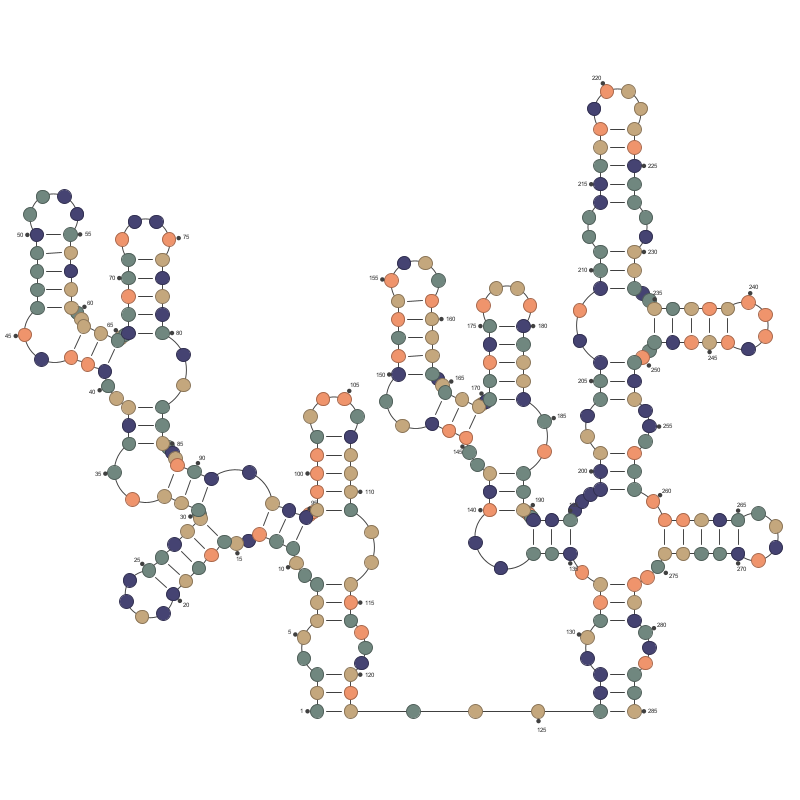
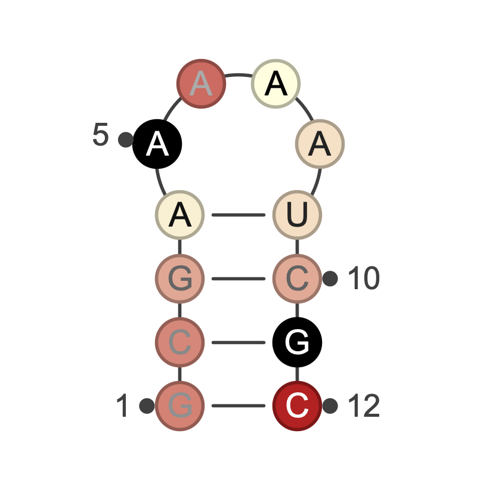

RNArtistCore
============




RNArtistCore provides a language to automate the plotting for RNA secondary structures. It is also a component of the graphical tool named [RNArtist](https://github.com/fjossinet/RNArtist).

While [RNArtist](https://github.com/fjossinet/RNArtist) is an interactive tool for RNA drawing and coloring, RNArtistCore can be used from the commandline to automate the drawing and highlight of specific regions for hundreds of RNA structures.

The largest part of this documentation explains the [syntax to write your own plotting script](#dsl). But first, how to install and run RNArtistCore? 

## Prerequisites and installation

You need to have java installed on your computer and executable in a terminal. Two options to install RNArtistCore on your computer:
* download the last release available [here](https://github.com/fjossinet/RNArtistCore/releases) and unzip the zip file
* download the source code from Github. You will need the tool [maven](https://maven.apache.org/) and a Java Development Kit to be installed. In the project directory, type: <pre>mvn clean package</pre> The zip file will be created in the target subdirectory. 

## Usage

In the RNArtistCore directory, type: 
<pre>java -jar rnartistcore-X.X.X-jar-with-dependencies.jar path/to/your/plotting_script.kts</pre>

From any directory, type:
<pre>java -jar path/to/your/rnartistcore-X.X.X-jar-with-dependencies.jar path/to/plotting_script.kts</pre>

# <a name="dsl"></a> How to write your plotting script

RNArtistCore exposes a language to write your plotting instructions more easily. All the examples described in this README are available in the file [scripts/readme_plots.kts](scripts/readme_plots.kts). 

Please note that this is still a work under development and that all instructions are not stable. You can take a look at the [changelog](Changelog.md) for details concerning the modifications. 

* [The **```booquet```** element](#booquet)
* [The **```rnartist```** element](#rnartist)
* [The **```svg```** and **```png```** elements](#output) 
* [The **```ss```** element](#ss)
  * [The **```parts```** element](#parts)
  * [The **```bn```** element](#bn)
  * [The ```bpseq```, ```ct```, ```vienna```, ```pdb``` and ```stockholm``` elements](#file)
  * [The ```rfam``` and ```pdb``` elements](#database)
* [The **```theme```** element](#theme)
  * [The **```color```** element](#color)
  * [The **```show```** element](#show)
  * [The **```hide```** element](#hide)
  * [The **```line```** element](#line)
* [The **```layout```** element](#layout)
* [The **```data```** element](#data)

Using pseudo-code, here is the structure that your instructions have to fit with:

```kotlin
drawing_algorithm {
  
  output_file {
      
  }

  secondary_structure {
    
  }

  data {

  }

  theme {

  }

  layout {

  }

}
```

As you can see, you choose a drawing algorithm that will use a secondary structure to output its drawing in an output file. The drawing can be customized with a theme and a layout to suit your needs. Data can be linked to the secondary structure (for example to color residues according to their experimental value).

Here is a concrete example:

```kotlin
rnartist {
  
  svg {
    path = "rnartist_outputs/"
  }
  
  ss {
    bn {
      seq = "CAACAUCAUACGUACUGCGCCCAAGCGUAACGCGAACACCACGAGUGGUGACUGGUGCUUG"
      value =
        "(((..(((..(((..(((((....)))))..)))..(((((....)))))..)))...)))"
      name = "concrete_example"
    }
  }
  theme {
      details {
        value = 5
      }

      color {
        type="A"
        value = "#A0ECF5"
      }

      color {
        type="a"
        value = "black"
      }

      color {
        type="U"
        value = "#9157E5"
      }

      color {
        type="G"
        value = "darkgreen"
      }

      color {
        type="C"
        value = "#E557E5"
      }
    }

  }
}
```



Two algorithms are available:
* rnartist (used in the graphical tool [RNArtist](https://github.com/fjossinet/RNArtist))
* booquet

Both algorithms need a secondary structure element. A drawing can be saved in an SVG or PNG file. The name of the RNA molecule will be used for the filename. Each algorithm has its own parameters to configure the drawing process and the final result.

## <a name="booquet"></a> ***The **```booquet```** element***

This algorithm has less options than the rnartist one. The parameters available are:
* **```file```** (mandatory): the absolute path and the name of the SVG output file. The path needs to start with ```/project/```, corresponding to the root of your project.
* **```ss```** (mandatory): a secondary structure element
* **```width```**: the width of the view containing the drawing (default: 600)
* **```height```**: the height of the view containing the drawingg (default: 600)
* **```color```**: an HTML color code or color name
* **```line```**: the width for the lines
* **```junction_diameter```**: the diameter of the circles

The drawing will be automatically zoomed to fit the view.

```kotlin
booquet {
  file = "/project/media/booquet_from_rfam.svg"
  junction_diameter = 15.0
  color = "midnightblue"
  line = 1.0
  ss {
    rfam {
      id = "RF00072"
      name = "AJ009730.1/1-133"
    }
  }
}
```


```kotlin
booquet {
  file = "/project/media/booquet_from_vienna.svg"
  junction_diameter = 15.0
  color = "olive"
  line = 3.0
  ss {
    vienna {
      file = "/project/samples/rna.vienna"
    }
  }
}
```


```kotlin
booquet {
  file = "/project/media/booquet_from_ct.svg"
  junction_diameter = 15.0
  color = "darkorchid"
  ss {
    ct {
      file = "/project/samples/ASE_00010_from_RNA_STRAND_database.ct"
    }
  }
}
```


```kotlin
booquet {
  file = "/project/media/booquet_from_pdb.svg"
  junction_diameter = 15.0
  color = "darkmagenta"
  width = 1200.0
  height = 800.0
  line = 0.5
  ss {
    pdb {
      file = "/project/samples/1jj2.pdb"
      name = "0"
    }
  }
}
```


## <a name="rnartist"></a> ***The **```rnartist```** element***

The parameters available for this algorithm are:
* **```svg``` or ```png```** (mandatory): the element to define how to save the drawing in an SVG or PNG file
* **```ss```** (mandatory): a secondary structure element
* **```theme```**: element to change the colors, details, line width,... for any object in the 2D
* **```layout```**: element to change the default layouts for the junctions
* **```data```**: element to link a dataset to the 2D

### <a name="output"></a>The ```svg``` and ```png``` elements

The parameters available are:

* **path** (mandatory): the path for the saving directory. The file will be created in this directory and its name will correspond to the name of the RNA molecule.

```kotlin
rnartist {
  svg {
    path = "media/"    
  }
  
  ss {
    bn {
      value = "((((....))))"
    }
  }
}
```

### <a name="ss"></a>The ```ss``` element

You have different ways to define a secondary structure:
* by describing all the structural elements yourself using the element **```parts```**
* from a bracket notation using the element **```bn```**
* from a file using the elements **```vienna```**, **```bpseq```**, **```ct```**, or **```stockholm```**
* from a public database using the elements **```rfam```**, **```rnacentral```**, or **```pdb```**

#### <a name="parts"></a>The ```parts``` element

Inside an element ```parts```, you need to describe your 2D with the elements ```rna``` and ```helix``` 

The element ```rna``` needs at least an attribute seq or an attribute length:
* **seq** (mandatory in no length): the sequence of your molecule. If this parameter is not defined, a random sequence is computed. Each execution of the script will compute a different sequence.
* **length** (mandatory if no seq): the length of your molecule. If this parameter is defined, a random sequence is computed. Each execution of the script will compute a different sequence.
* **name**: the name of the molecule (default: **```A```**)

The ```helix``` element needs at least a location:
* **name**: the name of the helix
* **location** (mandatory): the location of the helix

The parameter **```location```** needs to have the following format:

```kotlin
location {
    1 to 10
    30 to 40
}
```
In this example, the location is made with absolute positions from 1 to 10 and 30 to 40 (inclusive). An object 2D is targeted if its own location is inside the one defined with this parameter.

```kotlin
rnartist {

  png {
    path = "media/"
  }

  ss {
    parts {
      rna {
        seq = "ACAUAGCGUUCGCGCGUGUUCCUGUAGUUAAACUUAGAGUAUCUGUACUUAGAAUUAAUGUUGGAGGCCCAACAAUGGGUGUGGAUCAAUCGUAGUUAUUU"
        name = "rna_and_helix_elements"
      }
      helix {
        name = "H1"
        location {
          1 to 3
          17 to 19
        }
      }
      helix {
        name = "H2"
        location {
          6 to 8
          13 to 15
        }
      }
      helix {
        name = "H3"
        location {
          23 to 25
          39 to 41
        }
      }
      helix {
        name = "H4"
        location {
          28 to 30
          35 to 37
        }
      }
      helix {
        name = "H5"
        location {
          45 to 47
          80 to 82
        }
      }
      helix {
        name = "H6"
        location {
          48 to 50
          64 to 66
        }
      }
      helix {
        name = "H7"
        location {
          53 to 55
          60 to 62
        }
      }
      helix {
        name = "H8"
        location {
          69 to 71
          76 to 78
        }
      }
      helix {
        name = "H9"
        location {
          83 to 85
          99 to 101
        }
      }
      helix {
        name = "H10"
        location {
          88 to 90
          95 to 97
        }
      }
    }
  }
}
```


#### <a name="bn"></a>The ```bn``` element

The parameters available are:
* **value** (mandatory): the secondary structure described with the dot-bracket notation
* **name**: the name of the molecule (default: **```A```**)
* **seq**: the sequence of your molecule. If this parameter is not defined, a random sequence is computed. Each execution of the script will compute a different sequence.

```kotlin
rnartist {
  svg {
    path = "media/"
  }
  
  ss {
    bn {
      value = "((((....))))"
    }
  }
}
```

```kotlin
rnartist {
  svg {
    path = "media/"
  }
  
  ss {
    bn {
      value = "((((....))))"
      name = "My Fav RNA"
    }
  }
}
```

```kotlin
rnartist {
  svg {
    path = "media/"
  }
  
  ss {
    bn {
      value = "((((....))))"
      seq = "GGGGAAAACCCC"
      name = "My Fav RNA"
    }
  }
}
```

#### <a name="file"></a>The ```bpseq```, ```ct```, ```vienna```, ```pdb``` and ```stockholm``` elements

The secondary structure will be constructed from the data stored in the file.

To be able to use the PDB format, RNArtistCore needs to use the algorithm RNAVIEW available with the [Docker container rnartistcore](https://hub.docker.com/r/fjossinet/rnartistcore). RNArtistCore will delegate to RNAVIEW the annotation of the 3D structure into a 2D.

The parameters are:
* **file** (mandatory): the path and the name of your file. 
* **name**: if the file contains several molecular chains, this parameter allows to precise the one you want. If no name is provided, all the molecular chains will be processed.

```kotlin
rnartist {
  png {
    path = "media/"
  }

  ss {
    bpseq {
      file = "myrna.bpseq"
    }
  }
}
```

```kotlin
rnartist {
  png {
    path = "media/"
  }

  ss {
    pdb {
      file = "myrna.pdb"
      name = "A"
    }
  }
}
```


```kotlin
rnartist {
  png {
    path = "media/"
  }

  ss {
    stockholm {
      file = "./my_files/RF00072.stk"
      name = "consensus"
    }
  }
}
```

```kotlin
rnartist {
  png {
    path = "media/"
  }

  ss {
    stockholm {
      file = "C:/project/RF00072.stk"
      name = "AJ009730.1/1-133"
    }
  }
}
```

### <a name="database"></a>The ```rfam``` and ```pdb``` elements

The secondary structure will be constructed from the data stored in the database entry.

The parameters are:
* **```id```** (mandatory): the id of your database entry
* **```name```**: if the entry contains several molecular chains, this parameter allows to precise the one you want. If no name is provided, all the molecular chains will be processed.

```kotlin
ss {
  
  rfam {
    id = "RF00072"
    name = "AJ009730.1/1-133"
  }
}
```

```kotlin
ss {
  
  pdb {
    id = "1EHZ"
  }
}
```

```kotlin
ss {
  pdb {
    id = "1JJ2"
    name = "0"
  }
}
```

The element ```rfam``` can contain an attribute named ```use alignment numbering```. If this attribute is set, the locations described in the script will be understood as locations in the original alignment. Check this [video](https://www.youtube.com/watch?v=cEFlneO_muE) for details.

## <a name="theme"></a>The **```theme```** element

Using this element, you choose the rendering level for any object in the 2D drawing, from single residues to entire structural domains.
Each object can be lowly or highly rendered. In general, an object 2D produces a simple shape when it is lowly rendered and it doesn't allow its children to be rendered.

Object 2D | type<br/>(to be used with the elements ```show```/```hide```, see below) |                parent                |                   children                    | lowly rendered | highly rendered
--- |-----------------------------------------------------------------------|------------------------------------|---------------------------------------------|--------------|---------------
Helix |                                  helix                                   |                  2D                  | Secondary Interaction<br/>Phosphodiester Bond |  single line   | children rendering
Junction |                                 junction                                 |                  2D                  |     Residue Shape<br/>Phosphodiester Bond     |     circle     | children rendering
Single Strand |                              single_strand                               |                  2D                  |     Residue Shape<br/>Phosphodiester Bond     |  single line   | children rendering
Secondary Interaction |                          secondary_interaction                           |                Helix                 |     Residue Shape<br/>Interaction Symbol      |     | children rendering
Tertiary Interaction |                           tertiary_interaction                           |                  2D                  |              Interaction Symbol               |  single line   | children rendering
Phosphodiester Bond |                           phosphodiester_bond                            | Helix<br/>Junction<br/>Single Strand |                                               |                | single line
Residue Shape |                         N, X, A, U, G, C, R or Y                         | Secondary Interaction<br/>Junction<br/>Single Strand |               Residue Character               |                | shape (circle) + children rendering
Residue Character |                         n, x, a, u, g, c, r or y                         | Residue Shape|                                               |                |  character
Interaction Symbol |                            interaction_symbol                            | Secondary Interaction<br/>Tertiary Interaction |                                               |  single line   | symbol (triangle, circle, square, double lines,...)

To quickly change the details level of an entire 2D, you can use the element named **```details```**. Five details levels are available:

_____Level 1_____

The children of the 2D (helix, junction, single_strand) are lowly rendered

```kotlin
rnartist {
  png {
    path = "media/"
  }
  ss {
    bn {
      value =
        "(((..(((..(((..(((((....)))))..)))..(((((....)))))..)))...)))"
      name = "details_lvl1"
    }
  }
  theme {
    details {
      value = 1
    }
  }
}
```


_____Level 2_____

Those objets are highly rendered: helix, secondary_interaction, junction, single-strand, phosphodiester_bond

```kotlin
rnartist {
  png {
    path = "media/"
  }
  ss {
    bn {
      value =
        "(((..(((..(((..(((((....)))))..)))..(((((....)))))..)))...)))"
      name = "details_lvl2"
    }
  }
  theme {
    details {
      value = 2
    }
  }
}
```


_____Level 3_____

In addition to level 2, those objets are highly rendered: N, X, A, U, G, C, R, Y

```kotlin
rnartist {
  png {
    path = "media/"
  }
  ss {
    bn {
      value =
        "(((..(((..(((..(((((....)))))..)))..(((((....)))))..)))...)))"
      name = "details_lvl3"
    }
  }
  theme {
    details {
      value = 3
    }
  }
}
```



_____Level 4_____

In addition to level 3, those objets are highly rendered: n, x, a, u, g, c, r, y

```kotlin
rnartist {
  png {
    path = "media/"
  }
  ss {
    bn {
      value =
        "(((..(((..(((..(((((....)))))..)))..(((((....)))))..)))...)))"
      name = "details_lvl4"
    }
  }
  theme {
    details {
      value = 4
    }
  }
}
```



_____Level 5_____

In addition to level 4, those objets are highly rendered: interaction_symbol

```kotlin
rnartist {
  png {
    path = "media/"
  }
  ss {
    bn {
      value =
        "(((..(((..(((..(((((....)))))..)))..(((((....)))))..)))...)))"
      name = "details_lvl5"
    }
  }
  theme {
    details {
      value = 5
    }
  }
}
```


You can have several times the element ```details``` in a theme. Using its attribute ```location```, you can link different levels of details to different parts of the 2D. Without this attribute, the level of details is applied to the full 2D.

```kotlin
rnartist {
  png {
    path = "media/"
  }
  
  ss {
    bn {
      value = "(((..(((..(((..(((((....)))))..)))..(((((....)))))..)))...))"
      name = "several_details_lvl"
    }
  }
  theme {
    
    details {
      value = 1
    }
    
    details {
      value = 3
      location {
        8 to 37
        50 to 53
      }
    }
    
    details {
      value = 2
      location {
        37 to 50
      }
    }
    
    details {
      value = 2
      location {
        16 to 20
        25 to 29
      }
    }
    
  }
}
```


The details levels are applied one after other. If we take the previous example with the details level 1 at the end, since it is applied on the full 2D, this will erase the previous details element linked to specific elements.

```kotlin
rnartist {
  png {
    path = "media/"
  }
  ss {
    bn {
      value = "(((..(((..(((..(((((....)))))..)))..(((((....)))))..)))...))"
      name = "details_lvl_erased"
    }
  }
  theme {
    
    details {
      value = 3
      location {
        8 to 37
        50 to 53
      }
    }
    
    details {
      value = 2
      location {
        37 to 50
      }
    }
    
    details {
      value = 2
      location {
        16 to 20
        25 to 29
      }
    }

    details {
      value = 1
    }
    
  }
}
```


Using the attribute ```type```, you can quickly apply details levels to all the helices, junctions and/or single-strands. If the attribute  ```type``` is used,  ```location``` is ignored (if any).

```kotlin
rnartist {
  png {
    path = "media/"
  }
  ss {
    bn {
      value = "(((..(((....))).)))...(((..(((....))).)))...((((((..(((....))).)))..(((....))).)))(((..(((....))).)))"
      name = "details_lvl_helices_junctions"
    }
  }
  theme {
    details {
      value = 1
    }
    details {
      value = 3
      type = "helix"
    }
    details {
      value = 2
      type = "junction"
    }
  }
}
```


Inside a **```theme```**, you can also add several times the following elements:
* **```color```**: defines the color for objects 2D
* **```show```**: highly render objects 2D
* **```hide```**: lowly render objects 2D
* **```line```**: set the line width for objects 2D

### <a name="color"></a> The **```color```** element

Parameters:
* **```value```**: an HTML color code or predefined [color names](https://en.wikipedia.org/wiki/Web_colors#//project/media/File:SVG_Recognized_color_keyword_names.svg). If the parameter **```to```** is defined, this parameter defines the first color for the gradient.
* **```to```**: the last color in a gradient (HTML color code or predefined [color names](https://en.wikipedia.org/wiki/Web_colors#//project/media/File:SVG_Recognized_color_keyword_names.svg))
* **```type```**: the type of objects 2D targeted (check this [table](theme) for details)
* **```location```**: the location of objects 2D targeted
* **```data```**: selection based on the values linked to the residues  (see explanation for this element below)
* **```scheme```**: the name of a color scheme to apply. It can be: 
  * Persian Carolina
  * Snow Lavender
  * Fuzzy French
  * Chestnut Navajo
  * Irresistible Turquoise
  * Charm Jungle
  * Atomic Xanadu
  * Pale Coral
  * Maximum Salmon
  * Pacific Dream
  * New York Camel
  * Screamin' Olive
  * Baby Lilac
  * Celeste Olivine
  * Midnight Paradise
  * African Lavender
  * Charcoal Lazuli
  * Pumpkin Vegas

```kotlin
rnartist {
  png {
    path = "media/"
  }
  ss {
    bn {
      seq = "CAGAUAAGAAGGUUCCCCGAUAUGUUGGGCAACCAAAGAAUUCAUGUUCUUCCUUUGUUUG"
      value =
        "(((..(((..(((..(((((....)))))..)))..(((((....)))))..)))...)))"
      name = "atomic_xanadu"
    }
  }
  theme {
    details {
      value = 5
    }

    color {
      scheme = "Atomic Xanadu"
    }
  }
}
```


  
If the parameter **```type```** is not defined, all types are targeted. You can define several types in the same string using a space as separator: **```"single_strand R C interaction_symbol"```**

The parameter **```location```** needs to have the following format:

```kotlin
location {
    1 to 10
    30 to 40
}
```
In this example, the location is made with absolute positions from 1 to 10 and 30 to 40 (inclusive). An object 2D is targeted if its own location is inside the one defined with this parameter.

```kotlin
rnartist {
  png {
    path = "media/"
  }
  ss {
    bn {
      seq = "CAGAUAAGAAGGUUCCCCGAUAUGUUGGGCAACCAAAGAAUUCAUGUUCUUCCUUUGUUUG"
      value =
        "(((..(((..(((..(((((....)))))..)))..(((((....)))))..)))...)))"
      name = "nice_colors"
    }
  }
  theme {
    details {
      value = 5
    }

    color {
      type = "Y"
      value = "lavenderblush"
    }

    color {
      type = "y"
      value = "black"
    }

    color {
      type = "R"
      value = "red"
    }

    color {
      type = "r"
      value = "white"
    }

    color {
      type = "G g"
      value = "#ed781f"
      location {
        5 to 20
      }
    }
  }
}
```


### <a name="show"></a> The **```show```** element

This element allows to highly render a 2D object.

Parameters:
* **```type```**: the type of objects 2D targeted (check this [table](theme) for details)
* **```location```**: the location of 2D objects targeted
* **```data```**: selection based on the values linked to the residues (see explanation for this element below)

An empty ```show``` element will do nothing.

If the parameter **```type```** is not defined, all types are targeted. You can define several types in the same string using a space as separator: **```"single_strand R C interaction_symbol"```**

The parameter **```location```** needs to have the following format:

```kotlin
location {
    1 to 10
    30 to 40
}
```
In this example, the location is made with absolute positions from 1 to 10 and 30 to 40 (inclusive). A 2D object is targeted if its own location is inside the one defined with this parameter.

In the following examples, we start with the details level 1 for the full 2D (parameter ```details_lvl = 1```) and we increase the details level for some parts of a single helix defined by its location.

```kotlin
rnartist {
  png {
    path = "media/"
  }

  ss {
    bn {
      seq = "CUUACUCGAGUGACCUUGCUUG"
      value = "..((..((((....))))..))"
      name = "helix_lvl0"
    }
  }

  theme {
    details {
      value = 1
    }
  }
}
```


```kotlin
rnartist {
  png {
    path = "media/"
  }

  ss {
    bn {
      seq = "CUUACUCGAGUGACCUUGCUUG"
      value = "..((..((((....))))..))"
      name = "helix_lvl1"
    }
  }

  theme {
    details {
      value = 1
    }

    show {
      type = "helix"
      location {
        7 to 10
        15 to 18
      }
    }
  }
}
```


The helix is highly rendered, but not its children. This is a way to hide helices in order to reduce the complexity of an RNA secondary structure.

```kotlin
rnartist {
  png {
    path = "media/"
  }

  ss {
    bn {
      seq = "CUUACUCGAGUGACCUUGCUUG"
      value = "..((..((((....))))..))"
      name = "helix_lvl2"
    }
  }

  theme {
    details {
      value = 1
    }

    show {
      type = "helix secondary_interaction phosphodiester_bond"
      location {
        7 to 10
        15 to 18
      }
    }
  }
}
```


```kotlin
rnartist {
  png {
    path = "media/"
  }

  ss {
    bn {
      seq = "CUUACUCGAGUGACCUUGCUUG"
      value = "..((..((((....))))..))"
      name = "helix_lvl3"
    }
  }

  theme {
    details {
      value = 1
    }

    show {
      type = "helix secondary_interaction phosphodiester_bond N"
      location {
        7 to 10
        15 to 18
      }
    }
  }
}
```


```kotlin
rnartist {
  png {
    path = "media/"
  }

  ss {
    bn {
      seq = "CUUACUCGAGUGACCUUGCUUG"
      value = "..((..((((....))))..))"
      name = "helix_lvl4"
    }
  }

  theme {
    details {
      value = 1
    }

    show {
      type = "helix secondary_interaction phosphodiester_bond N n"
      location {
        7 to 10
        15 to 18
      }
    }
  }
}
```


```kotlin
rnartist {
  png {
    path = "media/"
  }

  ss {
    bn {
      seq = "CUUACUCGAGUGACCUUGCUUG"
      value = "..((..((((....))))..))"
      name = "helix_lvl5"
    }
  }

  theme {
    details {
      value = 1
    }

    show {
      type = "helix secondary_interaction phosphodiester_bond N n interaction_symbol"
      location {
        7 to 10
        15 to 18
      }
    }
  }
}
```


You can combine different details levels to fit your needs:

```kotlin
rnartist {
    png {
        path = "media/"
    }

    ss {
        bn {
            seq = "CUUACUCGAGUGACCUUGCUUG"
            value = "..((..((((....))))..))"
            name = "helix_mixed_lvl"
        }
    }

    theme {
        details {
          value = 1
        }

        show {
            type = "helix secondary_interaction phosphodiester_bond"
            location {
                7 to 10
                15 to 18
            }
        }

        show {
            type = "N n"
            location {
                7 to 8
                17 to 18
            }
        }

        show {
            type = "interaction_symbol"
            location {
                8 to 8
                17 to 17
            }
        }
    }
}
```


### <a name="hide"></a> The **```hide```** element

The ```hide``` element does the opposite of the ```show``` element.

Parameters:
* **```type```**: the type of objects 2D targeted (check this [table](theme) for details)
* **```location```**: the location of objects 2D targeted
* **```data```**: selection based on the values linked to the residues (see explanation for this element below)

An empty ```hide``` element will do nothing.

If the parameter **```type```** is not defined, all types are targeted. You can define several types in the same string using a space as separator: **```"single_strand R C interaction_symbol"```**

The parameter **```location```** needs to have the following format:

```kotlin
location {
    1 to 10
    30 to 40
}
```
In this example, the location is made with absolute positions from 1 to 10 and 30 to 40 (inclusive). A 2D object is targeted if its own location is inside the one defined with this parameter.

```kotlin
rnartist {
  png {
    path = "media/"
  }

  ss {
    bn {
      seq = "CUUACUCGAGUGACCUUGCUUG"
      value = "..((..((((....))))..))"
      name = "helix_hidden_parts"
    }
  }

  theme {
    details {
      value = 5
    }

    hide {
      type = "n"
      location {
        9 to 9
      }
    }

    hide {
      type = "secondary_interaction"
      location {
        7 to 8
        10 to 10
        15 to 15
        17 to 18
      }
    }
  }
}
```


### <a name="line"></a> The **```line```** element

Parameters:
* **```value```**: the line width
* **```type```**: the type of objects 2D targeted (check this [table](theme) for details)
* **```location```**: the location of objects 2D targeted

If the parameter **```type```** is not defined, all types are targeted. You can define several types in the same string using a space as separator: **```"single_strand R C interaction_symbol"```**

The parameter **```location```** needs to have the following format:

```kotlin
location {
    1 to 10
    30 to 40
}
```
In this example, the location is made with absolute positions from 1 to 10 and 30 to 40 (inclusive). A 2D object is targeted if its own location is inside the one defined with this parameter.

## <a name="layout"></a> The **```layout```** element

The rnartist drawing algorithm computes the layout to avoid overlapping of objects 2D. One of the parameter used is the default orientation of the helices linked to each type of junction (inner loops, 3-way junctions,...). Each junction is linked to an "in" helix (the red arrow in the diagram below) and to "out" helices (black arrows). The orientation for each "out" helix is defined according to the directions of a compass, the "in" helix making the south direction.


You can change the default layout for each type of junction by adding one or several **```junction```** elements to the layout. A **```junction```** element contains the following parameters:
* **```type```**: the type of the junction (1 for apical loops, 2 for inner loops, 3 for 3-way junctions,...)
* **```location```**: the location of objects 2D targeted
* **```out_ids```**: the compass directions for the leaving helices

If the parameter ```type``` is set, all the junctions for this type are targeted. The new layout will be used before the non-overlapping 2D plot. 
If the parameter ```location``` is set, the layout will be applied after the non-overlapping plot. For the junction targeted, the drawing engine will not take care of overlapping elements anymore.

In the following examples, you can see the different results when we modify the layout for all the 3-way junctions.

```kotlin
rnartist {
  png {
    path = "media/"
  }
  ss {
    bn {
      value = "(((..(((..(((..(((((....))))).(((..(((..(((..(((((....)))))..)))..(((((....)))))..)))...))).)))..(((((....)))))..)))...)))...(((..(((.(((..(((..(((..(((((....)))))..)))..(((((....)))))..)))...)))...(((..(((..(((..(((((....)))))..)))..(((((....)))))..)))...))).(((((....)))))..)))...)))"
      name = "3way_0"
    }
  }
  theme {
    details {
      value = 1
    }
  }
}
```


```kotlin
rnartist {
  png {
    path = "media/"
  }
  ss {
    bn {
      value = "(((..(((..(((..(((((....))))).(((..(((..(((..(((((....)))))..)))..(((((....)))))..)))...))).)))..(((((....)))))..)))...)))...(((..(((.(((..(((..(((..(((((....)))))..)))..(((((....)))))..)))...)))...(((..(((..(((..(((((....)))))..)))..(((((....)))))..)))...))).(((((....)))))..)))...)))"
      name = "3way_1"
    }
  }
  theme {
    details {
      value = 1
    }
  }

  layout {

    junction {
      type = 3
      out_ids ="nnw nne"
    }

  }
}
```


```kotlin
rnartist {
  png {
    path = "media/"
  }
  ss {
    bn {
      value = "(((..(((..(((..(((((....))))).(((..(((..(((..(((((....)))))..)))..(((((....)))))..)))...))).)))..(((((....)))))..)))...)))...(((..(((.(((..(((..(((..(((((....)))))..)))..(((((....)))))..)))...)))...(((..(((..(((..(((((....)))))..)))..(((((....)))))..)))...))).(((((....)))))..)))...)))"
      name = "3way_2"
    }
  }
  theme {
    details {
      value = 1
    }
  }

  layout {

    junction {
      type = 3
      out_ids ="nw ne"
    }

  }
}
```


```kotlin
rnartist {
  png {
    path = "media/"
  }
  ss {
    bn {
      value = "(((..(((..(((..(((((....))))).(((..(((..(((..(((((....)))))..)))..(((((....)))))..)))...))).)))..(((((....)))))..)))...)))...(((..(((.(((..(((..(((..(((((....)))))..)))..(((((....)))))..)))...)))...(((..(((..(((..(((((....)))))..)))..(((((....)))))..)))...))).(((((....)))))..)))...)))"
      name = "3way_3"
    }
  }
  theme {
    details {
      value = 1
    }
  }

  layout {

    junction {
      type = 3
      out_ids ="wnw ene"
    }

  }
}
```


```kotlin
rnartist {
  png {
    path = "media/"
  }
  ss {
    bn {
      value = "(((..(((..(((..(((((....))))).(((..(((..(((..(((((....)))))..)))..(((((....)))))..)))...))).)))..(((((....)))))..)))...)))...(((..(((.(((..(((..(((..(((((....)))))..)))..(((((....)))))..)))...)))...(((..(((..(((..(((((....)))))..)))..(((((....)))))..)))...))).(((((....)))))..)))...)))"
      name = "3way_4"
    }
  }
  theme {
    details {
      value = 1
    }
  }

  layout {

    junction {
      type = 3
      out_ids ="w e"
    }

  }
}
```


```kotlin
rnartist {
  png {
    path = "media/"
  }
  ss {
    bn {
      value = "(((..(((..(((..(((((....))))).(((..(((..(((..(((((....)))))..)))..(((((....)))))..)))...))).)))..(((((....)))))..)))...)))...(((..(((.(((..(((..(((..(((((....)))))..)))..(((((....)))))..)))...)))...(((..(((..(((..(((((....)))))..)))..(((((....)))))..)))...))).(((((....)))))..)))...)))"
      name = "3way_5"
    }
  }
  theme {
    details {
      value = 1
    }
  }

  layout {

    junction {
      type = 3
      out_ids ="w n"
    }

  }
}
```


```kotlin
rnartist {
  png {
    path = "media/"
  }
  ss {
    bn {
      value = "(((..(((..(((..(((((....))))).(((..(((..(((..(((((....)))))..)))..(((((....)))))..)))...))).)))..(((((....)))))..)))...)))...(((..(((.(((..(((..(((..(((((....)))))..)))..(((((....)))))..)))...)))...(((..(((..(((..(((((....)))))..)))..(((((....)))))..)))...))).(((((....)))))..)))...)))"
      name = "3way_6"
    }
  }
  theme {
    details {
      value = 1
    }
  }

  layout {

    junction {
      type = 3
      out_ids ="n e"
    }

  }
}
```


And now with full details:

```kotlin
rnartist {
  png {
    path = "media/"
  }
  ss {
    bn {
      value = "(((..(((..(((..(((((....))))).(((..(((..(((..(((((....)))))..)))..(((((....)))))..)))...))).)))..(((((....)))))..)))...)))...(((..(((.(((..(((..(((..(((((....)))))..)))..(((((....)))))..)))...)))...(((..(((..(((..(((((....)))))..)))..(((((....)))))..)))...))).(((((....)))))..)))...)))"
      name = "3way_full_details"
    }
  }
  theme {
    details {
      value = 5
    }
  }

  layout {

    junction {
      type = 3
      out_ids ="wnw n"
    }

  }
}
```


With the last example, you can see that everything is fine except for the 3-way junction on the right-most side. We're adding a specific layout for this junction to get a better plot

```kotlin
rnartist {
  png {
    path = "media/"
  }
  ss {
    bn {
      value = "(((..(((..(((..(((((....))))).(((..(((..(((..(((((....)))))..)))..(((((....)))))..)))...))).)))..(((((....)))))..)))...)))...(((..(((.(((..(((..(((..(((((....)))))..)))..(((((....)))))..)))...)))...(((..(((..(((..(((((....)))))..)))..(((((....)))))..)))...))).(((((....)))))..)))...)))"
      name = "3way_full_details_fixed"
    }
  }
  theme {
    details {
      value = 5
    }
  }
  layout {
    junction {
      type = 3
      out_ids = "wnw n"
    }
    junction {
      location {
        206 to 209
        232 to 235
        248 to 251
      }
      out_ids = "n e"
    }
  }
}
```


## <a name="data"></a> The **```data```** element

Datasets can be linked to an RNA secondary structure. You can either fill the dataset within the script, or load it from a file.
The ```data``` element has to be defined **before** the elements theme and layout.

```kotlin
rnartist {
    svg {
      path = "/media/"
    }
    ss {
        bn {
            value = "(((..(((..(((..(((((....)))))..)))..(((((....)))))..)))...)))"    
        } 
    }
    data {
        "1" to 200.7
        "2" to 192.3
        "3" to 143.6
    }
}
```

```kotlin
rnartist {
    svg {
      path = "/media/"
    }
    ss {
      bn {
        value = "(((..(((..(((..(((((....)))))..)))..(((((....)))))..)))...)))"
      }
    }
    data {
        file = "/project/QuSHAPE_01_shape_mode_reactivities.txt"
    }
}
```

The values linked to each residue can be used as a selection criteria to define the colors, line width and details level.

If you know Kotlin, you can embed Kotlin instructions to power your script.

```kotlin
rnartist {
  svg {
    path = "/media/"
  }
  ss {
    bn {
      value = "(((..(((..(((..(((((....)))))..)))..(((((....)))))..)))...)))"
    }
  }
  data {
    (1..secondaryStructures[0].length).forEach {
      "${it}" to Math.random()
    }
  }
  theme {
      details {
        value = 5
      }

      color {
        type = "R"
        value = "lightyellow"
        to = "firebrick"
      }

      color {
        type = "r"
        value = "black"
        to = "white"
      }

      hide {
        type = "Y"
      }
    }

  }
}
```


If a dataset is linked to the RNA secondary structure, a colored gradient can be defined inside the **```color```** element. You need to use the parameters  **```value```** and  **```to```**. To restrict the distribution of values to be used, you can use the parameter  **```data```**. You can select values lower than a value (**```lt```**), greater than a value (**```gt```**) or between two values (**```between```**).

```kotlin
rnartist {
  ss {
    bn {
      seq = "GCGAAAAAUCGC"
      value =
        "((((....))))"
      name = "dataset"
    }
  }
  data {
    "1" to 200.7
    "2" to 192.3
    "3" to 143.6
    "4" to 34.8
    "5" to 4.5
    "6" to 234.9
    "7" to 12.3
    "8" to 56.8
    "9" to 59.8
    "10" to 140.5
    "11" to 0.2
    "12" to 345.8
  }
  theme {
    details {
      value = 4
    }
    color {
      type = "N"
      value = "lightyellow"
      to = "firebrick"
      data between 10.0..350.0
    }
    color {
      type = "n"
      value = "black"
      to = "white"
      data between 10.0..350.0
    }
    color {
      type = "N"
      value = "black"
      data lt 10.0
    }
    color {
      type = "n"
      value = "white"
      data lt 10.0
    }
  }
}
```



# <a name="library"></a>The RNArtistCore library

RNArtistCore can be added as a dependency into your own projects. No stable release for now, only snapshots. To use RNArtistCore in a Java application, just add the below dependency in your file pom.xml:

```xml
    <repositories>
  <repository>
    <id>maven-snapshots</id>
    <url>http://oss.sonatype.org/content/repositories/snapshots</url>
    <layout>default</layout>
    <releases>
      <enabled>false</enabled>
    </releases>
    <snapshots>
      <enabled>true</enabled>
    </snapshots>
  </repository>
</repositories>

<dependencies>
<dependency>
  <groupId>io.github.fjossinet.rnartist</groupId>
  <artifactId>rnartistcore</artifactId>
  <version>0.2.7-SNAPSHOT</version>
</dependency>
</dependencies>
```

# Notes

On a Raspberry Pi, if you get this message when running the script plot_2ds.sh:

```OpenJDK Server VM warning: No monotonic clock was available - timed services may be adversely affected if the time-of-day clock changes```

RNArtistcore will hang on. This is not related to RNArtistCore, but you need to update the library libseccomp2 for your RPi. To do so, you can :
* get this file http://ftp.debian.org/debian/pool/main/libs/libseccomp/libseccomp2_2.5.1-1_armhf.deb
* type: ```sudo dpkg -i libseccomp2_2.5.1-1_armhf.deb```
* and it should work...


